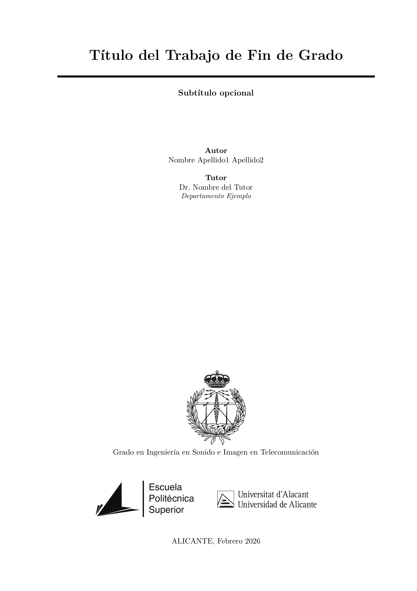

# 📚 Plantilla TFG/TFM - Escuela Politécnica Superior

**Universidad de Alicante**

[](https://www.latex-project.org/)
[](https://www.gnu.org/licenses/gpl-3.0)
[](https://github.com/jmrplens/TFG-TFM_EPS/releases)

Plantilla LaTeX moderna y profesional para la elaboración de **Trabajos de Fin de Grado (TFG)** y **Trabajos de Fin de Máster (TFM)** de la Escuela Politécnica Superior de la Universidad de Alicante.

---

## ✨ Características

- 🎨 **Portadas oficiales** a color y en blanco/negro con diseño profesional
- 🎓 **21 titulaciones** preconfiguradas (8 grados + 13 másteres)
- ⚙️ **Configuración simple** mediante un único archivo
- 📝 **Bibliografía APA 7** con BibLaTeX + Biber
- 💻 **Resaltado de código** para 25+ lenguajes con Minted
- 📊 **Gráficas y diagramas** con TikZ/PGFPlots
- 📖 **Glosarios y acrónimos** integrados
- 🚀 **Optimización TikZ** con caché de figuras
- 🔧 **Compatible con Overleaf** y editores locales

---

## 🆕 ¿Primera vez con LaTeX?

Si nunca has usado LaTeX, no te preocupes. Hemos preparado una guía completa para principiantes:

**📖 [Guía de LaTeX para Principiantes](docs/GUIA_PRINCIPIANTES.md)**

Incluye:

- Qué es LaTeX y por qué usarlo
- Instalación paso a paso (Windows, macOS, Linux)
- Elegir un editor
- Tu primera compilación
- Errores comunes y soluciones
- Recursos de aprendizaje

---

## � Documentación Especializada

Esta plantilla incluye una documentación exhaustiva para cada aspecto de tu TFG/TFM. Puedes acceder al índice completo o ir directamente a las guías específicas:

👉 **[ÍNDICE DE DOCUMENTACIÓN](docs/README.md)** (Empieza aquí si tienes dudas)

<details>
<summary><b>Ver lista de guías disponibles</b></summary>

| Guía | Descripción |
|------|-------------|
| 📝 [Código Fuente](docs/CODIGO_FUENTE.md) | Insertar y resaltar código con minted (40+ lenguajes) |
| 📊 [Figuras y Gráficas](docs/FIGURAS_GRAFICAS.md) | Crear gráficos con pgfplots y TikZ |
| 🖼️ [Imágenes y Subfiguras](docs/IMAGENES_SUBFIGURAS.md) | Incluir imágenes, subfiguras y posicionamiento |
| 📋 [Tablas](docs/TABLAS.md) | Tablas profesionales con booktabs |
| ✍️ [Texto y Listas](docs/TEXTO_LISTAS.md) | Formato de texto, listas y descripciones |
| 🔢 [Ecuaciones](docs/ECUACIONES.md) | Fórmulas matemáticas con amsmath |
| 📖 [Bibliografía](docs/BIBLIOGRAFIA.md) | Gestión de referencias con BibLaTeX |
| 📓 [Glosarios y Acrónimos](docs/GLOSARIOS_ACRONIMOS.md) | Términos, siglas y símbolos |
| 🔗 [Referencias Cruzadas](docs/REFERENCIAS_CRUZADAS.md) | Etiquetas, referencias y hyperref |
| ♿ [Accesibilidad PDF](docs/ACCESIBILIDAD.md) | PDFs accesibles (PDF/UA-2) |
| 🤖 [Contexto IA](docs/AI_CONTEXT.md) | Referencia técnica completa para asistentes de IA |
| 🔄 [Flujos de trabajo IA](docs/AI_WORKFLOWS.md) | Guías paso a paso para tareas comunes |

</details>

---

## 🤖 Ayuda con IA

¿Usas ChatGPT, Claude, Copilot u otro asistente de IA? Este proyecto incluye archivos de contexto para que las IAs te ayuden mejor:

| Archivo | Propósito |
|---------|----------|
| [AGENTS.md](AGENTS.md) | Instrucciones para agentes de código autónomos (Codex, Devin, etc.) |
| [CLAUDE.md](CLAUDE.md) | Instrucciones específicas para Claude |
| [.github/copilot-instructions.md](.github/copilot-instructions.md) | Instrucciones para GitHub Copilot |
| [docs/AI_CONTEXT.md](docs/AI_CONTEXT.md) | Referencia técnica completa |
| [docs/AI_WORKFLOWS.md](docs/AI_WORKFLOWS.md) | Flujos de trabajo paso a paso para tareas comunes |

### Agentes especializados

| Agente | Para Copilot | Para Claude | Prompts |
|---|---|---|---|
| Instalación guiada | [.github/agents/instalacion.md](.github/agents/instalacion.md) | [docs/agents/instalacion-claude.md](docs/agents/instalacion-claude.md) | [docs/agents/prompts-instalacion.md](docs/agents/prompts-instalacion.md) |
| Redacción de capítulos | [.github/agents/redaccion.md](.github/agents/redaccion.md) | [docs/agents/redaccion-claude.md](docs/agents/redaccion-claude.md) | [docs/agents/prompts-redaccion.md](docs/agents/prompts-redaccion.md) |
| Revisor tipo tribunal | [.github/agents/revisor.md](.github/agents/revisor.md) | [docs/agents/revisor-claude.md](docs/agents/revisor-claude.md) | [docs/agents/prompts-revisor.md](docs/agents/prompts-revisor.md) |

**Revisión automática:** `python3 scripts/revision-rapida.py` genera un informe estático sin necesidad de IA.

**Tip:** Si usas ChatGPT, Gemini u otra IA sin integración directa, copia el contenido de `docs/AI_CONTEXT.md` en el chat para obtener respuestas precisas sobre esta plantilla.

---

## 🚀 Inicio Rápido

### Instalación automática (recomendado)

La forma más sencilla de preparar el entorno es ejecutar el script de instalación incluido:

```bash
# Linux / macOS
python3 scripts/instalar.py

# Windows
python scripts/instalar.py
```

El script detecta qué falta, ofrece instalarlo automáticamente cuando es posible y guía paso a paso cuando requiere intervención manual. Si Python no está instalado aún, consulta la [Guía para Principiantes](docs/GUIA_PRINCIPIANTES.md#-instalación-paso-a-paso).

Para ayuda interactiva, usa el **agente de instalación**:

- GitHub Copilot: carga [`.github/agents/instalacion.md`](.github/agents/instalacion.md) en Copilot Chat
- Claude: consulta [docs/agents/instalacion-claude.md](docs/agents/instalacion-claude.md) o usa los [prompts listos](docs/agents/prompts-instalacion.md)

### Requisitos

- **TeX Live 2024** o superior (recomendado: TeX Live 2025)
- **LuaLaTeX** como motor de compilación
- **Biber** para bibliografía
- **Python + latexminted** para resaltado de código (minted 3.x)

```bash
# Ubuntu/Debian (instalación manual)
sudo apt install texlive-full
pip3 install latexminted

# macOS con Homebrew
brew install --cask mactex
pip3 install latexminted

# Windows con MiKTeX
# Descargar desde https://miktex.org/download
pip install latexminted
```

### Compilación

```bash
# Opción 1: Usando Make (recomendado)
make              # Compilación completa
make quick        # Compilación rápida (sin bibliografía)
make clean        # Limpiar archivos auxiliares
make view         # Abrir PDF generado

# Opción 2: Usando latexmk (compilación continua)
latexmk main.tex        # Compilar una vez
latexmk -pvc main.tex   # Compilar automáticamente al guardar

# Opción 3: Compilación manual
lualatex -shell-escape main.tex
biber main
lualatex -shell-escape main.tex
lualatex -shell-escape main.tex
```

---

## 📁 Estructura del Proyecto

```text
TFG-TFM_EPS/
├── main.tex                    # Documento principal
├── configuracion.tex           # Configuración del usuario
├── referencias.bib             # Bibliografía
├── Makefile                    # Comandos de compilación
├── .latexmkrc                  # Configuración de latexmk
├── .env.example                # Plantilla de credenciales (Copyleaks/Turnitin)
│
├── scripts/
│   ├── instalar.py             # Script de instalación y diagnóstico del entorno
│   └── revision-rapida.py      # Revisor estático del documento
│
├── cls/
│   └── eps-tfg.cls             # Clase principal
│
├── sty/
│   ├── eps-portadas.sty        # Paquete de portadas
│   ├── eps-codigo.sty          # Estilos de código
│   └── ...                     # Otros paquetes de estilo
│
├── contenido/
│   ├── frontmatter/
│   │   └── preliminares.tex    # Agradecimientos, resumen...
│   ├── capitulos/
│   │   ├── introduccion.tex
│   │   ├── marco-teorico.tex
│   │   ├── objetivos.tex
│   │   ├── metodologia.tex
│   │   ├── desarrollo.tex
│   │   ├── resultados.tex
│   │   └── conclusiones.tex
│   └── anexos/
│       ├── acronimos.tex
│       └── anexo-X.tex         # Tus anexos
│
├── recursos/
│   ├── logos/                  # Logos institucionales (PDF)
│   ├── fuentes/                # Fuentes tipográficas
│   ├── figuras/                # Tus figuras e imágenes
│   └── ejemplos/               # Ejemplos de código fuente
│
├── docs/                       # Documentación detallada
│   ├── GUIA_PRINCIPIANTES.md
│   ├── CODIGO_FUENTE.md
│   ├── ECUACIONES.md
│   ├── agents/                 # Agentes IA y prompts listos
│   └── ...                     # Más guías especializadas
│
├── .github/
│   ├── agents/                 # Agentes para GitHub Copilot
│   └── workflows/
│       ├── build.yml           # CI: compilar PDF
│       └── revision.yml        # CI: revisión estática automática en PR
│
├── .vscode/                    # Tareas y configuración para VS Code
├── AGENTS.md                   # Contexto para asistentes IA
├── CLAUDE.md                   # Instrucciones para Claude
├── CHANGELOG.md                # Historial de cambios
└── CONTRIBUTING.md             # Guía de contribución
```

---

## ⚙️ Configuración

Toda la configuración se realiza en el archivo `configuracion.tex`:

```latex
\EPSsetup{
  % Información del trabajo
  titulo = {Mi Título del Trabajo},
  subtitulo = {Subtítulo opcional},
  
  % Autor
  autor = {Nombre Apellido1 Apellido2},
  genero = m,  % m = masculino, f = femenino, n = neutro
  email = nombre@alu.ua.es,
  
  % Tutor/es
  tutor = {Dr. Nombre Apellido},
  tutor-genero = m,  % m = masculino, f = femenino, n = neutro
  tutor-departamento = {Departamento de Ejemplo},
  % cotutor = {Dra. Nombre Apellido},  % Opcional
  % cotutor-genero = f,
  
  % Titulación (ver lista completa abajo)
  titulacion = informatica,
  
  % Opciones
  optimizar-tikz = true,
  borrador = true,  % Muestra notas TODO
}
```

### Titulaciones Disponibles

#### Grados

| ID | Titulación |
|----|------------|
| `teleco` | Ingeniería en Sonido e Imagen en Telecomunicación |
| `civil` | Ingeniería Civil |
| `quimica` | Ingeniería Química |
| `informatica` | Ingeniería Informática |
| `multimedia` | Ingeniería Multimedia |
| `arquitectura-tecnica` | Arquitectura Técnica |
| `arquitectura` | Arquitectura |
| `robotica` | Ingeniería Robótica |

#### Másteres

| ID | Titulación |
|----|------------|
| `master-teleco` | Ingeniería de Telecomunicación |
| `master-caminos` | Caminos, Canales y Puertos |
| `master-edificacion` | Gestión de la Edificación |
| `master-web` | Desarrollo de Aplicaciones y Servicios Web |
| `master-materiales` | Materiales, Agua y Terreno |
| `master-informatica` | Ingeniería Informática |
| `master-robotica` | Automática y Robótica |
| `master-prevencion` | Prevención de Riesgos Laborales |
| `master-agua` | Gestión Sostenible y Tecnologías del Agua |
| `master-moviles` | Software para Dispositivos Móviles |
| `master-quimica` | Ingeniería Química |
| `master-ciberseguridad` | Ciberseguridad |
| `master-geologica` | Ingeniería Geológica |

---

## 🎨 Portadas

La plantilla genera automáticamente portadas a color y en blanco/negro según la titulación seleccionada.

### Galería de Portadas

Cada titulación tiene su propio diseño con colores y logotipos oficiales:

#### Grados

<p align="center">
</img>
</img>
</img>
</img>
</img>
</img>
</img>
</img>
</p>

#### Másteres

<p align="center">
</img>
</img>
</img>
</img>
</img>
</img>
</img>
</img>
</img>
</img>
</img>
</img>
</img>
</p>

### Ejemplo: Portada a color y B/N

<p align="center">
</img>
</img>
</p>
### Comandos de Portada

```latex
% Ambas portadas (por defecto)
\generarportada[ambas]

% Solo portada a color
\generarportada[solo-color]

% Solo portada en blanco y negro
\generarportada[solo-bn]

% Portadas individuales
\portadacolor
\portadabn
```

---

## 💻 Código Fuente

La plantilla incluye estilos de código basados en **Visual Studio Code** con temas Light y Dark, números de línea opcionales e iconos de lenguajes.

### Temas Disponibles

| Tema | Descripción | Sufijo |
|------|-------------|--------|
| **VS Code Light** | Fondo blanco, ideal para impresión | (ninguno) |
| **VS Code Dark** | Fondo oscuro, ideal para presentaciones | `Dark` |

### Variantes de Numeración

| Variante | Descripción | Sufijo |
|----------|-------------|--------|
| Con números | Muestra números de línea | (ninguno) |
| Sin números | Oculta números de línea | `NN` |

### Lenguajes con Entornos Predefinidos

| Lenguaje | Entorno Light | Entorno Dark | Icono |
|----------|---------------|--------------|-------|
| Python | `pythoncode` | `pythoncodeDark` | 🐍 |
| JavaScript | `jscode` | `jscodeDark` | 📜 |
| TypeScript | `tscode` | `tscodeDark` | 📜 |
| Java | `javacode` | `javacodeDark` | ☕ |
| C | `ccode` | `ccodeDark` | © |
| C++ | `cppcode` | `cppcodeDark` | © |
| C# | `csharpcode` | `csharpcodeDark` | 🪟 |
| Go | `gocode` | `gocodeDark` | 🔵 |
| Rust | `rustcode` | `rustcodeDark` | 🦀 |
| PHP | `phpcode` | `phpcodeDark` | 🐘 |
| Ruby | `rubycode` | `rubycodeDark` | 💎 |
| R | `rcode` | `rcodeDark` | 📊 |
| Swift | `swiftcode` | `swiftcodeDark` | 🍎 |
| Kotlin | `kotlincode` | `kotlincodeDark` | 🤖 |
| HTML | `htmlcode` | `htmlcodeDark` | 🌐 |
| CSS | `csscode` | `csscodeDark` | 🎨 |
| SQL | `sqlcode` | `sqlcodeDark` | 🗃️ |
| JSON | `jsoncode` | `jsoncodeDark` | 📋 |
| YAML | `yamlcode` | `yamlcodeDark` | 📄 |
| Bash | `bashcode` | `bashcodeDark` | 💻 |
| Docker | `dockercode` | `dockercodeDark` | 🐳 |
| LaTeX | `latexcode` | — | 📝 |
| Git | `gitcode` | — | 🔀 |

### Ejemplos de Uso

```latex
% ===== TEMA LIGHT (fondo blanco) =====

% Python con números de línea
\begin{pythoncode}
def fibonacci(n):
    if n <= 1:
        return n
    return fibonacci(n-1) + fibonacci(n-2)
\end{pythoncode}

% Python SIN números de línea
\begin{pythoncodeNN}
print("Hola mundo")
\end{pythoncodeNN}

% JavaScript con título personalizado
\begin{jscode}[title={Validación de email}]
function validateEmail(email) {
    return /^[^\s@]+@[^\s@]+\.[^\s@]+$/.test(email);
}
\end{jscode}

% ===== TEMA DARK (fondo oscuro) =====

% Python Dark con números
\begin{pythoncodeDark}
import numpy as np
resultado = np.array([1, 2, 3])
\end{pythoncodeDark}

% Python Dark SIN números
\begin{pythoncodeDarkNN}
print("Sin números de línea")
\end{pythoncodeDarkNN}

% ===== ENTORNO GENÉRICO (cualquier lenguaje) =====

% Light con números
\begin{codigo}{swift}
let mensaje = "Hola desde Swift"
print(mensaje)
\end{codigo}

% Light sin números
\begin{codigoNN}{kotlin}
fun main() = println("Hola")
\end{codigoNN}

% Dark con números
\begin{codigoDark}{scala}
object Main extends App {
  println("Hola Scala")
}
\end{codigoDark}

% Dark sin números
\begin{codigoDarkNN}{haskell}
main = putStrLn "Hola Haskell"
\end{codigoDarkNN}
```

### Resumen de Sufijos

```text
entorno          → Light + números de línea
entornoNN        → Light + sin números
entornoDark      → Dark + números de línea  
entornoDarkNN    → Dark + sin números
```

---

## 📚 Bibliografía

La plantilla usa **BibLaTeX con Biber** y estilo **APA 7**.

### Archivo `referencias.bib`

```bibtex
@book{autor2024,
  author    = {García, María},
  title     = {Título del Libro},
  publisher = {Editorial},
  year      = {2024},
  isbn      = {978-0000000000}
}

@article{ejemplo2024,
  author  = {López, Juan},
  title   = {Título del Artículo},
  journal = {Revista Científica},
  year    = {2024},
  volume  = {10},
  pages   = {1--15},
  doi     = {10.1234/ejemplo}
}
```

### Citar en el texto

```latex
Según \textcite{autor2024}, el tema es importante...
Esto ha sido estudiado previamente \parencite{ejemplo2024}.
```

---

## 📝 Acrónimos

Define acrónimos en `contenido/anexos/acronimos.tex`:

```latex
\newacronym{api}{API}{Application Programming Interface}
\newacronym{ml}{ML}{Machine Learning}
```

Usa en el texto:

```latex
La \gls{api} permite...          % Primera vez: Application Programming Interface (API)
Usando \gls{api}...              % Después: API
La \acrlong{ml} es...            % Machine Learning
```

---

## 🔧 Personalización

### Añadir Nueva Titulación

Para añadir una titulación que no esté incluida, contacta con el mantenedor o edita `cls/eps-tfg.cls`:

```latex
% En la sección de definición de titulaciones
\__eps_define_titulacion:nnnnnnn {mi-titulacion}
  {Nombre Completo de Mi Titulación}
  {tfg} % o tfm
  {mi-color} % definir color previamente
  {blanco} % o negro, según el fondo
  {Blanco} % variante del logo para portada
  {Negro}  % variante del logo normal
```

### Cambiar Colores

Los colores de las titulaciones se definen en la clase. Para personalizar:

```latex
% En configuracion.tex, después de \EPSsetup
\definecolor{mi-color}{RGB}{100,150,200}
```

---

## 🌐 Uso en Overleaf

1. Sube todos los archivos del proyecto a Overleaf
2. Configura el compilador como **LuaLaTeX**
3. Activa **shell-escape** en la configuración del proyecto
4. Compila `main.tex`

> ⚠️ **Nota:** Algunas funcionalidades como minted requieren shell-escape habilitado.

---

## 📋 Cambios respecto a v1.x

### Novedades en v2.0

- ✅ Motor actualizado a **LuaLaTeX**
- ✅ Bibliografía migrada a **BibLaTeX + Biber**
- ✅ Sistema de configuración **key-value** moderno
- ✅ Código con **Minted** (25+ lenguajes)
- ✅ Logos convertidos a **PDF**
- ✅ Estructura de carpetas reorganizada
- ✅ Eliminado conflicto babel/polyglossia
- ✅ Clase modular con paquetes separados
- ✅ Soporte mejorado para personalización

### Migración desde v1.x

Si tienes un documento con la versión anterior:

1. Copia tu contenido a los nuevos archivos en `contenido/`
2. Adapta la configuración al nuevo formato `\EPSsetup{}`
3. Convierte tu bibliografía al formato BibLaTeX si usabas `apacite`
4. Actualiza los entornos de código a los nuevos (ej: `lstlisting` → `pythoncode`)

---

## 🔧 Solución de Problemas

### Error: "File 'minted.sty' not found"

Instalar el paquete de Python latexminted:

```bash
pip3 install latexminted
```

### Error: "You must invoke LaTeX with -shell-escape"

Asegúrate de usar la opción `-shell-escape`:

```bash
lualatex -shell-escape main.tex
# O simplemente usa:
make
```

### Error: "Font not found"

La plantilla usa fuentes del sistema con fallbacks. Si aparecen warnings sobre fuentes:

1. El documento compilará con fuentes alternativas (DejaVu Sans)
2. Para mejores resultados, instala las fuentes del sistema

### La bibliografía no aparece

Ejecuta Biber entre compilaciones:

```bash
lualatex -shell-escape main.tex
biber main
lualatex -shell-escape main.tex
```

### El código fuente no tiene colores

Verifica que latexminted esté instalado:

```bash
latexminted --version
# Si no está: pip3 install latexminted
```

### Compilación muy lenta

Activa la caché de figuras TikZ en `configuracion.tex`:

```latex
\EPSsetup{
  optimizar-tikz = true,
}
```

---

## 🤝 Contribuir

¡Las contribuciones son bienvenidas! Por favor:

1. Haz fork del repositorio
2. Crea una rama para tu feature (`git checkout -b feature/nueva-funcionalidad`)
3. Commit tus cambios (`git commit -am 'Añade nueva funcionalidad'`)
4. Push a la rama (`git push origin feature/nueva-funcionalidad`)
5. Abre un Pull Request

Consulta la [Guía de Contribución](CONTRIBUTING.md) para más detalles.

---

## 🛠️ Herramientas y Recursos

### Herramientas incluidas en el proyecto

| Herramienta | Cómo ejecutar | Para qué sirve |
|-------------|---------------|----------------|
| `scripts/instalar.py` | `python3 scripts/instalar.py` | Comprueba e instala dependencias del entorno |
| `scripts/revision-rapida.py` | `python3 scripts/revision-rapida.py` | Análisis estático del documento; genera `informe-revision.md` |
| `.env.example` | Copiar a `.env` y rellenar | Credenciales para Copyleaks y Turnitin (opcional) |

La revisión estática también se ejecuta automáticamente en cada push/PR mediante el workflow de GitHub Actions (`.github/workflows/revision.yml`).

### Editores recomendados

| Editor | Plataforma | Descripción |
|--------|------------|-------------|
| [VS Code](https://code.visualstudio.com/) + [LaTeX Workshop](https://marketplace.visualstudio.com/items?itemName=James-Yu.latex-workshop) | Win/Mac/Linux | Editor moderno con excelente soporte LaTeX |
| [TeXstudio](https://www.texstudio.org/) | Win/Mac/Linux | Editor dedicado a LaTeX, muy completo |
| [Texmaker](https://www.xm1math.net/texmaker/) | Win/Mac/Linux | Similar a TeXstudio, más sencillo |
| [Overleaf](https://www.overleaf.com/) | Web | Editor online, sin instalación |

### Herramientas útiles

| Herramienta | Para qué sirve |
|-------------|----------------|
| [Detexify](https://detexify.kirelabs.org/) | Dibuja un símbolo → obtén el comando LaTeX |
| [Tables Generator](https://www.tablesgenerator.com/) | Crea tablas visualmente |
| [Mathpix](https://mathpix.com/) | Convierte imágenes de ecuaciones a LaTeX |
| [doi2bib](https://www.doi2bib.org/) | Genera BibTeX desde DOI |
| [Zotero](https://www.zotero.org/) + [Better BibTeX](https://retorque.re/zotero-better-bibtex/) | Gestión bibliográfica |
| [JabRef](https://www.jabref.org/) | Gestor de bibliografía BibLaTeX |
| [arXiv TeX Live Info](https://info.arxiv.org/help/faq/texlive.html) | Compatibilidad con arXiv |

### Documentación y tutoriales

| Recurso | Descripción |
|---------|-------------|
| [Overleaf Learn](https://www.overleaf.com/learn) | Tutoriales completos (EN/ES) |
| [LaTeX Wikibook](https://en.wikibooks.org/wiki/LaTeX) | Referencia exhaustiva |
| [TeX StackExchange](https://tex.stackexchange.com/) | Preguntas y respuestas |
| [CTAN](https://ctan.org/) | Repositorio de paquetes LaTeX |
| [LaTeX Project](https://www.latex-project.org/) | Documentación oficial de LaTeX |
| [TikZ & PGF Manual](https://tikz.dev/) | Documentación oficial de TikZ |
| [PGFPlots Manual](https://pgfplots.sourceforge.io/) | Manual oficial de PGFPlots |
| [BibLaTeX Manual](https://ctan.org/pkg/biblatex) | Documentación de bibliografía |

---

## 📄 Licencia

Este proyecto está bajo la licencia [GNU General Public License v3.0](LICENSE).

Puedes:

- ✅ Usar la plantilla para tu TFG/TFM
- ✅ Modificar y adaptar a tus necesidades
- ✅ Compartir con otros estudiantes

Debes:

- 📝 Mantener la atribución al autor original
- 🔄 Compartir modificaciones bajo la misma licencia

---

## ⭐ Agradecimientos

- A la Escuela Politécnica Superior de la Universidad de Alicante
- A todos los estudiantes que han usado y mejorado esta plantilla
- A la comunidad LaTeX por las herramientas utilizadas

---

<p align="center">
  <i>¡Buena suerte con tu TFG/TFM! 🎓</i>
</p>
