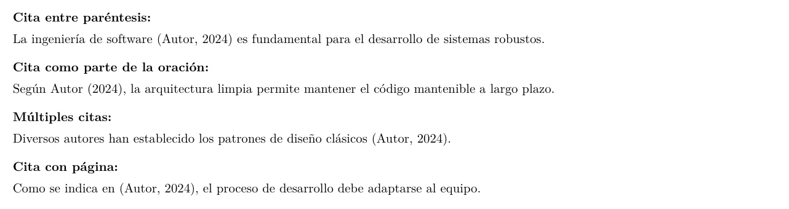
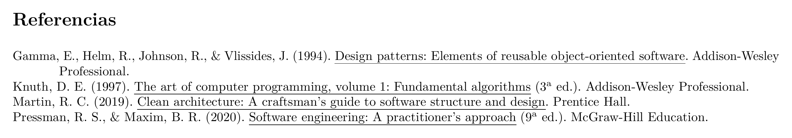
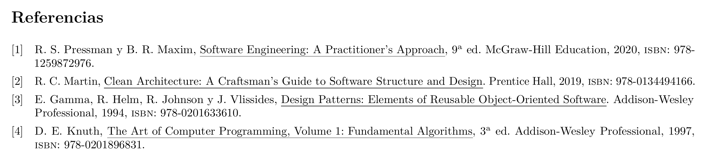

# 📚 Guía de Bibliografía con BibLaTeX

Esta guía explica cómo gestionar referencias bibliográficas usando **BibLaTeX** y **Biber**, el sistema de bibliografía moderno incluido en esta plantilla.

---

## 📋 Índice

- [📋 Índice](#-índice)
- [Introducción](#introducción)
  - [Compilación](#compilación)
- [Archivo .bib](#archivo-bib)
  - [Ubicación](#ubicación)
  - [Estructura de una entrada](#estructura-de-una-entrada)
  - [Ejemplo básico](#ejemplo-básico)
  - [Campos comunes](#campos-comunes)
  - [Formato de autores](#formato-de-autores)
  - [Proteger mayúsculas en títulos](#proteger-mayúsculas-en-títulos)
- [Tipos de entrada](#tipos-de-entrada)
  - [@article - Artículo de revista](#article---artículo-de-revista)
  - [@book - Libro](#book---libro)
  - [@inbook - Capítulo de libro](#inbook---capítulo-de-libro)
  - [@incollection - Parte de colección](#incollection---parte-de-colección)
  - [@inproceedings - Artículo en conferencia](#inproceedings---artículo-en-conferencia)
  - [@thesis - Tesis (TFG, TFM, doctorado)](#thesis---tesis-tfg-tfm-doctorado)
  - [@online - Recurso web](#online---recurso-web)
  - [@manual - Manual técnico](#manual---manual-técnico)
  - [@techreport - Informe técnico](#techreport---informe-técnico)
  - [@patent - Patente](#patent---patente)
  - [@software - Software](#software---software)
  - [@misc - Otros](#misc---otros)
- [Comandos de cita](#comandos-de-cita)
  - [Citas básicas](#citas-básicas)
  - [Múltiples citas](#múltiples-citas)
  - [Citas con información adicional](#citas-con-información-adicional)
  - [Comandos natbib (compatibilidad)](#comandos-natbib-compatibilidad)
  - [Cita textual (quote)](#cita-textual-quote)
  - [Cita sin paréntesis](#cita-sin-paréntesis)
- [Estilos de bibliografía](#estilos-de-bibliografía)
  - [Cambiar estilo](#cambiar-estilo)
  - [Estilos disponibles](#estilos-disponibles)
  - [Estilo APA (por defecto)](#estilo-apa-por-defecto)
  - [Personalizar apariencia](#personalizar-apariencia)
- [Configuración avanzada](#configuración-avanzada)
  - [Filtrar por tipo](#filtrar-por-tipo)
  - [Dividir bibliografía](#dividir-bibliografía)
  - [Por palabras clave](#por-palabras-clave)
  - [Añadir entrada sin citar](#añadir-entrada-sin-citar)
  - [Campos opcionales según estilo](#campos-opcionales-según-estilo)
  - [URL solo si no hay DOI](#url-solo-si-no-hay-doi)
- [Múltiples bibliografías](#múltiples-bibliografías)
  - [Por capítulo](#por-capítulo)
  - [Bibliografía separada](#bibliografía-separada)
- [Solución de problemas](#solución-de-problemas)
  - ["Citation undefined"](#citation-undefined)
  - ["I couldn't open file name.bib"](#i-couldnt-open-file-namebib)
  - [Caracteres especiales en el .bib](#caracteres-especiales-en-el-bib)
  - [La bibliografía no aparece](#la-bibliografía-no-aparece)
  - [Ordenación incorrecta](#ordenación-incorrecta)
  - [Advertencias de Biber](#advertencias-de-biber)
- [Herramientas útiles](#herramientas-útiles)
  - [Gestores de referencias](#gestores-de-referencias)
  - [Obtener entradas BibTeX](#obtener-entradas-bibtex)
  - [Validar y formatear .bib](#validar-y-formatear-bib)
- [Ejemplo completo](#ejemplo-completo)
  - [Archivo referencias.bib](#archivo-referenciasbib)
  - [En el documento](#en-el-documento)
- [Ejemplos visuales](#ejemplos-visuales)
  - [Citas en el texto (estilo autor-año)](#citas-en-el-texto-estilo-autor-año)
  - [Bibliografía estilo APA](#bibliografía-estilo-apa)
  - [Bibliografía estilo IEEE (numérico)](#bibliografía-estilo-ieee-numérico)
- [Recursos adicionales](#recursos-adicionales)
- [Ver también](#ver-también)

---

## Introducción

Esta plantilla usa el sistema moderno de bibliografía:

```latex
% Configuración en la clase eps-tfg.cls
\RequirePackage[
    backend=biber,        % Motor de procesamiento
    style=apa,           % Estilo APA
    sorting=nyt,         % Ordenar por nombre, año, título
    natbib=true,         % Compatibilidad con comandos natbib
    language=spanish,    % Idioma español
    url=true,            % Mostrar URLs
    doi=true,            % Mostrar DOIs
    eprint=false         % No mostrar eprints
]{biblatex}
```

### Compilación

Para generar la bibliografía correctamente, necesitas:

1. Compilar con LuaLaTeX
2. Ejecutar Biber
3. Compilar de nuevo con LuaLaTeX (dos veces)

```bash
lualatex main
biber main
lualatex main
lualatex main
```

O usa la receta "🚀 Compilación completa (latexmk)" en VS Code, que hace esto automáticamente.

---

## Archivo .bib

### Ubicación

El archivo de bibliografía está en:
```
referencias.bib
```

Y se carga en `main.tex` con:
```latex
\addbibresource{referencias.bib}
```

### Estructura de una entrada

```bibtex
@tipo{clave,
    campo1 = {valor1},
    campo2 = {valor2},
    ...
}
```

### Ejemplo básico

```bibtex
@book{knuth1984,
    author    = {Knuth, Donald E.},
    title     = {The {TeXbook}},
    publisher = {Addison-Wesley},
    year      = {1984},
    address   = {Reading, MA},
    isbn      = {0-201-13447-0}
}
```

### Campos comunes

| Campo | Descripción | Ejemplo |
|-------|-------------|---------|
| `author` | Autor(es) | `{García, Juan and López, María}` |
| `title` | Título | `{Título del trabajo}` |
| `year` | Año | `{2024}` |
| `publisher` | Editorial | `{Springer}` |
| `journal` | Revista | `{Nature}` |
| `volume` | Volumen | `{45}` |
| `number` | Número | `{3}` |
| `pages` | Páginas | `{123--145}` |
| `doi` | DOI | `{10.1000/xyz123}` |
| `url` | URL | `{https://ejemplo.com}` |
| `urldate` | Fecha de acceso | `{2024-01-15}` |
| `isbn` | ISBN | `{978-3-16-148410-0}` |
| `issn` | ISSN | `{1234-5678}` |
| `note` | Notas | `{En prensa}` |
| `abstract` | Resumen | `{Este artículo...}` |
| `keywords` | Palabras clave | `{LaTeX, bibliografía}` |
| `language` | Idioma | `{spanish}` |

### Formato de autores

```bibtex
% Un autor
author = {García López, Juan},

% Dos autores
author = {García, Juan and López, María},

% Más autores
author = {García, Juan and López, María and Pérez, Pedro},

% Con "y otros" (et al.)
author = {García, Juan and others},

% Organización como autor
author = {{Universidad de Alicante}},
author = {{Organización Mundial de la Salud}},
```

### Proteger mayúsculas en títulos

```bibtex
% Sin protección - puede cambiar a minúsculas según estilo
title = {Introduction to Machine Learning},

% Con protección - mantiene mayúsculas
title = {Introduction to {Machine Learning}},
title = {{NASA} Technical Report},
title = {The {LaTeX} Companion},
```

---

## Tipos de entrada

### @article - Artículo de revista

```bibtex
@article{einstein1905,
    author  = {Einstein, Albert},
    title   = {Zur Elektrodynamik bewegter Körper},
    journal = {Annalen der Physik},
    year    = {1905},
    volume  = {322},
    number  = {10},
    pages   = {891--921},
    doi     = {10.1002/andp.19053221004}
}
```

### @book - Libro

```bibtex
@book{lamport1994,
    author    = {Lamport, Leslie},
    title     = {{LaTeX}: A Document Preparation System},
    publisher = {Addison-Wesley},
    year      = {1994},
    edition   = {2},
    address   = {Reading, MA},
    isbn      = {0-201-52983-1}
}
```

### @inbook - Capítulo de libro

```bibtex
@inbook{smith2020chapter,
    author    = {Smith, John},
    title     = {Fundamentals of Neural Networks},
    booktitle = {Handbook of Machine Learning},
    publisher = {Springer},
    year      = {2020},
    chapter   = {3},
    pages     = {45--89},
    editor    = {Johnson, Mary},
    doi       = {10.1007/978-3-030-12345-6_3}
}
```

### @incollection - Parte de colección

```bibtex
@incollection{garcia2023,
    author    = {García, Ana},
    title     = {Técnicas de Optimización},
    booktitle = {Avances en Inteligencia Artificial},
    publisher = {Editorial Universitaria},
    year      = {2023},
    editor    = {Martínez, Carlos and Rodríguez, Luis},
    pages     = {120--150}
}
```

### @inproceedings - Artículo en conferencia

```bibtex
@inproceedings{chen2022,
    author    = {Chen, Wei and Wang, Li},
    title     = {A Novel Approach to Natural Language Processing},
    booktitle = {Proceedings of the 60th Annual Meeting of the ACL},
    year      = {2022},
    pages     = {1234--1245},
    publisher = {Association for Computational Linguistics},
    address   = {Dublin, Ireland},
    doi       = {10.18653/v1/2022.acl-long.123}
}
```

### @thesis - Tesis (TFG, TFM, doctorado)

```bibtex
@thesis{perez2023tfg,
    author      = {Pérez Gómez, Laura},
    title       = {Desarrollo de una Aplicación Web para Gestión de Proyectos},
    type        = {Trabajo Fin de Grado},
    institution = {Universidad de Alicante},
    year        = {2023},
    address     = {Alicante, España}
}

@thesis{martinez2022tfm,
    author      = {Martínez López, Carlos},
    title       = {Análisis de Redes Neuronales Profundas},
    type        = {Trabajo Fin de Máster},
    institution = {Universidad de Alicante},
    year        = {2022}
}

@phdthesis{lopez2021,
    author  = {López García, María},
    title   = {Contribuciones al Aprendizaje Automático},
    school  = {Universidad Politécnica de Madrid},
    year    = {2021},
    address = {Madrid}
}
```

### @online - Recurso web

```bibtex
@online{mozilla2024,
    author  = {{Mozilla Developer Network}},
    title   = {JavaScript Guide},
    year    = {2024},
    url     = {https://developer.mozilla.org/en-US/docs/Web/JavaScript/Guide},
    urldate = {2024-01-15}
}

@online{github2024,
    author  = {Requena Plens, José Manuel},
    title   = {Plantilla {TFG/TFM} {EPS} {UA}},
    year    = {2024},
    url     = {https://github.com/jmrplens/TFG-TFM_EPS},
    urldate = {2024-02-01}
}
```

### @manual - Manual técnico

```bibtex
@manual{intel2023,
    author       = {{Intel Corporation}},
    title        = {Intel 64 and IA-32 Architectures Software Developer's Manual},
    year         = {2023},
    organization = {Intel Corporation},
    url          = {https://www.intel.com/sdm}
}
```

### @techreport - Informe técnico

```bibtex
@techreport{nist2020,
    author      = {Barker, Elaine and Dang, Quynh},
    title       = {Recommendation for Key Management},
    institution = {National Institute of Standards and Technology},
    year        = {2020},
    type        = {NIST Special Publication},
    number      = {800-57 Part 1 Rev. 5},
    doi         = {10.6028/NIST.SP.800-57pt1r5}
}
```

### @patent - Patente

```bibtex
@patent{page1998,
    author  = {Page, Lawrence and Brin, Sergey},
    title   = {Method for node ranking in a linked database},
    number  = {US6285999B1},
    year    = {1998},
    holder  = {Stanford University}
}
```

### @software - Software

```bibtex
@software{python2024,
    author  = {{Python Software Foundation}},
    title   = {Python},
    version = {3.12},
    year    = {2024},
    url     = {https://www.python.org}
}
```

### @misc - Otros

```bibtex
@misc{lecun2015,
    author       = {LeCun, Yann and Bengio, Yoshua and Hinton, Geoffrey},
    title        = {Deep Learning},
    howpublished = {Nature 521, 436-444},
    year         = {2015},
    note         = {Review article}
}
```

---

## Comandos de cita

### Citas básicas

```latex
% Cita entre paréntesis: (García, 2024)
\parencite{garcia2024}

% Cita textual: García (2024)
\textcite{garcia2024}

% Solo autor: García
\citeauthor{garcia2024}

% Solo año: 2024
\citeyear{garcia2024}

% Cita completa en pie de página
\footcite{garcia2024}
```

### Múltiples citas

```latex
% Varias citas: (García, 2024; López, 2023)
\parencite{garcia2024,lopez2023}

% Ordenadas automáticamente
\parencite{lopez2023,garcia2024,perez2022}
```

### Citas con información adicional

```latex
% Con página: (García, 2024, p. 45)
\parencite[p.~45]{garcia2024}

% Con páginas: (García, 2024, pp. 45-50)
\parencite[pp.~45-50]{garcia2024}

% Con prefijo: (véase García, 2024)
\parencite[véase][]{garcia2024}

% Con prefijo y página: (véase García, 2024, p. 45)
\parencite[véase][p.~45]{garcia2024}

% Texto antes y después: (véase García, 2024, cap. 3 para más detalles)
\parencite[véase][cap.~3 para más detalles]{garcia2024}
```

### Comandos natbib (compatibilidad)

```latex
% Estos funcionan gracias a natbib=true
\citet{garcia2024}     % García (2024)
\citep{garcia2024}     % (García, 2024)
\citet*{garcia2024}    % Todos los autores
\citep*{garcia2024}    % (Todos los autores, 2024)
```

### Cita textual (quote)

```latex
Según \textcite{garcia2024}, ``el aprendizaje profundo ha 
revolucionado el campo'' \parencite[p.~15]{garcia2024}.
```

### Cita sin paréntesis

```latex
% Para usar en contextos donde ya hay paréntesis
Como indica García (\citeyear{garcia2024}), el método...
```

---

## Estilos de bibliografía

### Cambiar estilo

```latex
% En el preámbulo, modificar la opción style
\usepackage[
    backend=biber,
    style=ieee,        % Cambiar aquí
    ...
]{biblatex}
```

### Estilos disponibles

| Estilo | Descripción | Ejemplo de cita |
|--------|-------------|-----------------|
| `apa` | American Psychological Association | (García, 2024) |
| `ieee` | IEEE (numérico) | [1] |
| `chicago-authordate` | Chicago autor-fecha | (García 2024) |
| `chicago-notes` | Chicago notas al pie | ¹ |
| `mla` | Modern Language Association | (García 45) |
| `numeric` | Numérico simple | [1] |
| `alphabetic` | Alfabético | [Gar24] |
| `authoryear` | Autor-año | García 2024 |
| `verbose` | Completo en notas | Nota completa |

### Estilo APA (por defecto)

```latex
% Configuración específica para APA en español
\DeclareLanguageMapping{spanish}{spanish-apa}
```

### Personalizar apariencia

```latex
% En el preámbulo

% Separador entre autores
\renewcommand*{\multinamedelim}{\addcomma\space}
\renewcommand*{\finalnamedelim}{\addspace y\addspace}

% Formato de "et al."
\DefineBibliographyStrings{spanish}{
    andothers = {et\addabbrvspace al\adddot},
}

% Tamaño de fuente de bibliografía
\renewcommand*{\bibfont}{\small}
```

---

## Configuración avanzada

### Filtrar por tipo

```latex
% Solo libros
\printbibliography[type=book, title={Libros}]

% Solo artículos
\printbibliography[type=article, title={Artículos}]
```

### Dividir bibliografía

```latex
% Por tipo de fuente
\printbibheading[title={Referencias}]

\printbibliography[type=book, heading=subbibliography, title={Libros}]
\printbibliography[type=article, heading=subbibliography, title={Artículos}]
\printbibliography[type=online, heading=subbibliography, title={Recursos web}]
```

### Por palabras clave

```latex
% En el .bib
@article{example,
    ...
    keywords = {primario}
}

% En el documento
\printbibliography[keyword=primario, title={Fuentes primarias}]
\printbibliography[notkeyword=primario, title={Otras fuentes}]
```

### Añadir entrada sin citar

```latex
% Incluir en bibliografía aunque no se cite en el texto
\nocite{referencia_no_citada}

% Incluir todas las entradas del .bib
\nocite{*}
```

### Campos opcionales según estilo

```latex
% Mostrar ISBN
\ExecuteBibliographyOptions{isbn=true}

% Mostrar URL
\ExecuteBibliographyOptions{url=true}

% Mostrar DOI
\ExecuteBibliographyOptions{doi=true}

% Acortar con "et al." después de N autores
\ExecuteBibliographyOptions{maxcitenames=2, maxbibnames=10}
```

### URL solo si no hay DOI

```latex
\DeclareSourcemap{
    \maps[datatype=bibtex]{
        \map{
            \step[fieldsource=doi, final]
            \step[fieldset=url, null]
        }
    }
}
```

---

## Múltiples bibliografías

### Por capítulo

```latex
% En el preámbulo
\usepackage[refsegment=chapter]{biblatex}

% Al final de cada capítulo
\printbibliography[segment=\therefsegment, heading=subbibliography]

% O al final del documento con todas separadas
\bibbysegment[heading=subbibliography]
```

### Bibliografía separada

```latex
% Usar varios archivos .bib
\addbibresource{principal.bib}
\addbibresource{secundario.bib}

% La bibliografía combinará ambos
\printbibliography
```

---

## Solución de problemas

### "Citation undefined"

**Causa**: Biber no se ha ejecutado o hay error en el .bib.

**Solución**:
```bash
# Verificar que biber se ejecuta
lualatex main
biber main    # Revisar errores aquí
lualatex main
```

### "I couldn't open file name.bib"

**Causa**: Ruta incorrecta o archivo no existe.

**Solución**:
```latex
% Verificar que el archivo existe y la ruta es correcta
\addbibresource{referencias.bib}  % Relativo a main.tex
```

### Caracteres especiales en el .bib

**Solución**: Usar llaves o comandos LaTeX:
```bibtex
title = {Análisis de señales},           % UTF-8 directo
title = {An{\'a}lisis de se{\~n}ales},   % Comandos LaTeX
author = {O'Brien, Patrick},             % Apóstrofe normal
author = {M{\"u}ller, Hans},             % Diéresis
```

### La bibliografía no aparece

**Causas posibles**:
1. Falta `\printbibliography`
2. No hay citas en el documento
3. Biber no se ha ejecutado

**Solución**:
```latex
% Asegúrate de tener al final del documento
\printbibliography

% O si usas \nocite{*} para incluir todo sin citar
\nocite{*}
\printbibliography
```

### Ordenación incorrecta

```latex
% Cambiar ordenación
\ExecuteBibliographyOptions{sorting=nyt}  % Nombre, año, título
\ExecuteBibliographyOptions{sorting=none} % Orden de citación
\ExecuteBibliographyOptions{sorting=ynt}  % Año, nombre, título
```

### Advertencias de Biber

```bash
# Ver log detallado
biber --debug main

# Validar archivo .bib
biber --validate-datamodel main
```

---

## Herramientas útiles

### Gestores de referencias

- **Zotero** (gratuito): https://www.zotero.org/
- **Mendeley** (gratuito): https://www.mendeley.com/
- **JabRef** (gratuito, específico BibTeX): https://www.jabref.org/
- **EndNote** (comercial)

### Obtener entradas BibTeX

- **Google Scholar**: Clic en "Citar" → BibTeX
- **DOI**: https://doi2bib.org/
- **ISBN**: https://www.ottobib.com/
- **arXiv**: Cada artículo tiene enlace BibTeX

### Validar y formatear .bib

- **BibTeX Tidy**: https://flamingtempura.github.io/bibtex-tidy/

---

## Ejemplo completo

### Archivo referencias.bib

```bibtex
% Libro
@book{goodfellow2016,
    author    = {Goodfellow, Ian and Bengio, Yoshua and Courville, Aaron},
    title     = {Deep Learning},
    publisher = {MIT Press},
    year      = {2016},
    url       = {http://www.deeplearningbook.org}
}

% Artículo
@article{vaswani2017,
    author  = {Vaswani, Ashish and Shazeer, Noam and Parmar, Niki and 
               Uszkoreit, Jakob and Jones, Llion and Gomez, Aidan N. and 
               Kaiser, Łukasz and Polosukhin, Illia},
    title   = {Attention Is All You Need},
    journal = {Advances in Neural Information Processing Systems},
    year    = {2017},
    volume  = {30}
}

% Recurso web
@online{tensorflow2024,
    author  = {{Google Brain Team}},
    title   = {{TensorFlow}: An End-to-End Open Source Machine Learning Platform},
    year    = {2024},
    url     = {https://www.tensorflow.org/},
    urldate = {2024-01-15}
}
```

### En el documento

```latex
El aprendizaje profundo \parencite{goodfellow2016} ha revolucionado
el campo de la inteligencia artificial. En particular, la arquitectura
Transformer \parencite{vaswani2017} ha demostrado resultados 
excepcionales en procesamiento de lenguaje natural.

Según \textcite{goodfellow2016}, las redes neuronales profundas
son ``representaciones composicionales de funciones'' 
\parencite[p.~6]{goodfellow2016}.

Para la implementación, se utilizó TensorFlow \parencite{tensorflow2024}.

% Al final del documento
\printbibliography
```

---

## Ejemplos visuales

Estos ejemplos muestran cómo se visualizan las citas y la bibliografía en el documento final.

### Citas en el texto (estilo autor-año)

```latex <!-- preview -->
\noindent\textbf{Cita entre paréntesis:}\\[0.5em]
La ingeniería de software \parencite{pressman2020} es fundamental para el desarrollo de sistemas robustos.

\vspace{1em}
\noindent\textbf{Cita como parte de la oración:}\\[0.5em]
Según \textcite{martin2019}, la arquitectura limpia permite mantener el código mantenible a largo plazo.

\vspace{1em}
\noindent\textbf{Múltiples citas:}\\[0.5em]
Diversos autores han establecido los patrones de diseño clásicos \parencite{gamma1994,knuth1997}.

\vspace{1em}
\noindent\textbf{Cita con página:}\\[0.5em]
Como se indica en \parencite[p.~45]{pressman2020}, el proceso de desarrollo debe adaptarse al equipo.
```

**Resultado:**



[📄 Ver PDF](assets/previews/BIBLIOGRAFIA_001.pdf)

### Bibliografía estilo APA

```latex <!-- preview -->
\textbf{\Large Referencias}
\vspace{0.5em}

% Forzamos inclusión de referencias para el ejemplo
\nocite{pressman2020,martin2019,gamma1994,knuth1997}

\printbibliography[heading=none]
```

**Resultado:**



[📄 Ver PDF](assets/previews/BIBLIOGRAFIA_002.pdf)

### Bibliografía estilo IEEE (numérico)

```latex <!-- preview -->
% bibstyle: ieee
\textbf{\Large Referencias}
\vspace{0.5em}

\nocite{pressman2020,martin2019,gamma1994,knuth1997}

\printbibliography[heading=none]
```

**Resultado:**



[📄 Ver PDF](assets/previews/BIBLIOGRAFIA_003.pdf)

---

## Recursos adicionales

- [Documentación de BibLaTeX](https://ctan.org/pkg/biblatex)
- [Documentación de Biber](https://ctan.org/pkg/biber)
- [BibLaTeX Cheat Sheet](https://tug.ctan.org/info/biblatex-cheatsheet/biblatex-cheatsheet.pdf)

---

## Ver también

- [REFERENCIAS_CRUZADAS.md](REFERENCIAS_CRUZADAS.md) - Referencias internas
- [GUIA_PRINCIPIANTES.md](GUIA_PRINCIPIANTES.md) - Introducción a LaTeX
