# 📝 Guía de Código Fuente en LaTeX

Esta guía explica cómo incluir código fuente en tu documento usando los entornos predefinidos de esta plantilla, que utilizan **minted** con estilos visuales tipo VS Code.

---

## 📋 Índice

1. [Introducción](#introducción)
2. [Entornos disponibles](#entornos-disponibles)
3. [Uso básico](#uso-básico)
4. [Opciones de personalización](#opciones-de-personalización)
5. [Incluir código desde archivo](#incluir-código-desde-archivo)
6. [Código inline](#código-inline)
7. [Resaltar líneas](#resaltar-líneas)
8. [Crear entornos personalizados](#crear-entornos-personalizados)
9. [Solución de problemas](#solución-de-problemas)

---

## Introducción

Esta plantilla incluye el paquete `eps-codigo.sty` que proporciona entornos predefinidos para más de **40 lenguajes de programación** con dos temas visuales:

- **VS Code Light** (fondo claro) - Por defecto
- **VS Code Dark** (fondo oscuro) - Añadiendo `Dark` al nombre del entorno

Cada lenguaje tiene dos variantes:
- **Con números de línea** - Por defecto
- **Sin números de línea** - Añadiendo `NN` al final

### Requisitos

El resaltado de sintaxis usa **minted 3.x** con **latexminted**, que requiere Python. Al compilar con `-shell-escape`, minted ejecuta el resaltado automáticamente.

```bash
# Instalar latexminted (incluye Pygments automáticamente)
pip install latexminted
```

---

## Entornos disponibles

### Lenguajes de programación

| Lenguaje | Light | Light (sin líneas) | Dark | Dark (sin líneas) |
|----------|-------|-------------------|------|-------------------|
| Python | `pythoncode` | `pythoncodeNN` | `pythoncodeDark` | `pythoncodeDarkNN` |
| JavaScript | `jscode` | `jscodeNN` | `jscodeDark` | `jscodeDarkNN` |
| TypeScript | `tscode` | `tscodeNN` | `tscodeDark` | `tscodeDarkNN` |
| Java | `javacode` | `javacodeNN` | `javacodeDark` | `javacodeDarkNN` |
| C | `ccode` | `ccodeNN` | `ccodeDark` | `ccodeDarkNN` |
| C++ | `cppcode` | `cppcodeNN` | `cppcodeDark` | `cppcodeDarkNN` |
| C# | `csharpcode` | `csharpcodeNN` | `csharpcodeDark` | `csharpcodeDarkNN` |
| Go | `gocode` | `gocodeNN` | `gocodeDark` | `gocodeDarkNN` |
| Rust | `rustcode` | `rustcodeNN` | `rustcodeDark` | `rustcodeDarkNN` |
| Swift | `swiftcode` | `swiftcodeNN` | `swiftcodeDark` | `swiftcodeDarkNN` |
| Kotlin | `kotlincode` | `kotlincodeNN` | `kotlincodeDark` | `kotlincodeDarkNN` |
| PHP | `phpcode` | `phpcodeNN` | `phpcodeDark` | `phpcodeDarkNN` |
| Ruby | `rubycode` | `rubycodeNN` | `rubycodeDark` | `rubycodeDarkNN` |
| R | `rcode` | `rcodeNN` | `rcodeDark` | `rcodeDarkNN` |
| Scala | `scalacode` | `scalacodeNN` | - | - |
| Perl | `perlcode` | `perlcodeNN` | - | - |
| Haskell | `haskellcode` | `haskellcodeNN` | - | - |
| Lua | `luacode` | `luacodeNN` | - | - |
| Prolog | `prologcode` | `prologcodeNN` | `prologcodeDark` | `prologcodeDarkNN` |
| MATLAB | `matlabcode` | `matlabcodeNN` | `matlabcodeDark` | `matlabcodeDarkNN` |
| Fortran | `fortrancode` | `fortrancodeNN` | `fortrancodeDark` | `fortrancodeDarkNN` |

### Web y markup

| Lenguaje | Light | Light (sin líneas) | Dark | Dark (sin líneas) |
|----------|-------|-------------------|------|-------------------|
| HTML | `htmlcode` | `htmlcodeNN` | `htmlcodeDark` | `htmlcodeDarkNN` |
| CSS | `csscode` | `csscodeNN` | `csscodeDark` | `csscodeDarkNN` |
| SASS | `sasscode` | `sasscodeNN` | - | - |
| JSON | `jsoncode` | `jsoncodeNN` | `jsoncodeDark` | `jsoncodeDarkNN` |
| XML | `xmlcode` | `xmlcodeNN` | - | - |
| YAML | `yamlcode` | `yamlcodeNN` | `yamlcodeDark` | `yamlcodeDarkNN` |
| Markdown | `mdcode` | `mdcodeNN` | - | - |
| LaTeX | `latexcode` | `latexcodeNN` | - | - |
| TeX | `texcode` | `texcodeNN` | `texcodeDark` | `texcodeDarkNN` |

### Shell y sistema

| Lenguaje | Light | Light (sin líneas) | Dark | Dark (sin líneas) |
|----------|-------|-------------------|------|-------------------|
| Bash | `bashcode` | `bashcodeNN` | `bashcodeDark` | `bashcodeDarkNN` |
| PowerShell | `pscode` | `pscodeNN` | - | - |
| Makefile | `makecode` | `makecodeNN` | - | - |
| Dockerfile | `dockercode` | `dockercodeNN` | `dockercodeDark` | `dockercodeDarkNN` |
| INI/Config | `inicode` | `inicodeNN` | - | - |
| TOML | `tomlcode` | `tomlcodeNN` | - | - |
| Git | `gitcode` | `gitcodeNN` | - | - |
| Diff | `diffcode` | `diffcodeNN` | - | - |

### Bases de datos y redes

| Lenguaje | Light | Light (sin líneas) | Dark | Dark (sin líneas) |
|----------|-------|-------------------|------|-------------------|
| SQL | `sqlcode` | `sqlcodeNN` | `sqlcodeDark` | `sqlcodeDarkNN` |
| Nginx | `nginxcode` | `nginxcodeNN` | `nginxcodeDark` | `nginxcodeDarkNN` |
| Apache | `apachecode` | `apachecodeNN` | `apachecodeDark` | `apachecodeDarkNN` |
| MikroTik | `mikrotikcode` | `mikrotikcodeNN` | `mikrotikcodeDark` | `mikrotikcodeDarkNN` |

### Hardware y bajo nivel

| Lenguaje | Light | Light (sin líneas) | Dark | Dark (sin líneas) |
|----------|-------|-------------------|------|-------------------|
| Assembly | `asmcode` | `asmcodeNN` | `asmcodeDark` | `asmcodeDarkNN` |
| VHDL | `vhdlcode` | `vhdlcodeNN` | `vhdlcodeDark` | `vhdlcodeDarkNN` |
| Verilog | `verilogcode` | `verilogcodeNN` | `verilogcodeDark` | `verilogcodeDarkNN` |

### Genéricos (cualquier lenguaje)

| Variante | Entorno |
|----------|---------|
| Light con líneas | `\begin{codigo}{lenguaje}...\end{codigo}` |
| Light sin líneas | `\begin{codigoNN}{lenguaje}...\end{codigoNN}` |
| Dark con líneas | `\begin{codigoDark}{lenguaje}...\end{codigoDark}` |
| Dark sin líneas | `\begin{codigoDarkNN}{lenguaje}...\end{codigoDarkNN}` |

---

## Uso básico

### Ejemplo simple

```latex <!-- preview -->
\begin{pythoncode}
def fibonacci(n):
    """Calcula el n-ésimo número de Fibonacci."""
    if n <= 1:
        return n
    return fibonacci(n-1) + fibonacci(n-2)

# Uso
for i in range(10):
    print(f"F({i}) = {fibonacci(i)}")
\end{pythoncode}
```

**Resultado:**

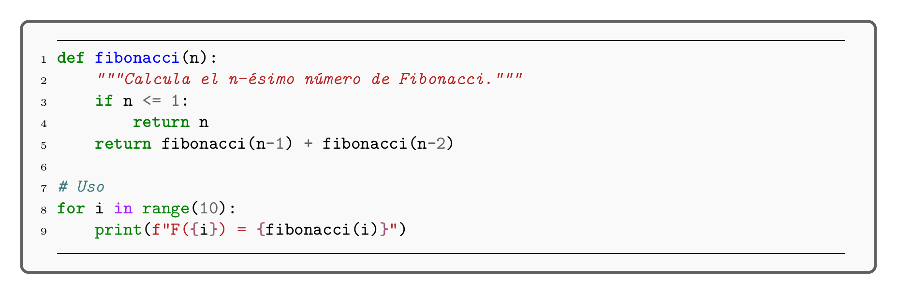

[📄 Ver PDF](assets/previews/CODIGO_FUENTE_001.pdf)


### Con tema oscuro

```latex <!-- preview -->
\begin{pythoncodeDark}
def quicksort(arr):
    if len(arr) <= 1:
        return arr
    pivot = arr[len(arr) // 2]
    left = [x for x in arr if x < pivot]
    middle = [x for x in arr if x == pivot]
    right = [x for x in arr if x > pivot]
    return quicksort(left) + middle + quicksort(right)
\end{pythoncodeDark}
```

**Resultado:**

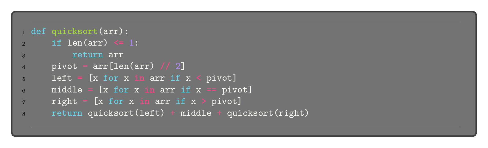

[📄 Ver PDF](assets/previews/CODIGO_FUENTE_002.pdf)


### Sin números de línea

```latex <!-- preview -->
\begin{jscodeNN}
const greeting = "Hello, World!";
console.log(greeting);
\end{jscodeNN}
```

**Resultado:**

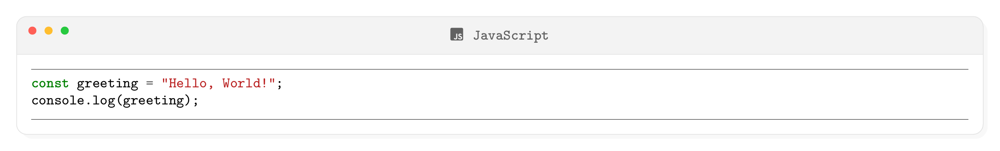

[📄 Ver PDF](assets/previews/CODIGO_FUENTE_003.pdf)


---

## Opciones de personalización

Todos los entornos aceptan opciones opcionales entre corchetes `[...]`. Las opciones principales son:

### Título personalizado

```latex <!-- preview -->
\begin{pythoncode}[title={Mi algoritmo de ordenación}]
def bubble_sort(arr):
    n = len(arr)
    for i in range(n):
        for j in range(0, n-i-1):
            if arr[j] > arr[j+1]:
                arr[j], arr[j+1] = arr[j+1], arr[j]
    return arr
\end{pythoncode}
```

**Resultado:**

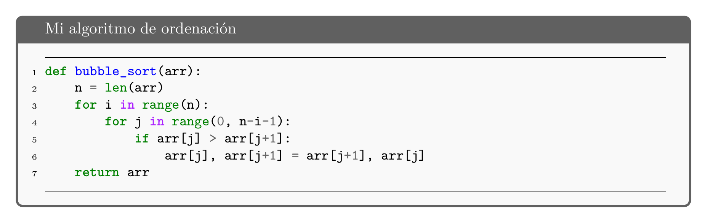

[📄 Ver PDF](assets/previews/CODIGO_FUENTE_004.pdf)


### Caption y etiqueta (para índice de códigos)

```latex <!-- preview:2 -->
\begin{pythoncode}[title={Algoritmo de búsqueda binaria}, label={cod:busqueda-binaria}]
def busqueda_binaria(arr, x):
    izq, der = 0, len(arr) - 1
    while izq <= der:
        mid = (izq + der) // 2
        if arr[mid] == x:
            return mid
        elif arr[mid] < x:
            izq = mid + 1
        else:
            der = mid - 1
    return -1
\end{pythoncode}
```

**Resultado:**

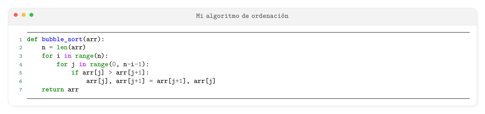

[📄 Ver PDF](assets/previews/CODIGO_FUENTE_005.pdf)


Para referenciar: `Como se muestra en el Código~\ref{cod:busqueda-binaria}...`

### Opciones de minted

Puedes pasar opciones adicionales a minted:

```latex
\begin{pythoncode}[
    minted options={
        fontsize=\footnotesize,
        linenos=true,
        firstnumber=100,
        highlightlines={3-5},
        highlightcolor=yellow!30
    }
]
# Este código empieza en la línea 100
def ejemplo():
    # Estas líneas están resaltadas
    importante = True
    muy_importante = True
    return importante and muy_importante
\end{pythoncode}
```

### Todas las opciones de minted disponibles

| Opción | Descripción | Ejemplo |
|--------|-------------|---------|
| `fontsize` | Tamaño de fuente | `\small`, `\footnotesize`, `\scriptsize` |
| `linenos` | Mostrar números de línea | `true`, `false` |
| `firstnumber` | Número de la primera línea | `100` |
| `highlightlines` | Líneas a resaltar | `{3-5,8,10-12}` |
| `highlightcolor` | Color de resaltado | `yellow!30` |
| `style` | Estilo de Pygments | `monokai`, `friendly`, `colorful` |
| `bgcolor` | Color de fondo | `gray!10` |
| `breaklines` | Romper líneas largas | `true`, `false` |
| `breakanywhere` | Romper en cualquier lugar | `true`, `false` |
| `tabsize` | Tamaño de tabulación | `2`, `4` |
| `showspaces` | Mostrar espacios | `true`, `false` |
| `showtabs` | Mostrar tabulaciones | `true`, `false` |
| `obeytabs` | Respetar tabulaciones | `true`, `false` |
| `autogobble` | Eliminar indentación común | `true`, `false` |
| `xleftmargin` | Margen izquierdo | `1em`, `2cm` |
| `xrightmargin` | Margen derecho | `1em`, `2cm` |

### Opciones de tcolorbox

| Opción | Descripción | Ejemplo |
|--------|-------------|---------|
| `title` | Título del bloque | `Mi código` |
| `label` | Etiqueta para referencias | `cod:mi-codigo` |
| `colback` | Color de fondo | `white` |
| `colframe` | Color del borde | `blue!50!black` |
| `coltitle` | Color del texto del título | `white` |
| `colbacktitle` | Color de fondo del título | `blue` |
| `fonttitle` | Fuente del título | `\bfseries` |
| `arc` | Radio de las esquinas | `0pt`, `3mm` |
| `boxrule` | Grosor del borde | `1pt`, `0.5mm` |
| `left` | Padding izquierdo | `5pt` |
| `right` | Padding derecho | `5pt` |
| `top` | Padding superior | `3pt` |
| `bottom` | Padding inferior | `3pt` |
| `width` | Ancho del bloque | `0.8\textwidth` |

---

## Incluir código desde archivo

### Usando inputminted directamente

```latex
% Código Python desde archivo
\inputminted[
    linenos,
    fontsize=\small,
    firstline=10,
    lastline=50
]{python}{recursos/codigo/mi_script.py}
```

### Crear un entorno con archivo

```latex
% En el preámbulo o en un archivo .sty
\newtcbinputlisting{\pythonfile}[2][]{
    vscode-light-linenos,
    minted language=python,
    listing file={#2},
    title={\faIcon{python}~~#2},
    #1
}

% En el documento
\pythonfile{recursos/codigo/algoritmo.py}

% Con opciones
\pythonfile[
    title={Mi algoritmo personalizado},
    minted options={firstline=20, lastline=45}
]{recursos/codigo/algoritmo.py}
```

### Ejemplo completo de archivo externo

```latex
% Para incluir solo ciertas líneas de un archivo
\begin{tcblisting}{
    vscode-light-linenos,
    listing file={recursos/codigo/servidor.py},
    minted language=python,
    minted options={firstline=50, lastline=80},
    title={\faIcon{python}~~Configuración del servidor (líneas 50-80)}
}
\end{tcblisting}
```

---

## Código inline

### Usando mintinline

```latex <!-- preview:2 -->
La función \mintinline{python}{print("Hola")} muestra texto en pantalla.

En JavaScript usamos \mintinline{javascript}{const x = 10} para declarar constantes.

El comando SQL \mintinline{sql}{SELECT * FROM usuarios} obtiene todos los registros.
```

**Resultado:**

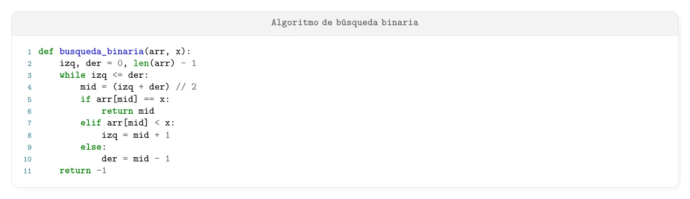

[📄 Ver PDF](assets/previews/CODIGO_FUENTE_006.pdf)


### Opciones de mintinline

```latex <!-- preview:2 -->
% Con estilo diferente
\mintinline[style=colorful]{python}{lambda x: x**2}

% Con fondo
\mintinline[bgcolor=gray!20]{bash}{sudo apt update}

% Con tamaño diferente
\mintinline[fontsize=\large]{java}{public static void main}
```

**Resultado:**

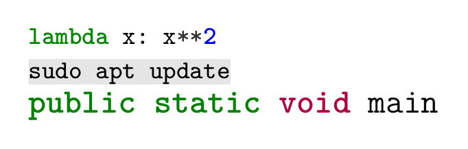

[📄 Ver PDF](assets/previews/CODIGO_FUENTE_007.pdf)


### Crear comando personalizado para inline

```latex <!-- preview:2 -->
% En el preámbulo
\newcommand{\py}[1]{\mintinline{python}{#1}}
\newcommand{\js}[1]{\mintinline{javascript}{#1}}
\newcommand{\sql}[1]{\mintinline{sql}{#1}}

% En el documento
La función \py{range(10)} genera números del 0 al 9.
```

**Resultado:**

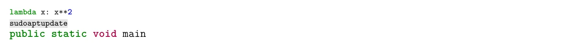

[📄 Ver PDF](assets/previews/CODIGO_FUENTE_008.pdf)


---

## Resaltar líneas

### Resaltado básico

```latex <!-- preview:2 -->
\begin{pythoncode}[minted options={highlightlines={2,4-6}, highlightcolor=yellow!40}]
def procesar_datos(datos):
    resultado = []  # Esta línea está resaltada
    for item in datos:
        valor = transformar(item)  # Líneas 4-6
        resultado.append(valor)    # están
        contador += 1              # resaltadas
    return resultado
\end{pythoncode}
```

**Resultado:**


[📄 Ver PDF](assets/previews/CODIGO_FUENTE_009.pdf)


### Resaltado con diferentes colores

```latex <!-- preview:2 -->
% Definir colores primero
\definecolor{resaltado1}{RGB}{255,255,150}
\definecolor{resaltado2}{RGB}{150,255,150}

% Usar en el código
\begin{pythoncode}[minted options={highlightlines={3}, highlightcolor=resaltado1}]
def ejemplo():
    paso_1 = inicializar()
    paso_importante = procesar()  % Resaltado
    return paso_importante
\end{pythoncode}
```

**Resultado:**

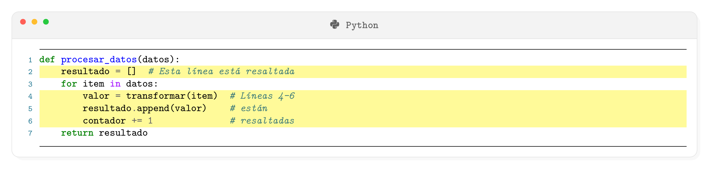

[📄 Ver PDF](assets/previews/CODIGO_FUENTE_010.pdf)


---

## Crear entornos personalizados

### Crear un nuevo lenguaje con estilo personalizado

```latex
% En el preámbulo o archivo .sty

% Definir colores del tema
\definecolor{mi-bg}{HTML}{F5F5F5}
\definecolor{mi-frame}{HTML}{4A90A4}
\definecolor{mi-title-bg}{HTML}{4A90A4}
\definecolor{mi-title-text}{HTML}{FFFFFF}

% Crear el estilo base
\tcbset{
    mi-estilo/.style={
        enhanced,
        breakable,
        colback=mi-bg,
        colframe=mi-frame,
        coltitle=mi-title-text,
        colbacktitle=mi-title-bg,
        arc=6pt,
        boxrule=1.5pt,
        left=5pt,
        right=5pt,
        top=3pt,
        bottom=3pt,
        listing only,
        listing engine=minted,
        fonttitle=\bfseries\sffamily,
    }
}

% Crear entorno para Arduino
\newtcblisting{arduinocode}[1][]{
    mi-estilo,
    minted language=cpp,
    minted options={linenos, fontsize=\small},
    title={\faIcon{microchip}~~Arduino},
    #1
}
```

### Crear entorno con caption flotante

```latex
% Entorno que aparece en el índice de listados
\newtcblisting[
    auto counter,
    number within=chapter,
    list inside=listings
]{codigofloat}[3][]{
    vscode-light-linenos,
    minted language=#2,
    title={Código~\thetcbcounter:~#3},
    label={#1},
    list entry={#3}
}

% Uso
\begin{codigofloat}[cod:ejemplo]{python}{Función de factorial}
def factorial(n):
    if n <= 1:
        return 1
    return n * factorial(n-1)
\end{codigofloat}
```

---

## Solución de problemas

### Error: "You must invoke LaTeX with the -shell-escape flag"

**Causa**: minted necesita ejecutar latexminted externamente.

**Solución**: Compila con la opción `-shell-escape`:
```bash
lualatex -shell-escape main.tex
```

O en VS Code, asegúrate de que el archivo `.vscode/settings.json` tenga:
```json
"latex-workshop.latex.tools": [
    {
        "name": "lualatex",
        "command": "lualatex",
        "args": [
            "-shell-escape",
            "-synctex=1",
            "-interaction=nonstopmode",
            "%DOC%"
        ]
    }
]
```

### Error: "latexminted not found" o "Pygments not found"

**Causa**: Python o latexminted no están instalados.

**Solución**:
```bash
# Linux/Mac
pip install latexminted

# Windows
py -m pip install latexminted

# Verificar instalación
latexminted --version
```

### Error: "Couldn't find lexer"

**Causa**: El lenguaje especificado no existe en Pygments.

**Solución**: Usa uno de los lenguajes soportados. Lista completa:
```bash
python -c "from pygments.lexers import get_all_lexers; print([l[1][0] for l in get_all_lexers()])"
```

O consulta la [documentación de Pygments](https://pygments.org/docs/lexers/).

### El código no se muestra correctamente

**Causas posibles**:
1. Caracteres especiales en LaTeX (`%`, `#`, `$`, `&`, `\`)
2. Indentación incorrecta

**Solución**: El entorno minted escapa automáticamente estos caracteres, pero si hay problemas:
```latex
\begin{pythoncode}
# Los caracteres especiales funcionan normalmente
precio = 100  # 50% de descuento = $50
formula = "E = mc^2"
\end{pythoncode}
```

### Las líneas son muy largas

**Solución**: Las opciones `breaklines` y `breakanywhere` ya están activadas por defecto. Para ajustar:

```latex
\begin{pythoncode}[
    minted options={
        breaklines=true,
        breakanywhere=true,
        breakautoindent=true,
        breaksymbolleft=\tiny\ensuremath{\hookrightarrow}
    }
]
# Código con líneas muy largas que se romperán automáticamente
una_variable_con_nombre_muy_largo = funcion_con_muchos_parametros(param1, param2, param3, param4, param5)
\end{pythoncode}
```

### Error con caracteres Unicode

**Solución**: Esta plantilla usa LuaLaTeX que soporta Unicode nativamente. Si hay problemas:

```latex
\begin{pythoncode}[
    minted options={encoding=utf8}
]
def saludar(nombre):
    return f"¡Hola, {nombre}! 👋"
\end{pythoncode}
```

---

## Ejemplos completos

### Comparación de algoritmos

```latex <!-- preview:2 -->
\begin{figure}[htbp]
\centering

\begin{minipage}{0.48\textwidth}
\begin{pythoncodeNN}[title={Bubble Sort - O(n²)}]
def bubble_sort(arr):
    n = len(arr)
    for i in range(n):
        for j in range(n-i-1):
            if arr[j] > arr[j+1]:
                arr[j], arr[j+1] = \
                    arr[j+1], arr[j]
\end{pythoncodeNN}
\end{minipage}
\hfill
\begin{minipage}{0.48\textwidth}
\begin{pythoncodeDarkNN}[title={Quick Sort - O(n log n)}]
def quick_sort(arr):
    if len(arr) <= 1:
        return arr
    pivot = arr[0]
    left = [x for x in arr[1:] 
            if x < pivot]
    right = [x for x in arr[1:] 
             if x >= pivot]
    return quick_sort(left) + \
           [pivot] + quick_sort(right)
\end{pythoncodeDarkNN}
\end{minipage}

\caption{Comparación de algoritmos de ordenación}
\label{fig:comparacion-sort}
\end{figure}
```

**Resultado:**

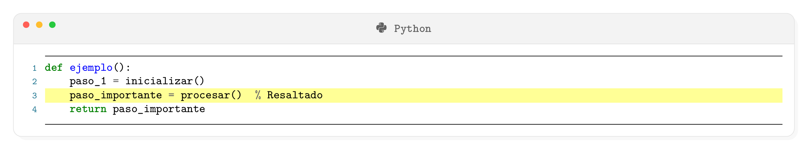

[📄 Ver PDF](assets/previews/CODIGO_FUENTE_011.pdf)


### Código con explicaciones

```latex <!-- preview:2 -->
\begin{pythoncode}[title={API REST con Flask}, minted options={highlightlines={5-8}}]
from flask import Flask, jsonify, request

app = Flask(__name__)

@app.route('/api/users', methods=['GET'])
def get_users():
    """Endpoint para obtener usuarios."""
    return jsonify(users)

@app.route('/api/users/<int:id>', methods=['GET'])
def get_user(id):
    user = next((u for u in users if u['id'] == id), None)
    if user:
        return jsonify(user)
    return jsonify({'error': 'Not found'}), 404

if __name__ == '__main__':
    app.run(debug=True)
\end{pythoncode}

Las líneas resaltadas (5-8) muestran el decorador de ruta y la función 
que maneja las peticiones GET al endpoint \mintinline{text}{/api/users}.
```

**Resultado:**

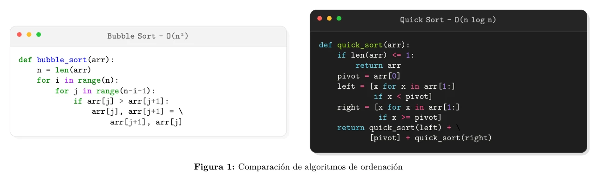

[📄 Ver PDF](assets/previews/CODIGO_FUENTE_012.pdf)


### Pseudocódigo

```latex <!-- preview:2 -->
\begin{codigo}[title={Algoritmo de Dijkstra (pseudocódigo)}]{text}
DIJKSTRA(G, origen):
    dist[origen] = 0
    PARA cada vértice v en G:
        SI v ≠ origen:
            dist[v] = INFINITO
        AÑADIR v a Q
    
    MIENTRAS Q no está vacío:
        u = vértice en Q con mínimo dist[u]
        ELIMINAR u de Q
        
        PARA cada vecino v de u:
            alt = dist[u] + peso(u, v)
            SI alt < dist[v]:
                dist[v] = alt
                previo[v] = u
    
    DEVOLVER dist[], previo[]
\end{codigo}
```

**Resultado:**

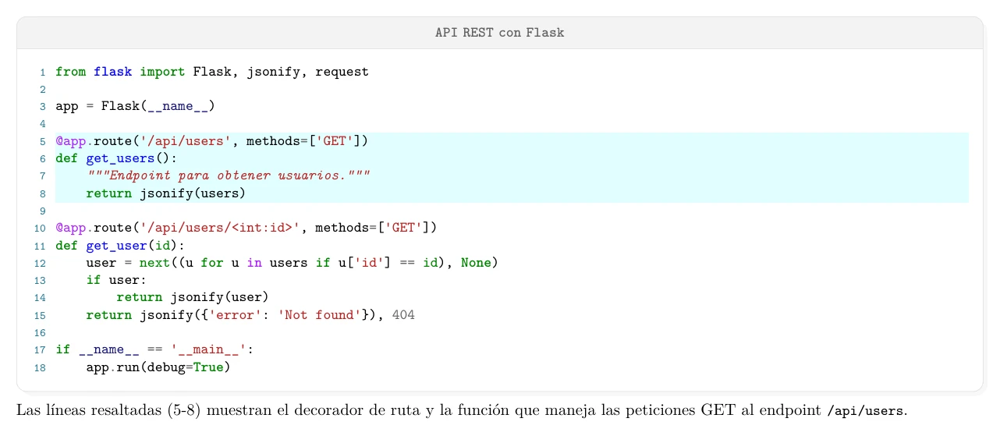

[📄 Ver PDF](assets/previews/CODIGO_FUENTE_013.pdf)


---

## Recursos adicionales

- [Documentación de minted](https://ctan.org/pkg/minted)
- [Documentación de tcolorbox](https://ctan.org/pkg/tcolorbox)
- [Lista de lexers de Pygments](https://pygments.org/docs/lexers/)
- [Estilos de Pygments](https://pygments.org/styles/)

---

## Ver también

- [GUIA_PRINCIPIANTES.md](GUIA_PRINCIPIANTES.md) - Introducción a LaTeX
- [TABLAS.md](TABLAS.md) - Guía de tablas
- [FIGURAS_GRAFICAS.md](FIGURAS_GRAFICAS.md) - Guía de gráficas con pgfplots
