# Componentes Especializados para TFG/TFM

Este sistema proporciona componentes visuales especializados para diferentes disciplinas académicas de la EPS UA.

## Instalación y Uso

### Carga del paquete

El paquete se carga de forma modular para minimizar el tiempo de compilación:

```latex
% Solo componentes comunes (cajas de información, alertas, etc.)
\usepackage{eps-componentes}

% Componentes específicos (carga también los comunes)
\usepackage[software]{eps-componentes}       % IT/Informática
\usepackage[telecom]{eps-componentes}        % Telecomunicaciones
\usepackage[arquitectura]{eps-componentes}   % Arquitectura/Construcción
\usepackage[quimica]{eps-componentes}        % Química/Materiales
\usepackage[geologia]{eps-componentes}       % Geología
\usepackage[prevencion]{eps-componentes}     % Prevención de riesgos

% Múltiples módulos
\usepackage[software,telecom]{eps-componentes}

% Todos los componentes (más lento)
\usepackage[all]{eps-componentes}
```

---

## Componentes Comunes (`eps-comunes.sty`)

Se cargan siempre automáticamente con cualquier opción.

### Cajas de información

#### `infobox` - Información general

```latex <!-- preview infobox -->
\begin{infobox}
  Esta es una caja de información general para notas importantes.
\end{infobox}
```

**Resultado:**

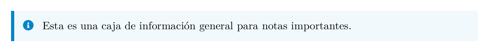

[📄 Ver PDF](assets/previews/infobox.pdf)


---

#### `successbox` - Éxito/Correcto

```latex <!-- preview successbox -->
\begin{successbox}
  Operación completada correctamente. Buena práctica recomendada.
\end{successbox}
```

**Resultado:**

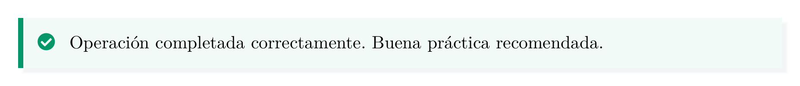

[📄 Ver PDF](assets/previews/successbox.pdf)


---

#### `warningbox` - Advertencia

```latex <!-- preview warningbox -->
\begin{warningbox}
  Advertencia: este proceso requiere atención especial.
\end{warningbox}
```

**Resultado:**

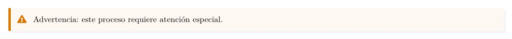

[📄 Ver PDF](assets/previews/warningbox.pdf)


---

#### `dangerbox` - Peligro/Error

```latex <!-- preview dangerbox -->
\begin{dangerbox}
  ¡Peligro! Error crítico que debe evitarse.
\end{dangerbox}
```

**Resultado:**


[📄 Ver PDF](assets/previews/dangerbox.pdf)


---

#### `tipbox` - Consejo

```latex <!-- preview tipbox -->
\begin{tipbox}
  Consejo: usa atajos de teclado para mayor productividad.
\end{tipbox}
```

**Resultado:**

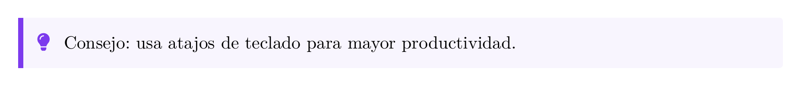

[📄 Ver PDF](assets/previews/tipbox.pdf)


---

#### `notebox` - Nota

```latex <!-- preview notebox -->
\begin{notebox}
  Nota adicional o comentario secundario.
\end{notebox}
```

**Resultado:**

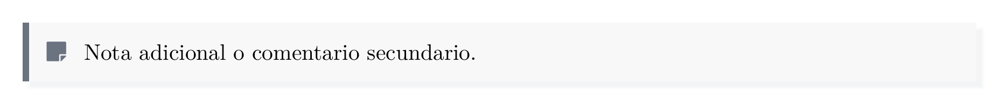

[📄 Ver PDF](assets/previews/notebox.pdf)


---

### Cajas con título

#### `titlebox` - Caja con título personalizado

```latex <!-- preview titlebox -->
\begin{titlebox}{Título Personalizado}
  Contenido de la caja con título personalizado.
\end{titlebox}
```

**Resultado:**

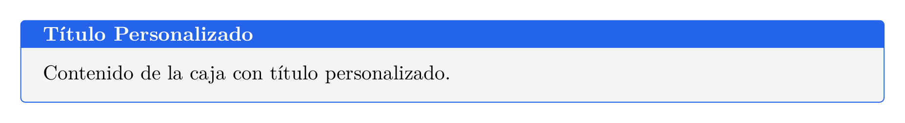

[📄 Ver PDF](assets/previews/titlebox.pdf)


---

#### `definitionbox` - Definición

```latex <!-- preview definitionbox -->
\begin{definitionbox}{Algoritmo}
  Conjunto ordenado y finito de operaciones que permite hallar la solución de un problema.
\end{definitionbox}
```

**Resultado:**

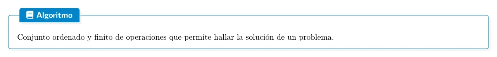

[📄 Ver PDF](assets/previews/definitionbox.pdf)


---

#### `examplebox` - Ejemplo

```latex <!-- preview examplebox -->
\begin{examplebox}[Ejemplo de uso]
  Aquí se muestra un caso práctico de aplicación.
\end{examplebox}
```

**Resultado:**

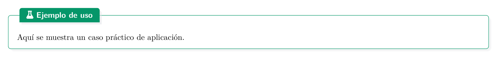

[📄 Ver PDF](assets/previews/examplebox.pdf)


---

#### `importantbox` - Importante

```latex <!-- preview importantbox -->
\begin{importantbox}
  Este contenido es especialmente importante y no debe pasarse por alto.
\end{importantbox}
```

**Resultado:**

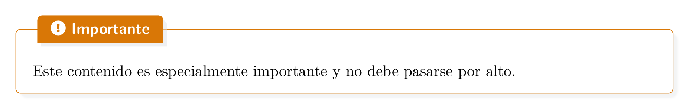

[📄 Ver PDF](assets/previews/importantbox.pdf)


---

### Listas especiales

#### `checklist` - Lista de verificación

```latex <!-- preview checklist -->
\begin{checklist}
  \item[\checked] Tarea completada
  \item[\partialchecked] Tarea parcialmente completada
  \item[\unchecked] Tarea pendiente
\end{checklist}
```

**Resultado:**

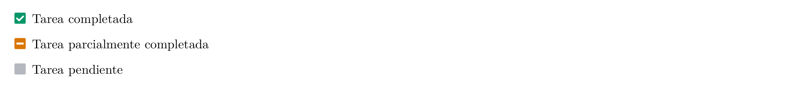

[📄 Ver PDF](assets/previews/checklist.pdf)


---

#### `proscons` - Pros y contras

```latex <!-- preview proscons -->
\begin{proscons}
  \pro Fácil de implementar
  \pro Bien documentado
  \con Curva de aprendizaje inicial
  \con Requiere configuración
\end{proscons}
```

**Resultado:**

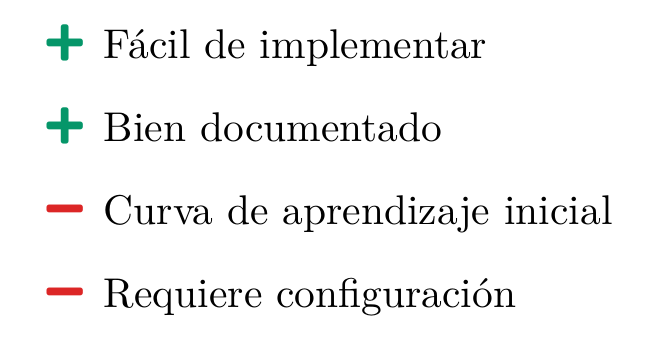

[📄 Ver PDF](assets/previews/proscons.pdf)


---

#### `steplist` - Lista de pasos

```latex <!-- preview steplist -->
\begin{steplist}
  \step Descargar el código fuente
  \step Instalar dependencias
  \step Configurar variables
  \step Ejecutar el script
\end{steplist}
```

**Resultado:**

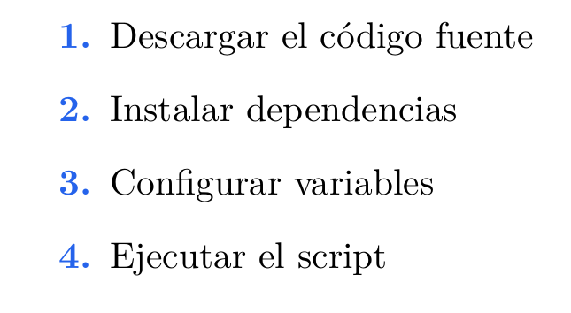

[📄 Ver PDF](assets/previews/steplist.pdf)


---

### Badges e indicadores

#### `\badge` - Etiquetas

```latex <!-- preview badges -->
\badge{Estable} \quad
\badge[eps-success]{Completado} \quad
\badge[eps-warning]{En revisión} \quad
\badge[eps-danger]{Crítico}
```

**Resultado:**


[📄 Ver PDF](assets/previews/badges.pdf)


---

#### Badges predefinidos

```latex <!-- preview badges_predefinidos -->
\badgenew \quad \badgewip \quad \badgedeprecated \quad \badgebeta
```

**Resultado:**

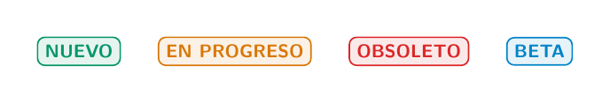

[📄 Ver PDF](assets/previews/badges_predefinidos.pdf)


---

#### `\version` - Versiones

```latex <!-- preview version -->
\version{1.0.0} \quad \version{2.1.0} \quad \version{3.0.0-beta}
```

**Resultado:**


[📄 Ver PDF](assets/previews/version.pdf)


---

#### `\progressbar` - Barra de progreso

```latex <!-- preview progressbar -->
Progreso: \progressbar{25} \quad \progressbar{50} \quad \progressbar{75}
```

**Resultado:**


[📄 Ver PDF](assets/previews/progressbar.pdf)


---

#### `\rating` - Estrellas

```latex <!-- preview rating -->
Rating: \rating{3}{5} \quad \rating{4}{5} \quad \rating{5}{5}
```

**Resultado:**


[📄 Ver PDF](assets/previews/rating.pdf)


---

#### `\levelbar` - Nivel

```latex <!-- preview levelbar -->
Nivel: \levelbar{2}{5} \quad \levelbar{4}{5} \quad \levelbar{5}{5}
```

**Resultado:**

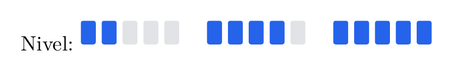

[📄 Ver PDF](assets/previews/levelbar.pdf)


---

### Timeline

#### `timeline` - Línea temporal

```latex <!-- preview timeline -->
\begin{timeline}
  \timeitem{Ene 2024}{Inicio del proyecto}
  \timeitem{Mar 2024}{Diseño de arquitectura}
  \timeitem{Jun 2024}{Implementación principal}
  \timeitem{Dic 2024}{Entrega final}
\end{timeline}
```

**Resultado:**

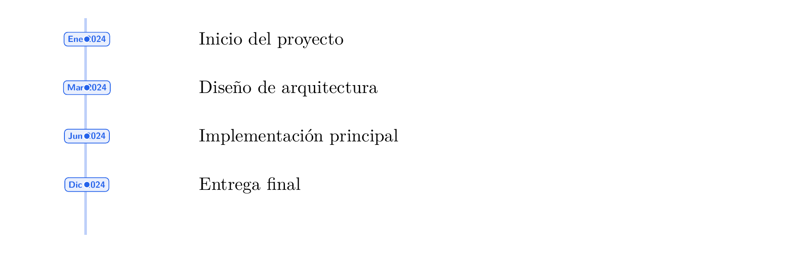

[📄 Ver PDF](assets/previews/timeline.pdf)


---

### Otros componentes comunes

#### `quotebox` - Cita destacada

```latex <!-- preview quotebox -->
\begin{quotebox}[Albert Einstein]
  La imaginación es más importante que el conocimiento.
\end{quotebox}
```

**Resultado:**


[📄 Ver PDF](assets/previews/quotebox.pdf)


---

#### `comparison` - Tabla comparativa

```latex <!-- preview comparison -->
\begin{comparison}{Opción A}{Opción B}
  \comprow{Velocidad}{Rápido}{Moderado}
  \comprow{Memoria}{Alta}{Baja}
  \comprow{Costo}{Bajo}{\$\$\$}
\end{comparison}
```

**Resultado:**


[📄 Ver PDF](assets/previews/comparison.pdf)


---

#### `\personcard` - Tarjeta de persona

```latex <!-- preview personcard -->
\personcard{Dr. García}{Director}{Experto en IA con 15 años de experiencia}
```

**Resultado:**


[📄 Ver PDF](assets/previews/personcard.pdf)


---

#### `\statcard` - Tarjeta de estadística

```latex <!-- preview statcard -->
\statcard{1.5M}{Usuarios}{\faUsers}{eps-primary}
```

**Resultado:**

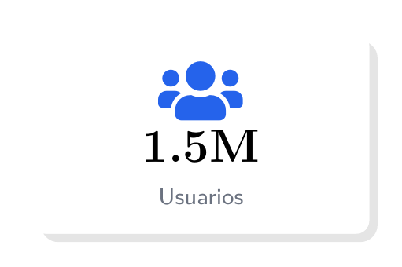

[📄 Ver PDF](assets/previews/statcard.pdf)


---

## Componentes de Software (`eps-software.sty`)

Cargar con: `\usepackage[software]{eps-componentes}`

### API REST Endpoints

#### `apiendpoint` - Endpoint GET

```latex <!-- preview apiendpoint_get -->
\begin{apiendpoint}{GET}{/api/users/:id}
  \apidescription{Obtiene un usuario por su ID único del sistema.}
  \apiresponse{200}{\{"id": 123, "name": "Juan García"\}}
\end{apiendpoint}
```

**Resultado:**

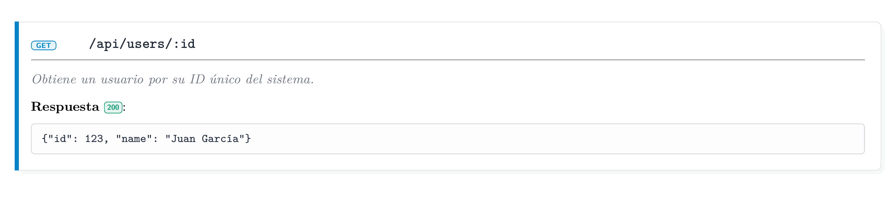

[📄 Ver PDF](assets/previews/apiendpoint_get.pdf)


---

#### `apiendpoint` - Endpoint POST

```latex <!-- preview apiendpoint_post -->
\begin{apiendpoint}{POST}{/api/users}
  \apidescription{Crea un nuevo usuario en el sistema.}
  \apiresponse{201}{\{"id": 124, "message": "Usuario creado"\}}
\end{apiendpoint}
```

**Resultado:**

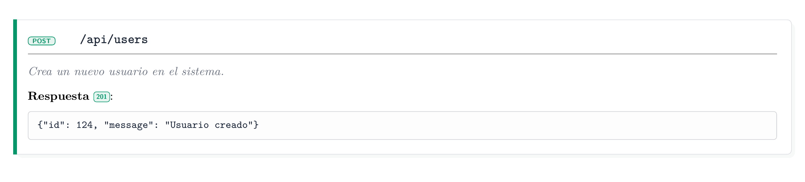

[📄 Ver PDF](assets/previews/apiendpoint_post.pdf)


---

#### Métodos HTTP

```latex <!-- preview http_methods -->
\httpget \quad \httppost \quad \httpput \quad \httppatch \quad \httpdelete
```

**Resultado:**


[📄 Ver PDF](assets/previews/http_methods.pdf)


---

### Terminal / CLI

#### `terminal` - Bloque de terminal

```latex <!-- preview terminal -->
\begin{terminal}[Instalación]
\prompt npm install express\\
\prompt npm run build\\
\promptroot systemctl restart nginx
\end{terminal}
```

**Resultado:**

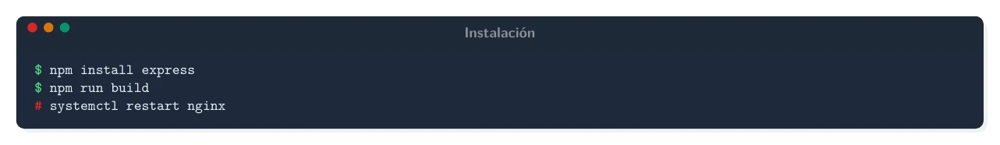

[📄 Ver PDF](assets/previews/terminal.pdf)


---

#### `dirtreebox` - Árbol de directorios

```latex <!-- preview dirtreebox -->
\begin{dirtreebox}[Estructura del Proyecto]
  \dirtreeitem[1]{src/}
  \dirtreeitem[2]{assets/}
  \dirtreeitem[3]{logo.png}
  \dirtreeitem[2]{components/}
  \dirtreeitem[3]{Header.js}
  \dirtreeitem[3]{Footer.js}
  \dirtreeitem[2]{App.js}
  \dirtreeitem[2]{index.js}
  \dirtreeitem[1]{package.json}
  \dirtreeitem[1]{README.md}
\end{dirtreebox}
```

**Resultado:**


[📄 Ver PDF](assets/previews/dirtreebox.pdf)


---

### Base de datos

#### `dbtable` - Tabla de base de datos

```latex <!-- preview dbtable -->
\dbtable{usuarios}{
  \pkicon~id & INT & PK, AUTO\_INCREMENT \\
  nombre & VARCHAR(100) & NOT NULL \\
  email & VARCHAR(255) & UNIQUE \\
  \fkicon~rol\_id & INT & FK $\rightarrow$ roles.id \\
}
```

**Resultado:**

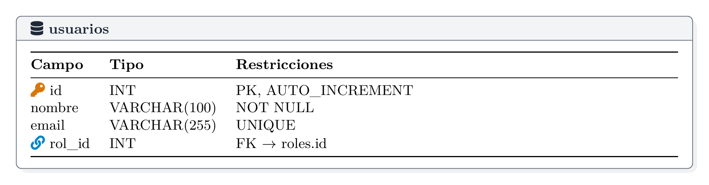

[📄 Ver PDF](assets/previews/dbtable.pdf)


---

### UML

#### `umlclass` - Clase UML

```latex <!-- preview umlclass -->
\umlclass{Usuario}{%
  \visibility{-} id: int \\
  \visibility{-} nombre: string%
}{%
  \visibility{+} getNombre(): string \\
  \visibility{+} setEmail(e: string): void%
}
```

**Resultado:**

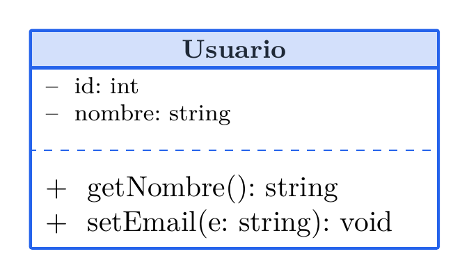

[📄 Ver PDF](assets/previews/umlclass.pdf)


---

### Git y control de versiones

#### Branches y Tags

```latex <!-- preview git_branches -->
\gitbranch{main} \quad \gitbranch{develop} \quad \gitbranch{feature/login}

\vspace{0.5em}

\gittag{v1.0.0} \quad \gittag{v2.0.0} \quad \gittag{v2.1.0-beta}
```

**Resultado:**

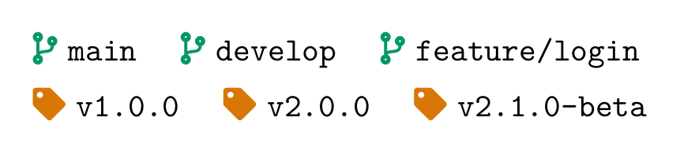

[📄 Ver PDF](assets/previews/git_branches.pdf)


---

#### `gitcommit` - Commit de Git

```latex <!-- preview gitcommit -->
\gitcommit{a1b2c3d}{feat: implementar autenticación JWT}{María López}{2024-06-15}
```

**Resultado:**

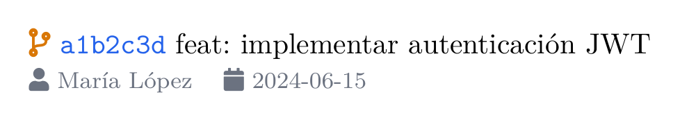

[📄 Ver PDF](assets/previews/gitcommit.pdf)


---

### Logs y configuración

#### `logbox` - Caja de logs

```latex <!-- preview logbox -->
\begin{logbox}[Application Logs]
\logentry{INFO}{2024-06-15 10:30:45}{Servidor iniciado en puerto 3000}
\logentry{WARN}{2024-06-15 10:31:02}{Cache miss para usuario 123}
\logentry{ERROR}{2024-06-15 10:32:15}{Timeout en servicio externo}
\end{logbox}
```

**Resultado:**

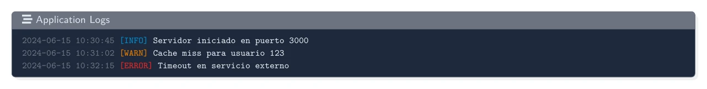

[📄 Ver PDF](assets/previews/logbox.pdf)


---

#### `configbox` - Variables de configuración

```latex <!-- preview configbox -->
\begin{configbox}
DATABASE\_URL="postgresql://localhost/mydb"\\
SECRET\_KEY="super-secret-key-123"\\
DEBUG=true
\end{configbox}
```

**Resultado:**

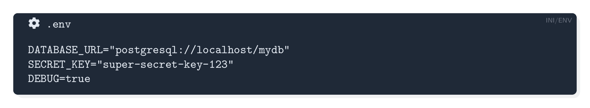

[📄 Ver PDF](assets/previews/configbox.pdf)


---

### Métricas

#### `metricbox` - Tarjeta de métrica

```latex <!-- preview metricbox -->
\metricbox{Tiempo de respuesta}{45ms}{-12\%}{\faArrowDown}
```

**Resultado:**

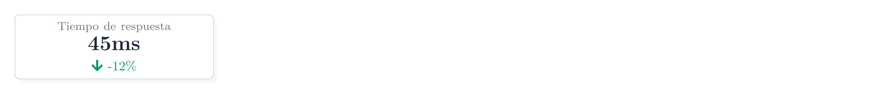

[📄 Ver PDF](assets/previews/metricbox.pdf)


---

#### `benchmark` - Comparativa de rendimiento

```latex <!-- preview benchmark -->
\begin{tcolorbox}[enhanced, title=Benchmark Resultados]
  \benchmark{React DOM}{15ms}{20}
  \benchmark{Vue Virtual DOM}{12ms}{15}
  \benchmark{Vanilla JS}{8ms}{10}
  \benchmark{Angular Ivy}{18ms}{25}
\end{tcolorbox}
```

**Resultado:**

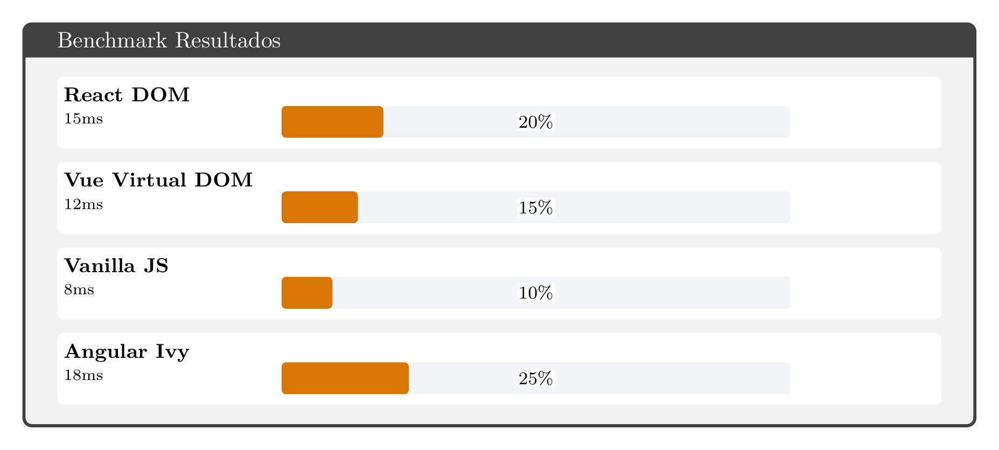

[📄 Ver PDF](assets/previews/benchmark.pdf)


---

## Componentes de Telecomunicaciones (`eps-telecom.sty`)

Cargar con: `\usepackage[telecom]{eps-componentes}`

### Carta de Smith

#### `smithchartbox` - Carta de Smith

```latex <!-- preview smithchart -->
\begin{smithchartbox}[Adaptación de Impedancias]
  \addplot [mark=none, eps-primary, thick] coordinates {(0.5,0.2) (0.2,0) (0.5,-0.2) (1,0)};
  \smithpoint{0.5}{0.2}{$Z_L$}
  \smithpoint{0.2}{0}{$Z_{in}$}
\end{smithchartbox}
```

**Resultado:**

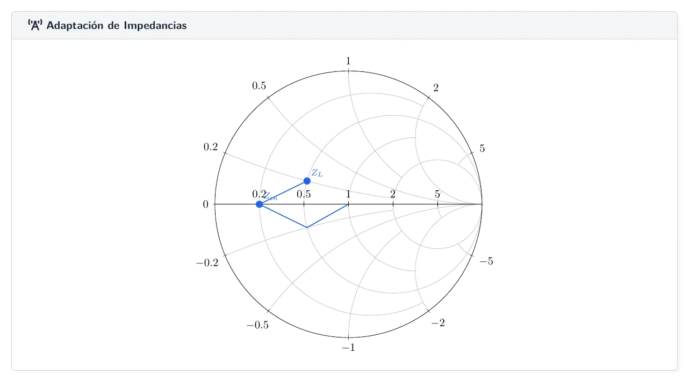

[📄 Ver PDF](assets/previews/smithchart.pdf)


---

### Constelaciones de modulación

#### `constellation` - Diagrama de constelación

```latex <!-- preview constellation -->
\begin{constellation}[Constelación QPSK]
  \constpoint{1}{1}{00}
  \constpoint{-1}{1}{01}
  \constpoint{-1}{-1}{11}
  \constpoint{1}{-1}{10}
\end{constellation}
```

**Resultado:**

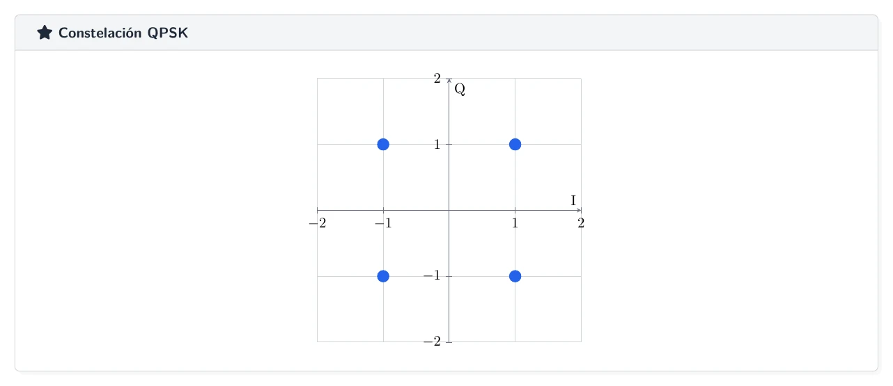

[📄 Ver PDF](assets/previews/constellation.pdf)


---

### Parámetros S

#### `sparameters` - Tabla de parámetros S

Tabla estilo booktabs con indicadores de conformidad.

```latex <!-- preview sparameters -->
\begin{sparameters}[Amplificador LNA - 2.4 GHz]
  \sparam{2.40 GHz}{-18.5}{22.3}{-35.2}{-15.8}
  \sparam{2.44 GHz}{-17.2}{21.8}{-33.5}{-14.9}
  \sparam{2.48 GHz}{-16.8}{21.2}{-32.1}{-14.2}
\end{sparameters}

\textbf{Especificaciones:} S$_{11}$ < -15 dB \sparamok \quad S$_{21}$ > 20 dB \sparamok
```

**Resultado:**


[📄 Ver PDF](assets/previews/sparameters.pdf)


---

### Diagramas de bloques

#### `blockdiagram` - Diagrama de bloques de sistema

```latex <!-- preview blockdiagram -->
\begin{blockdiagram}
  \sysblock{ant}{0,0}{Antena}
  \sysblock{lna}{3,0}{LNA}
  \sysblock{mix}{6,0}{Mixer}
  \sysblock{fil}{9,0}{Filtro}
  \sysarrow{ant}{lna}
  \sysarrow{lna}{mix}
  \sysarrow{mix}{fil}
\end{blockdiagram}
```

**Resultado:**


[📄 Ver PDF](assets/previews/blockdiagram.pdf)


---

### Máquinas de estados

#### `fsmdiagram` - Diagrama FSM

```latex <!-- preview fsmdiagram -->
\begin{fsmdiagram}
  \fsmstate{s0}{0,0}{IDLE}{initial}
  \fsmstate{s1}{3,0}{TX}{}
  \fsmstate{s2}{3,-2}{RX}{}
  \fsmtrans{s0}{s1}{start}
  \fsmtrans{s1}{s2}{ack}
  \fsmtrans{s2}{s0}{done}
\end{fsmdiagram}
```

**Resultado:**


[📄 Ver PDF](assets/previews/fsmdiagram.pdf)


---

### Tramas de protocolo

#### `protocolframe` - Trama de protocolo estilo bytefield

Diagrama de trama con regla de bits, soporte para múltiples filas y campos de longitud variable.

```latex <!-- preview protocolframe -->
\begin{protocolframe}[32]{Trama TCP/IP}
  \framefield{4}{Ver}
  \framefield{4}{IHL}
  \framefield{8}{ToS}
  \framefield{16}{Longitud total}
  \framebreak
  \framefield{16}{Identificación}
  \framefield{3}{Flags}
  \framefield{13}{Fragment Offset}
  \framebreak
  \framefield{8}{TTL}
  \framefieldhighlight{8}{Protocolo}
  \framefield{16}{Checksum cabecera}
  \framebreak
  \framefield{32}{Dirección IP origen}
  \framebreak
  \framefield{32}{Dirección IP destino}
  \framebreak
  \framefieldvar{Opciones + Padding}
\end{protocolframe}
```

**Resultado:**

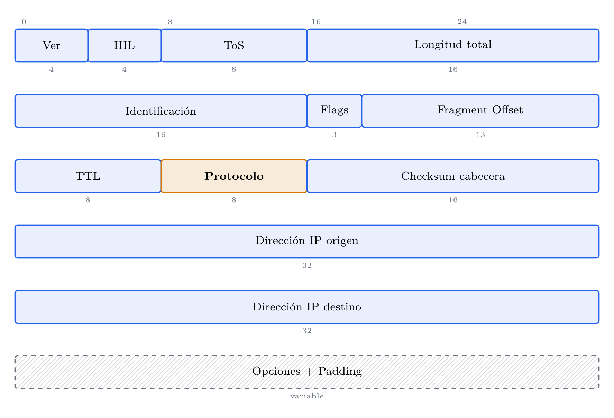

[📄 Ver PDF](assets/previews/protocolframe.pdf)


---

### Especificaciones RF

#### `rfspecs` - Tabla de especificaciones RF

Tabla de especificaciones estilo datasheet con soporte para rangos y valores min/typ/max.

```latex <!-- preview rfspecs -->
\begin{rfspecs}[Transceptor WiFi 802.11ac]
  \rfspec{Frecuencia central}{5.8}{GHz}{Canal 36}
  \rfspecrange{Rango de frecuencia}{5.15}{5.85}{GHz}{}
  \rfspecfull{Potencia de salida}{18}{20}{22}{dBm}{HT80}
  \rfspec{Sensibilidad RX}{-90}{dBm}{MCS0}
  \rfspec{Figura de ruido}{4.5}{dB}{Típico}
\end{rfspecs}
```

**Resultado:**


[📄 Ver PDF](assets/previews/rfspecs.pdf)


---

## Componentes de Arquitectura (`eps-arquitectura.sty`)

Cargar con: `\usepackage[arquitectura]{eps-componentes}`

### Fichas técnicas

#### `techsheet` - Ficha técnica de material

Tabla de propiedades estilo booktabs con soporte para secciones.

```latex <!-- preview techsheet -->
\begin{techsheet}{Hormigón HA-25}
  \techprop{Resistencia característica}{25 MPa}
  \techprop{Tamaño máximo árido}{20 mm}
  \techprop{Consistencia}{Blanda (6-9 cm)}
  \techsection{Propiedades físicas}
  \techprop{Densidad}{2400 kg/m³}
  \techprop{Módulo de elasticidad}{27000 MPa}
\end{techsheet}
```

**Resultado:**

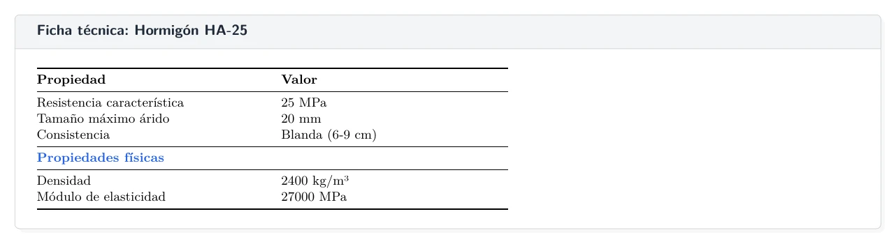

[📄 Ver PDF](assets/previews/techsheet.pdf)


---

### Presupuestos

#### `presupuesto` - Tabla de presupuesto profesional

Tabla de presupuesto estilo booktabs con soporte para capítulos, partidas, subtotales e IVA.

```latex <!-- preview presupuesto -->
\begin{presupuesto}[Presupuesto de ejecución material]
  \capitulo{1}{Movimiento de tierras}
  \partida{01.01}{Excavación en zanja}{m³}{150}{25.00}
  \partida{01.02}{Transporte a vertedero}{m³}{150}{8.50}
  \subtotal{5025.00}
  \capitulo{2}{Cimentación}
  \partida{02.01}{Hormigón HA-25}{m³}{80}{95.00}
  \partida{02.02}{Acero B500S}{kg}{1200}{1.25}
  \subtotal{9100.00}
  \totalconiva{14125.00}{17091.25}
\end{presupuesto}
```

**Resultado:**

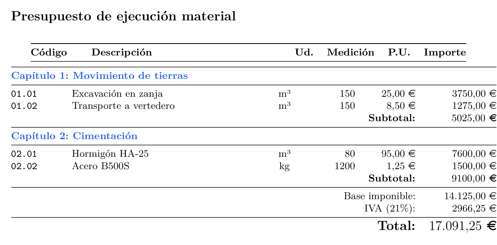

[📄 Ver PDF](assets/previews/presupuesto.pdf)


---

### Normativa

#### `normativa` - Referencia normativa (lista de descripción)

Lista de normativa con indicadores de vigencia.

```latex <!-- preview normativa -->
\begin{normativa}
  \normavigente{CTE DB-SE}{Seguridad estructural}{2019}
  \normavigente{CTE DB-SI}{Seguridad en caso de incendio}{2019}
  \norma{EHE-08}{Instrucción de hormigón estructural}{2008}
  \normaderogada{NBE-AE/88}{Acciones en la edificación}{1988}
\end{normativa}
```

**Resultado:**

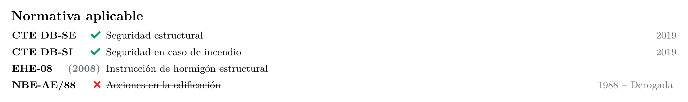

[📄 Ver PDF](assets/previews/normativa.pdf)


---

### Leyendas

#### `leyenda` - Leyenda de planos

```latex <!-- preview leyenda -->
\begin{leyenda}
  \simbolo{\simboloagua}{Agua fría} &
  \simbolo{\simbologas}{Gas natural} \\
  \simbolo{\simboloelec}{Electricidad} &
  \simbolo{\simbolotele}{Telecomunicaciones} \\
\end{leyenda}
```

**Resultado:**

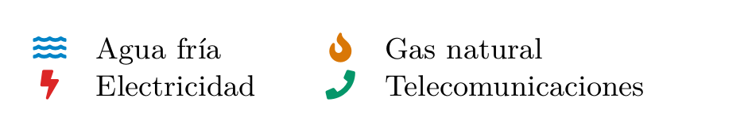

[📄 Ver PDF](assets/previews/leyenda.pdf)


---

### Certificaciones

#### `certificacion` - Sello de certificación

```latex <!-- preview certificaciones -->
\certificacion{LEED Gold}{Sostenibilidad}
\quad
\certificacion{BREEAM}{Muy bueno}
\quad
\certiso{14001}
```

**Resultado:**


[📄 Ver PDF](assets/previews/certificaciones.pdf)


---

### Superficies

#### `cuadrosuperficies` - Cuadro de superficies

Tabla estilo booktabs con soporte para plantas y subtotales.

```latex <!-- preview superficies -->
\begin{cuadrosuperficies}
  \superficieplanta{Planta baja}
  \superficie{Salón-comedor}{35.50}{40.20}
  \superficie{Cocina}{12.80}{14.50}
  \superficie{Dormitorio principal}{18.20}{20.80}
  \superficiesubtotal{66.50}{75.50}
  \superficieplanta{Planta primera}
  \superficie{Dormitorio 1}{14.50}{16.80}
  \superficie{Dormitorio 2}{12.30}{14.20}
  \superficie{Baño}{6.80}{7.90}
  \superficiesubtotal{33.60}{38.90}
  \superficietotal{TOTAL VIVIENDA}{100.10}{114.40}
\end{cuadrosuperficies}
```

**Resultado:**

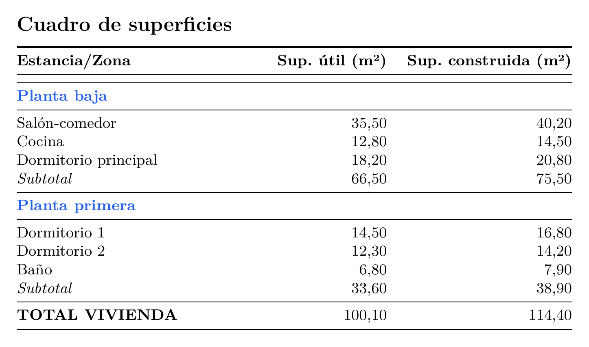

[📄 Ver PDF](assets/previews/superficies.pdf)


---

## Componentes de Química (`eps-quimica.sty`)

Cargar con: `\usepackage[quimica]{eps-componentes}`

### Reacciones químicas

#### `reactionbox` - Caja de reacción

```latex <!-- preview reactionbox -->
\begin{reactionbox}[Síntesis del agua]
  \ch{2 H2 + O2 -> 2 H2O}
  
  Condiciones: 25°C, 1 atm
\end{reactionbox}
```

**Resultado:**

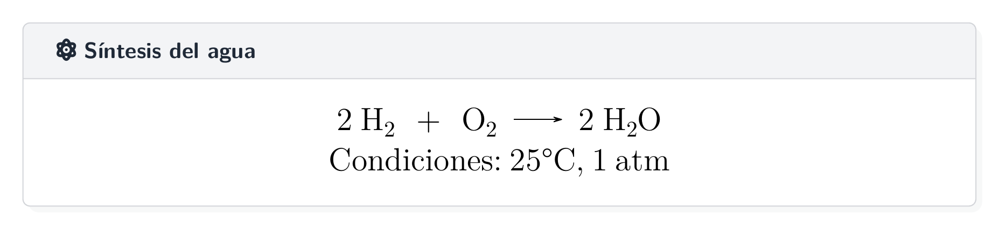

[📄 Ver PDF](assets/previews/reactionbox.pdf)


---

### Propiedades

#### `proptable` - Tabla de propiedades físico-químicas

Tabla estilo booktabs con soporte para secciones y propiedades con incertidumbre.

```latex <!-- preview proptable -->
\begin{proptable}[Propiedades del agua (H$_2$O)]
  \property{Masa molar}{18.015}{g/mol}{---}
  \propertyunc{Densidad}{0.998}{0.001}{g/cm³}{a 25°C}
  \propsection{Puntos de transición}
  \property{Punto de fusión}{0.00}{°C}{a 1 atm}
  \property{Punto de ebullición}{100.00}{°C}{a 1 atm}
  \propertyrange{Densidad máxima}{3.98}{4.00}{°C}{anomalía del agua}
\end{proptable}
```

**Resultado:**


[📄 Ver PDF](assets/previews/proptable.pdf)


---

### Resultados analíticos

#### `analyticalresults` - Resultados analíticos

Tabla de resultados con indicadores de conformidad y soporte para grupos.

```latex <!-- preview analyticalmethod -->
\begin{analyticalresults}[Análisis de aguas - Muestra M-001]
  \analytegroup{Parámetros físico-químicos}
  \analyte{pH}{7.2}{0.1}{---}{OK}
  \analyte{Conductividad}{450}{10}{μS/cm}{OK}
  \analytegroup{Aniones}
  \analyte{Cloruros}{125.5}{3.2}{mg/L}{OK}
  \analyte{Nitratos}{52.8}{1.5}{mg/L}{HIGH}
  \analytelod{Fluoruros}{0.1}{mg/L}
\end{analyticalresults}
```

**Resultado:**

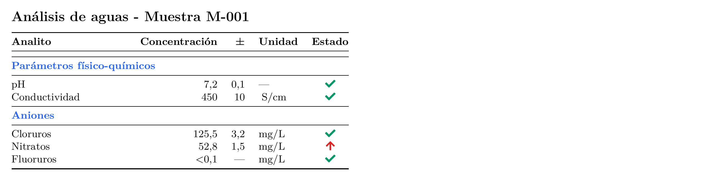

[📄 Ver PDF](assets/previews/analyticalmethod.pdf)


---

### Protocolos de laboratorio

#### `protocol` - Protocolo de laboratorio

Protocolo paso a paso con soporte para tiempos, advertencias y notas.

```latex <!-- preview labprotocol -->
\begin{protocol}[Síntesis de aspirina]
  \protocolmaterials{Ácido salicílico, anhídrido acético, ácido fosfórico}
  \protocolstep{Pesar 2.0 g de ácido salicílico en un erlenmeyer de 125 mL}
  \protocolsteptime{Añadir 5 mL de anhídrido acético y 5 gotas de H$_3$PO$_4$}{2 min}
  \protocolwarning{Realizar en campana de extracción. El anhídrido acético es irritante}
  \protocolsteptime{Calentar en baño maría a 85°C}{15 min}
  \protocolstep{Enfriar y añadir 20 mL de agua destilada fría}
  \protocolnote{El producto cristaliza al enfriar}
  \protocolstep{Filtrar a vacío y lavar con agua fría}
\end{protocol}
```

**Resultado:**

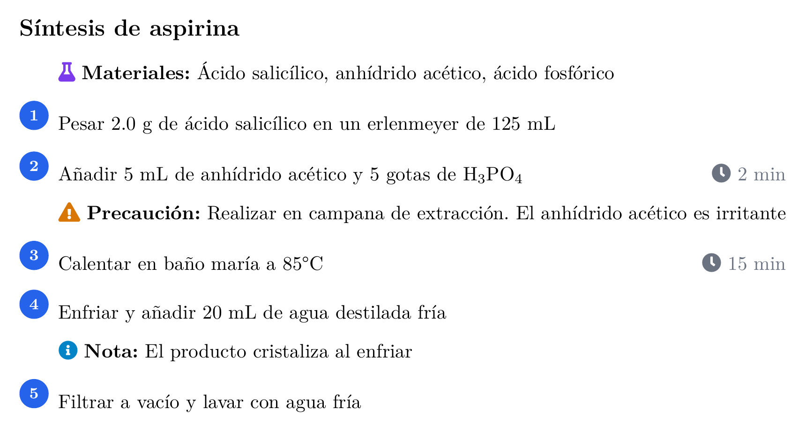

[📄 Ver PDF](assets/previews/labprotocol.pdf)


---

## Componentes de Geología (`eps-geologia.sty`)

Cargar con: `\usepackage[geologia]{eps-componentes}`

### Tabla de minerales

#### `mineraltable` - Tabla de minerales

Tabla estilo booktabs con soporte para grupos de minerales.

```latex <!-- preview mineraltable -->
\begin{mineraltable}[Minerales de la muestra S-15]
  \mineralgroup{Silicatos}
  \mineralrow{Cuarzo}{7}{2.65}{Incoloro}{Vítreo}{SiO2}
  \mineralrow{Feldespato}{6}{2.56}{Blanco-rosado}{Vítreo}{KAlSi3O8}
  \mineralgroup{Carbonatos}
  \mineralrow{Calcita}{3}{2.71}{Blanco}{Vítreo}{CaCO3}
  \mineralgroup{Sulfuros}
  \mineralrow{Pirita}{6}{5.02}{Amarillo latón}{Metálico}{FeS2}
\end{mineraltable}
```

**Resultado:**

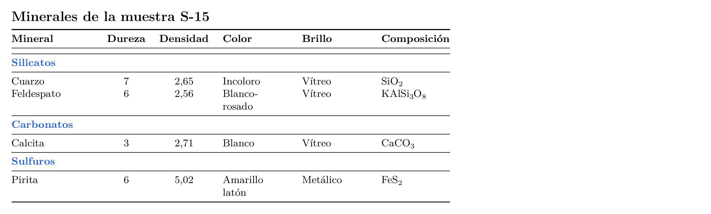

[📄 Ver PDF](assets/previews/mineraltable.pdf)


---

### Columna estratigráfica

#### `stratcolumn` - Columna estratigráfica

```latex <!-- preview stratigraphy -->
\begin{stratigraphybox}
\begin{stratcolumn}
  \stratlayer{2}{lito arenisca}{Aluvial}{Cuaternario}
  \stratlayer{4}{lito caliza}{Calcarenitas}{Mioceno}
  \stratlayer{3}{lito arcilla}{Arcillas}{Cretácico}
\end{stratcolumn}
\end{stratigraphybox}
```

**Resultado:**

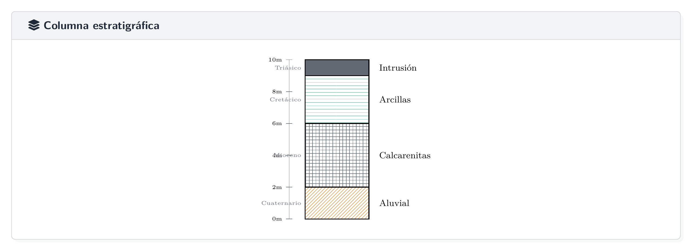

[📄 Ver PDF](assets/previews/stratigraphy.pdf)


---

### Símbolos geológicos

#### Símbolos geológicos disponibles

```latex <!-- preview geosymbols -->
\textbf{Símbolos geológicos:}\\[0.5em]
\faultline\ Falla \quad
\anticline\ Anticlinal \quad
\syncline\ Sinclinal
```

**Resultado:**


[📄 Ver PDF](assets/previews/geosymbols.pdf)


---

## Componentes de Prevención (`eps-prevencion.sty`)

Cargar con: `\usepackage[prevencion]{eps-componentes}`

### Matriz de riesgos

#### `riskmatrix` - Matriz visual de riesgos

```latex <!-- preview riskmatrix -->
\riskmatrix
```

**Resultado:**

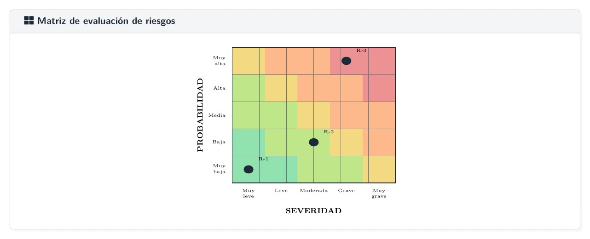

[📄 Ver PDF](assets/previews/riskmatrix.pdf)


---

### Evaluación de riesgos

#### `riskassessment` - Tabla de evaluación de riesgos

Tabla estilo booktabs con cálculo automático de nivel de riesgo y soporte para grupos.

```latex <!-- preview riskassessment -->
\begin{riskassessment}[Evaluación de riesgos - Fase de estructura]
  \riskgroup{Trabajos en altura}
  \riskentry{R-01}{Caída a distinto nivel}{4}{4}{}{Arnés + línea de vida, redes}
  \riskentry{R-02}{Caída de objetos}{3}{3}{}{Marquesinas, zonas delimitadas}
  \riskgroup{Riesgos eléctricos}
  \riskentry{R-03}{Contacto eléctrico directo}{2}{5}{}{Verificar ausencia tensión}
  \riskentry{R-04}{Contacto eléctrico indirecto}{2}{4}{}{Toma de tierra, diferenciales}
\end{riskassessment}
```

**Resultado:**

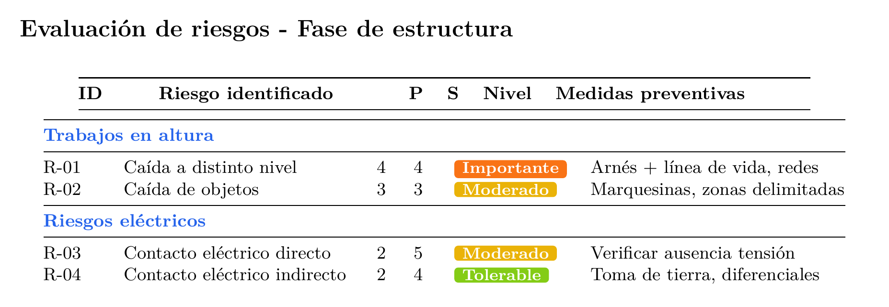

[📄 Ver PDF](assets/previews/riskassessment.pdf)


---

### Checklist de seguridad

#### `safetychecklist` - Lista de verificación de seguridad

```latex <!-- preview safetychecklist -->
\begin{safetychecklist}[Inspección diaria]
  \checkitem{Casco de seguridad}
  \checkitem{Arnés anticaídas}
  \uncheckitem{Guantes de protección}
  \naitem{Gafas de seguridad}
\end{safetychecklist}
```

**Resultado:**

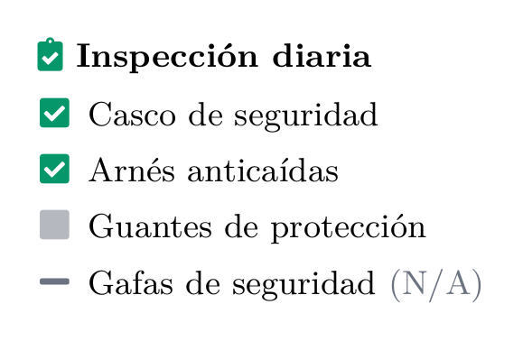

[📄 Ver PDF](assets/previews/safetychecklist.pdf)


---

### Señales de seguridad

#### Señales de advertencia y prohibición

```latex <!-- preview safety_signs -->
\signwarning{Riesgo eléctrico}
\quad
\signprohibition{Prohibido fumar}
\quad
\signmandatory{Uso obligatorio de casco}
```

**Resultado:**

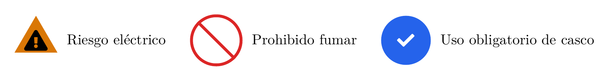

[📄 Ver PDF](assets/previews/safety_signs.pdf)


---

### Indicadores de seguridad

#### Indicadores de frecuencia y gravedad

```latex <!-- preview safety_indicators -->
\indicatorIF{15.5}
\quad
\indicatorIG{0.85}
\quad
\indicatorDaysSafe{125}
```

**Resultado:**

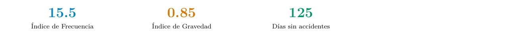

[📄 Ver PDF](assets/previews/safety_indicators.pdf)


---

### Lista de EPIs

#### `epilist` - Lista de equipos de protección individual

```latex <!-- preview epilist -->
\begin{epilist}
  \item \epihardhat
  \item \epigloves
  \item \epiboots
  \item \epiharness
\end{epilist}
```

**Resultado:**

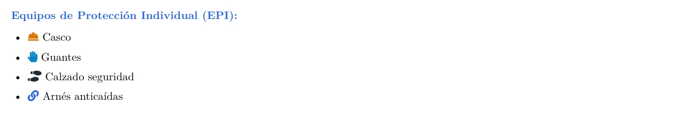

[📄 Ver PDF](assets/previews/epilist.pdf)


---

### Procedimientos de emergencia

#### `emergencyprocedure` - Procedimiento de emergencia

```latex <!-- preview emergencyprocedure -->
\begin{emergencyprocedure}[Evacuación por incendio]
  \begin{enumerate}
    \item Activar alarma de incendio
    \item Evacuar por escaleras de emergencia
    \item Dirigirse al punto de reunión
    \item Esperar instrucciones del coordinador
  \end{enumerate}
  \emergencyphone{Emergencias}{112}
\end{emergencyprocedure}
```

**Resultado:**

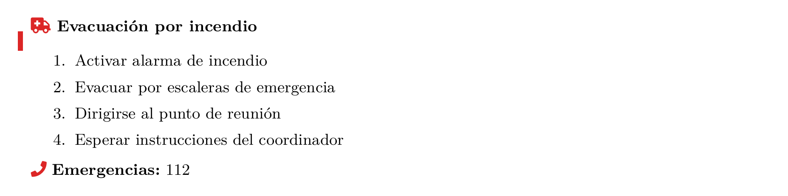

[📄 Ver PDF](assets/previews/emergencyprocedure.pdf)


---

## Paleta de colores

Todos los componentes usan una paleta unificada:

| Color | Código | Uso | Muestra |
|-------|--------|-----|---------|
| `eps-primary` | `#2563EB` | Azul principal | 🔵 |
| `eps-secondary` | `#7C3AED` | Violeta | 🟣 |
| `eps-success` | `#059669` | Verde éxito | 🟢 |
| `eps-warning` | `#D97706` | Naranja advertencia | 🟠 |
| `eps-danger` | `#DC2626` | Rojo peligro | 🔴 |
| `eps-info` | `#0284C7` | Azul información | 🔵 |
| `eps-dark` | `#1F2937` | Texto oscuro | ⚫ |
| `eps-gray` | `#6B7280` | Gris medio | ⚪ |
| `eps-light` | `#F3F4F6` | Fondos claros | ⬜ |

---

## Regenerar previews

Para regenerar las imágenes de preview de los componentes:

```bash
cd /ruta/al/proyecto
python3 .herramientas/actualizar_previews.py --archivo COMPONENTES
```

**Requisitos:** `lualatex`, Python 3.8+
