# ➗ Guía de Ecuaciones Matemáticas

Esta guía explica cómo escribir ecuaciones y expresiones matemáticas en LaTeX usando los paquetes `amsmath`, `mathtools`, y otros incluidos en la plantilla.

---

## 📋 Índice

1. [Introducción](#introducción)
2. [Modo matemático básico](#modo-matemático-básico)
3. [Entornos de ecuaciones](#entornos-de-ecuaciones)
4. [Símbolos y operadores](#símbolos-y-operadores)
5. [Fracciones y raíces](#fracciones-y-raíces)
6. [Subíndices y superíndices](#subíndices-y-superíndices)
7. [Matrices y sistemas](#matrices-y-sistemas)
8. [Alineación de ecuaciones](#alineación-de-ecuaciones)
9. [Teoremas y definiciones](#teoremas-y-definiciones)
10. [Trucos avanzados](#trucos-avanzados)

---

## Introducción

Esta plantilla incluye los siguientes paquetes matemáticos:

```latex
% Ya incluidos en la clase eps-tfg
\RequirePackage{mathtools}   % Extensión de amsmath
\RequirePackage{amsthm}      % Teoremas
\RequirePackage{amsfonts}    % Fuentes matemáticas
\RequirePackage{amssymb}     % Símbolos matemáticos
\RequirePackage{bm}          % Negrita en matemáticas
\RequirePackage{mathrsfs}    % Fuente script
\RequirePackage{nicefrac}    % Fracciones en línea
```

### Entornos predefinidos para teoremas

```latex
\newtheorem{teorema}{Teorema}[chapter]
\newtheorem{definicion}{Definición}[chapter]
\newtheorem{lema}{Lema}[chapter]
\newtheorem{corolario}{Corolario}[chapter]
\newtheorem{proposicion}{Proposición}[chapter]
\newtheorem{ejemplo}{Ejemplo}[chapter]
```

---

## Modo matemático básico

### Matemáticas en línea

```latex <!-- preview -->
La ecuación $E = mc^2$ relaciona energía y masa.

El valor de $\pi \approx 3.14159$.

Para $x > 0$, tenemos $\sqrt{x} \geq 0$.
```

**Resultado:**

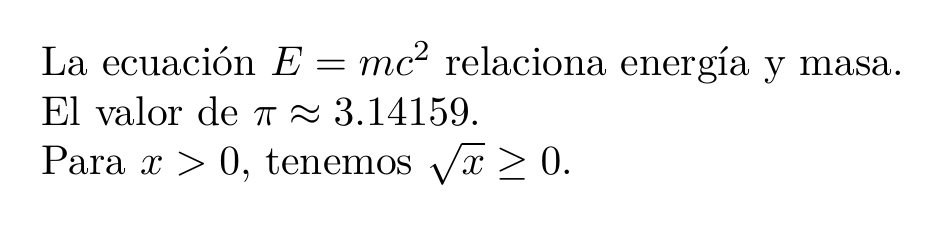

[📄 Ver PDF](assets/previews/ECUACIONES_001.pdf)


### Matemáticas en bloque (display)

```latex <!-- preview -->
La fórmula cuadrática es:
\[
    x = \frac{-b \pm \sqrt{b^2 - 4ac}}{2a}
\]

% Equivalente pero obsoleto
$$ x = \frac{-b \pm \sqrt{b^2 - 4ac}}{2a} $$
```

**Resultado:**

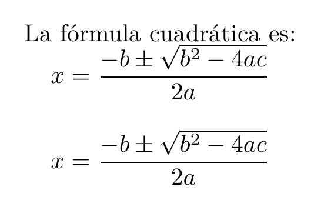

[📄 Ver PDF](assets/previews/ECUACIONES_002.pdf)


### Ecuación numerada

```latex <!-- preview:2 -->
\begin{equation}
    E = mc^2
    \label{eq:einstein}
\end{equation}

Como se muestra en la Ecuación~\eqref{eq:einstein}...
```

**Resultado:**

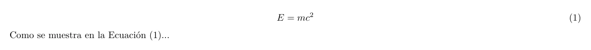

[📄 Ver PDF](assets/previews/ECUACIONES_003.pdf)


### Ecuación sin número

```latex <!-- preview -->
\begin{equation*}
    a^2 + b^2 = c^2
\end{equation*}

% O simplemente
\[
    a^2 + b^2 = c^2
\]
```

**Resultado:**


[📄 Ver PDF](assets/previews/ECUACIONES_004.pdf)


---

## Entornos de ecuaciones

### equation - Una ecuación

```latex <!-- preview:2 -->
\begin{equation}
    \int_0^\infty e^{-x^2} dx = \frac{\sqrt{\pi}}{2}
    \label{eq:gaussiana}
\end{equation}
```

**Resultado:**


[📄 Ver PDF](assets/previews/ECUACIONES_005.pdf)


### align - Múltiples ecuaciones alineadas

```latex <!-- preview:2 -->
\begin{align}
    f(x) &= x^2 + 2x + 1 \label{eq:f}\\
    g(x) &= x^3 - x \label{eq:g}\\
    h(x) &= f(x) + g(x) \label{eq:h}
\end{align}
```

**Resultado:**


[📄 Ver PDF](assets/previews/ECUACIONES_006.pdf)


### align* - Sin numeración

```latex <!-- preview -->
\begin{align*}
    (a + b)^2 &= a^2 + 2ab + b^2 \\
    (a - b)^2 &= a^2 - 2ab + b^2 \\
    (a + b)(a - b) &= a^2 - b^2
\end{align*}
```

**Resultado:**


[📄 Ver PDF](assets/previews/ECUACIONES_004.pdf)


### gather - Ecuaciones centradas

```latex <!-- preview -->
\begin{gather}
    x + y = z \\
    a^2 + b^2 = c^2 \\
    1 + 1 = 2
\end{gather}
```

**Resultado:**


[📄 Ver PDF](assets/previews/ECUACIONES_005.pdf)


### multline - Ecuación larga en varias líneas

```latex <!-- preview -->
\begin{multline}
    p(x) = x^8 + x^7 + x^6 + x^5 + x^4 \\
    + x^3 + x^2 + x + 1
\end{multline}
```

**Resultado:**


[📄 Ver PDF](assets/previews/ECUACIONES_006.pdf)


### split - División dentro de equation

```latex <!-- preview -->
\begin{equation}
    \begin{split}
        (a + b)^3 &= (a + b)(a + b)^2 \\
        &= (a + b)(a^2 + 2ab + b^2) \\
        &= a^3 + 3a^2b + 3ab^2 + b^3
    \end{split}
\end{equation}
```

**Resultado:**


[📄 Ver PDF](assets/previews/ECUACIONES_007.pdf)


### cases - Funciones por partes

```latex <!-- preview -->
\begin{equation}
    f(x) = 
    \begin{cases}
        x^2 & \text{si } x \geq 0 \\
        -x^2 & \text{si } x < 0
    \end{cases}
\end{equation}
```

**Resultado:**


[📄 Ver PDF](assets/previews/ECUACIONES_006.pdf)


### subequations - Subnumeración

```latex <!-- preview -->
\begin{subequations}
    \begin{align}
        \nabla \cdot \mathbf{E} &= \frac{\rho}{\varepsilon_0} \label{eq:maxwell1}\\
        \nabla \cdot \mathbf{B} &= 0 \label{eq:maxwell2}\\
        \nabla \times \mathbf{E} &= -\frac{\partial \mathbf{B}}{\partial t} \label{eq:maxwell3}\\
        \nabla \times \mathbf{B} &= \mu_0 \mathbf{J} + \mu_0 \varepsilon_0 \frac{\partial \mathbf{E}}{\partial t} \label{eq:maxwell4}
    \end{align}
    \label{eq:maxwell}
\end{subequations}
```

**Resultado:**


[📄 Ver PDF](assets/previews/ECUACIONES_007.pdf)


---

## Símbolos y operadores

### Letras griegas

| Minúscula | Código | Mayúscula | Código |
|-----------|--------|-----------|--------|
| α | `\alpha` | A | `A` |
| β | `\beta` | B | `B` |
| γ | `\gamma` | Γ | `\Gamma` |
| δ | `\delta` | Δ | `\Delta` |
| ε | `\epsilon`, `\varepsilon` | E | `E` |
| ζ | `\zeta` | Z | `Z` |
| η | `\eta` | H | `H` |
| θ | `\theta`, `\vartheta` | Θ | `\Theta` |
| ι | `\iota` | I | `I` |
| κ | `\kappa` | K | `K` |
| λ | `\lambda` | Λ | `\Lambda` |
| μ | `\mu` | M | `M` |
| ν | `\nu` | N | `N` |
| ξ | `\xi` | Ξ | `\Xi` |
| π | `\pi`, `\varpi` | Π | `\Pi` |
| ρ | `\rho`, `\varrho` | P | `P` |
| σ | `\sigma`, `\varsigma` | Σ | `\Sigma` |
| τ | `\tau` | T | `T` |
| υ | `\upsilon` | Υ | `\Upsilon` |
| φ | `\phi`, `\varphi` | Φ | `\Phi` |
| χ | `\chi` | X | `X` |
| ψ | `\psi` | Ψ | `\Psi` |
| ω | `\omega` | Ω | `\Omega` |

### Operadores relacionales

```latex
$a = b$      % Igual
$a \neq b$   % Distinto
$a < b$      % Menor
$a > b$      % Mayor
$a \leq b$   % Menor o igual
$a \geq b$   % Mayor o igual
$a \ll b$    % Mucho menor
$a \gg b$    % Mucho mayor
$a \approx b$ % Aproximadamente
$a \sim b$   % Similar
$a \equiv b$ % Equivalente
$a \propto b$ % Proporcional
$a \in A$    % Pertenece
$a \notin A$ % No pertenece
$A \subset B$ % Subconjunto
$A \subseteq B$ % Subconjunto o igual
$A \supset B$ % Superconjunto
$A \cup B$   % Unión
$A \cap B$   % Intersección
```

### Operadores binarios

```latex
$a + b$      % Suma
$a - b$      % Resta
$a \times b$ % Multiplicación
$a \div b$   % División
$a \cdot b$  % Producto punto
$a \pm b$    % Más menos
$a \mp b$    % Menos más
$a \ast b$   % Asterisco
$a \star b$  % Estrella
$a \circ b$  % Composición
$a \bullet b$ % Punto
$a \oplus b$ % Suma directa
$a \otimes b$ % Producto tensorial
```

### Flechas

```latex
$\rightarrow$ o $\to$       % →
$\leftarrow$ o $\gets$      % ←
$\leftrightarrow$           % ↔
$\Rightarrow$               % ⇒
$\Leftarrow$                % ⇐
$\Leftrightarrow$           % ⇔
$\mapsto$                   % ↦
$\uparrow$                  % ↑
$\downarrow$                % ↓
$\nearrow$                  % ↗
$\searrow$                  % ↘
$\nwarrow$                  % ↖
$\swarrow$                  % ↙
$\longrightarrow$           % ⟶
$\xrightarrow{texto}$       % → con texto arriba
$\xrightarrow[abajo]{arriba}$ % → con texto arriba y abajo
```

### Operadores grandes

```latex
$\sum_{i=1}^{n} a_i$        % Sumatorio
$\prod_{i=1}^{n} a_i$       % Productorio
$\int_a^b f(x) dx$          % Integral
$\oint f(z) dz$             % Integral de contorno
$\iint f(x,y) dx\,dy$       % Integral doble
$\iiint f(x,y,z) dx\,dy\,dz$ % Integral triple
$\lim_{x \to \infty} f(x)$  % Límite
$\bigcup_{i=1}^{n} A_i$     % Unión grande
$\bigcap_{i=1}^{n} A_i$     % Intersección grande
$\bigoplus_{i=1}^{n} V_i$   % Suma directa grande
$\bigotimes_{i=1}^{n} V_i$  % Producto tensorial grande
```

### Funciones comunes

```latex
$\sin(x)$, $\cos(x)$, $\tan(x)$
$\arcsin(x)$, $\arccos(x)$, $\arctan(x)$
$\sinh(x)$, $\cosh(x)$, $\tanh(x)$
$\exp(x)$, $\ln(x)$, $\log(x)$, $\log_{10}(x)$
$\min(a, b)$, $\max(a, b)$
$\det(A)$, $\dim(V)$
$\gcd(a, b)$, $\lcm(a, b)$
$\inf S$, $\sup S$
$\arg z$, $\ker T$, $\Im(z)$, $\Re(z)$
```

### Definir operadores propios

```latex
% En preámbulo
\DeclareMathOperator{\sen}{sen}      % Seno en español
\DeclareMathOperator{\arcsen}{arcsen}
\DeclareMathOperator{\argmax}{arg\,max}
\DeclareMathOperator{\sgn}{sgn}
\DeclareMathOperator{\diag}{diag}
\DeclareMathOperator{\tr}{tr}        % Traza
\DeclareMathOperator{\rango}{rango}

% Uso
$\sen(x)$, $\argmax_x f(x)$
```

---

## Fracciones y raíces

### Fracciones

```latex
% Fracción estándar
$\frac{a}{b}$

% Fracción en display (más grande)
$\dfrac{a}{b}$

% Fracción en texto (más pequeña)
$\tfrac{a}{b}$

% Fracción continua
$\cfrac{1}{1 + \cfrac{1}{2 + \cfrac{1}{3}}}$

% Fracción inclinada (nicefrac)
$\nicefrac{1}{2}$

% Binomial
$\binom{n}{k}$
$\dbinom{n}{k}$  % Display
$\tbinom{n}{k}$  % Texto
```

### Ejemplos de fracciones

```latex <!-- preview -->
\begin{equation}
    \frac{d}{dx}\left(\frac{f(x)}{g(x)}\right) = 
    \frac{f'(x)g(x) - f(x)g'(x)}{[g(x)]^2}
\end{equation}

\begin{equation}
    e = \lim_{n \to \infty} \left(1 + \frac{1}{n}\right)^n = 
    \sum_{n=0}^{\infty} \frac{1}{n!}
\end{equation}
```

**Resultado:**

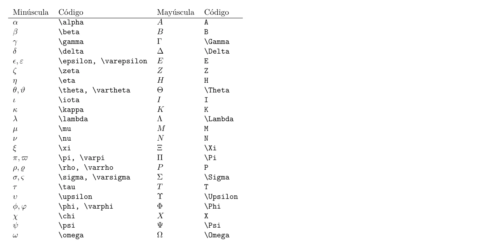

[📄 Ver PDF](assets/previews/ECUACIONES_013.pdf)


### Raíces

```latex
$\sqrt{x}$          % Raíz cuadrada
$\sqrt[3]{x}$       % Raíz cúbica
$\sqrt[n]{x}$       % Raíz n-ésima
$\sqrt{a^2 + b^2}$  % Raíz de expresión
```

---

## Subíndices y superíndices

### Básicos

```latex
$x^2$           % Superíndice simple
$x_1$           % Subíndice simple
$x^{n+1}$       % Superíndice compuesto
$x_{i,j}$       % Subíndice compuesto
$x_i^2$         % Ambos
$x^{2^n}$       % Superíndice de superíndice
${}_a^b X$      % Pre-superíndice y pre-subíndice
```

### Ejemplos

```latex
$a_1, a_2, \ldots, a_n$

$x_{ij}^{(k)}$

$\sum_{i=1}^{n} x_i^2$

$\lim_{n \to \infty} a_n$

$\int_{-\infty}^{+\infty} e^{-x^2} dx$
```

### Límites debajo/encima

```latex
% En línea
$\sum_{i=1}^n$

% En display (límites debajo/encima)
\[
    \sum_{i=1}^n  \quad \prod_{j=1}^m
\]

% Forzar límites debajo en línea
$\sum\limits_{i=1}^n$

% Forzar límites al lado en display
\[
    \sum\nolimits_{i=1}^n
\]
```

---

## Matrices y sistemas

### Matrices básicas

```latex <!-- preview -->
% Sin delimitadores
\begin{equation}
    \begin{matrix}
        a & b \\
        c & d
    \end{matrix}
\end{equation}

% Con paréntesis
\begin{equation}
    \begin{pmatrix}
        a & b \\
        c & d
    \end{pmatrix}
\end{equation}

% Con corchetes
\begin{equation}
    \begin{bmatrix}
        a & b \\
        c & d
    \end{bmatrix}
\end{equation}

% Con llaves
\begin{equation}
    \begin{Bmatrix}
        a & b \\
        c & d
    \end{Bmatrix}
\end{equation}

% Con barras (determinante)
\begin{equation}
    \begin{vmatrix}
        a & b \\
        c & d
    \end{vmatrix}
\end{equation}

% Con doble barra (norma)
\begin{equation}
    \begin{Vmatrix}
        a & b \\
        c & d
    \end{Vmatrix}
\end{equation}
```

**Resultado:**


[📄 Ver PDF](assets/previews/ECUACIONES_011.pdf)


### Matrices con puntos

```latex <!-- preview -->
\begin{equation}
    A = \begin{pmatrix}
        a_{11} & a_{12} & \cdots & a_{1n} \\
        a_{21} & a_{22} & \cdots & a_{2n} \\
        \vdots & \vdots & \ddots & \vdots \\
        a_{m1} & a_{m2} & \cdots & a_{mn}
    \end{pmatrix}
\end{equation}
```

**Resultado:**

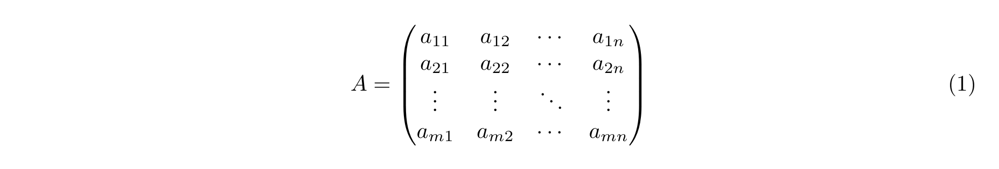

[📄 Ver PDF](assets/previews/ECUACIONES_008.pdf)


### Matriz identidad

```latex <!-- preview -->
\begin{equation}
    I_n = \begin{pmatrix}
        1 & 0 & \cdots & 0 \\
        0 & 1 & \cdots & 0 \\
        \vdots & \vdots & \ddots & \vdots \\
        0 & 0 & \cdots & 1
    \end{pmatrix}
\end{equation}
```

**Resultado:**

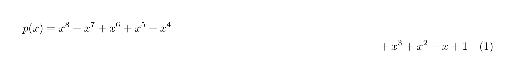

[📄 Ver PDF](assets/previews/ECUACIONES_009.pdf)


### Matriz pequeña en línea

```latex <!-- preview -->
La matriz $\bigl(\begin{smallmatrix} a & b \\ c & d \end{smallmatrix}\bigr)$ 
es invertible si $ad - bc \neq 0$.
```

**Resultado:**

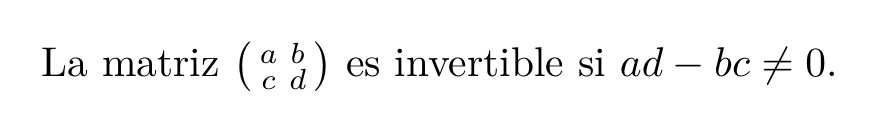

[📄 Ver PDF](assets/previews/ECUACIONES_017.pdf)


### Sistemas de ecuaciones

```latex <!-- preview -->
\begin{equation}
    \begin{cases}
        x + y + z = 1 \\
        2x - y + 3z = 4 \\
        -x + 2y - z = -3
    \end{cases}
\end{equation}

% Sistema con alineación
\begin{equation}
    \left\{
    \begin{aligned}
        x + y + z &= 1 \\
        2x - y + 3z &= 4 \\
        -x + 2y - z &= -3
    \end{aligned}
    \right.
\end{equation}
```

**Resultado:**


[📄 Ver PDF](assets/previews/ECUACIONES_010.pdf)


### Matriz aumentada

```latex <!-- preview -->
\begin{equation}
    \left(\begin{array}{ccc|c}
        1 & 2 & 3 & 4 \\
        5 & 6 & 7 & 8 \\
        9 & 10 & 11 & 12
    \end{array}\right)
\end{equation}
```

**Resultado:**


[📄 Ver PDF](assets/previews/ECUACIONES_011.pdf)


---

## Alineación de ecuaciones

### Alineación simple con align

```latex <!-- preview -->
\begin{align}
    f(x) &= (x+1)^2 \\
         &= x^2 + 2x + 1
\end{align}
```

**Resultado:**


[📄 Ver PDF](assets/previews/ECUACIONES_012.pdf)


### Múltiples puntos de alineación

```latex <!-- preview -->
\begin{align}
    x &= a + b & y &= c + d \\
    x' &= a' + b' & y' &= c' + d'
\end{align}
```

**Resultado:**

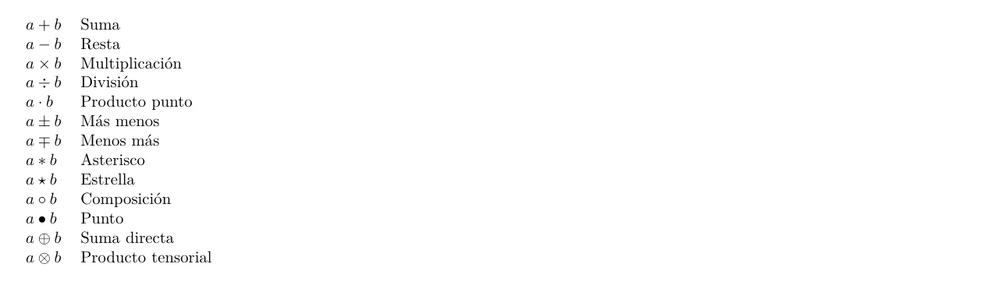

[📄 Ver PDF](assets/previews/ECUACIONES_015.pdf)


### Texto dentro de ecuaciones

```latex <!-- preview -->
\begin{align}
    f(x) &= x^2 - 4 \\
         &= (x-2)(x+2) && \text{factorizando} \\
         &= 0 && \text{si } x = \pm 2
\end{align}
```

**Resultado:**

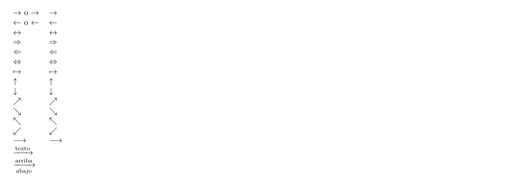

[📄 Ver PDF](assets/previews/ECUACIONES_016.pdf)


### Intertext

```latex <!-- preview -->
\begin{align}
    x^2 + y^2 &= r^2
    \intertext{sustituyendo $y = x$:}
    2x^2 &= r^2 \\
    x &= \frac{r}{\sqrt{2}}
\end{align}
```

**Resultado:**


[📄 Ver PDF](assets/previews/ECUACIONES_017.pdf)


### Numerar solo algunas ecuaciones

```latex <!-- preview -->
\begin{align}
    a &= b + c \notag \\
    d &= e + f \\
    g &= h + i \notag
\end{align}
```

**Resultado:**

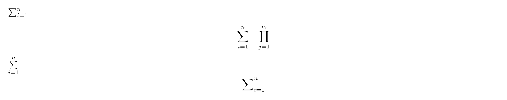

[📄 Ver PDF](assets/previews/ECUACIONES_024.pdf)


### Etiquetar con tag

```latex <!-- preview -->
\begin{equation}
    E = mc^2 \tag{Einstein}
\end{equation}

\begin{equation}
    F = ma \tag{$\ast$}
\end{equation}
```

**Resultado:**


[📄 Ver PDF](assets/previews/ECUACIONES_013.pdf)


---

## Teoremas y definiciones

### Usar entornos predefinidos

```latex <!-- preview -->
\begin{teorema}[Pitágoras]
    En un triángulo rectángulo, el cuadrado de la hipotenusa 
    es igual a la suma de los cuadrados de los catetos:
    \begin{equation}
        c^2 = a^2 + b^2
    \end{equation}
\end{teorema}

\begin{proof}
    Sea un triángulo rectángulo con catetos $a$ y $b$ e 
    hipotenusa $c$. Por construcción geométrica...
\end{proof}
```

**Resultado:**


[📄 Ver PDF](assets/previews/ECUACIONES_009.pdf)


```latex <!-- preview -->
\begin{definicion}[Derivada]
    La derivada de una función $f$ en un punto $a$ es:
    \begin{equation}
        f'(a) = \lim_{h \to 0} \frac{f(a+h) - f(a)}{h}
    \end{equation}
    siempre que este límite exista.
\end{definicion}
```

**Resultado:**


[📄 Ver PDF](assets/previews/ECUACIONES_010.pdf)


```latex <!-- preview -->
\begin{lema}
    Si $f$ es continua en $[a,b]$ y derivable en $(a,b)$,
    entonces existe $c \in (a,b)$ tal que:
    \begin{equation}
        f'(c) = \frac{f(b) - f(a)}{b - a}
    \end{equation}
\end{lema}
```

**Resultado:**


[📄 Ver PDF](assets/previews/ECUACIONES_011.pdf)


```latex <!-- preview -->
\begin{ejemplo}
    Calcular la derivada de $f(x) = x^3$:
    \begin{align*}
        f'(x) &= \lim_{h \to 0} \frac{(x+h)^3 - x^3}{h} \\
              &= \lim_{h \to 0} \frac{3x^2h + 3xh^2 + h^3}{h} \\
              &= 3x^2
    \end{align*}
\end{ejemplo}
```

**Resultado:**

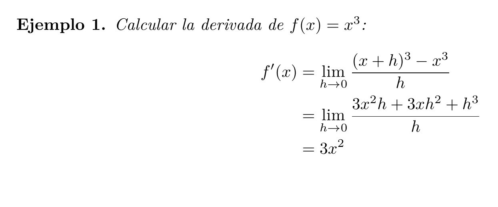

[📄 Ver PDF](assets/previews/ECUACIONES_029.pdf)


### Crear nuevos entornos

```latex
% En preámbulo
\newtheorem{observacion}{Observación}[chapter]
\newtheorem{hipotesis}{Hipótesis}
\newtheorem*{nota}{Nota}  % Sin numeración

% Uso
\begin{observacion}
    Este resultado se puede generalizar...
\end{observacion}

\begin{nota}
    Esta nota no está numerada.
\end{nota}
```

---

## Trucos avanzados

### Delimitadores escalables

```latex
% Automático
\left( \frac{a}{b} \right)
\left[ \frac{a}{b} \right]
\left\{ \frac{a}{b} \right\}
\left| \frac{a}{b} \right|
\left\| \frac{a}{b} \right\|

% Manual
\big( \Big( \bigg( \Bigg(
\big] \Big] \bigg] \Bigg]

% Delimitador invisible
\left. \frac{df}{dx} \right|_{x=0}
```

### Acentos matemáticos

```latex
$\hat{x}$       % Sombrero
$\bar{x}$       % Barra
$\vec{x}$       % Vector
$\dot{x}$       % Punto (derivada temporal)
$\ddot{x}$      % Doble punto
$\tilde{x}$     % Tilde
$\widehat{xyz}$ % Sombrero ancho
$\widetilde{xyz}$ % Tilde ancha
$\overline{xy}$ % Línea superior
$\underline{xy}$ % Línea inferior
$\overbrace{x+y}^{z}$ % Llave superior
$\underbrace{x+y}_{z}$ % Llave inferior
```

### Estilos de fuente en matemáticas

```latex
$\mathbf{v}$    % Negrita (vectores)
$\bm{v}$        % Negrita mejorada (paquete bm)
$\mathit{diff}$ % Itálica
$\mathrm{const}$ % Romana (texto)
$\mathsf{ABC}$  % Sans-serif
$\mathtt{code}$ % Typewriter
$\mathcal{L}$   % Caligráfica
$\mathscr{L}$   % Script (mathrsfs)
$\mathbb{R}$    % Blackboard bold
$\mathfrak{g}$  % Fraktur
```

### Espaciado en matemáticas

```latex
$a\,b$          % Espacio fino
$a\:b$          % Espacio medio
$a\;b$          % Espacio grueso
$a\quad b$      % Quad
$a\qquad b$     % Doble quad
$a\!b$          % Espacio negativo fino
$a\negthinspace b$ % Igual que \!
```

### Texto en modo matemático

```latex <!-- preview -->
% Texto normal
$x = 1 \text{ si } y > 0$

% Texto con formato
$\text{velocidad} = \frac{\text{distancia}}{\text{tiempo}}$

% Intertext para texto entre líneas
\begin{align}
    x &= y + z
    \intertext{donde}
    y &= a + b
\end{align}
```

**Resultado:**

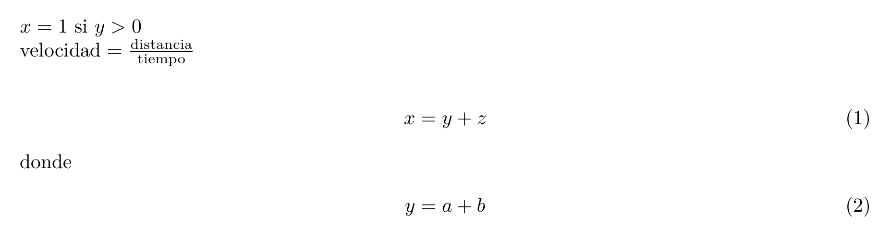

[📄 Ver PDF](assets/previews/ECUACIONES_030.pdf)


### Cancelar términos

```latex
\usepackage{cancel}

$\frac{x^2 - 1}{x - 1} = \frac{\cancel{(x-1)}(x+1)}{\cancel{x-1}} = x + 1$

$\cancelto{0}{\sin(0)}$
```

### Cajas en ecuaciones

```latex <!-- preview -->
\begin{equation}
    \boxed{E = mc^2}
\end{equation}

% Con color
\begin{equation}
    \colorbox{yellow}{$E = mc^2$}
\end{equation}
```

**Resultado:**

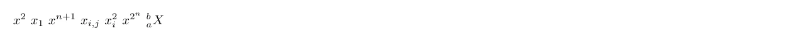

[📄 Ver PDF](assets/previews/ECUACIONES_022.pdf)


### Entorno para describir variables

```latex
% Definido en la plantilla
\begin{equation}
    F = ma
\end{equation}
\begin{condiciones}
    F & fuerza aplicada (\si{\newton}) \\
    m & masa del cuerpo (\si{\kilogram}) \\
    a & aceleración (\si{\meter\per\second\squared})
\end{condiciones}
```

### Ecuaciones con flechas de implicación

```latex <!-- preview -->
\begin{align}
    x^2 &= 4 \\
    \Downarrow \\
    x &= \pm 2
\end{align}
```

**Resultado:**

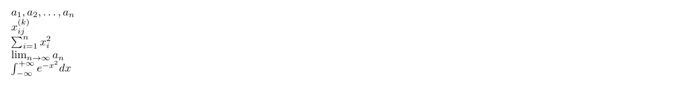

[📄 Ver PDF](assets/previews/ECUACIONES_023.pdf)


---

## Ejemplos completos

### Integral de Gauss

```latex <!-- preview:2 -->
\begin{teorema}[Integral de Gauss]
    La integral de la función gaussiana sobre toda la recta real es:
    \begin{equation}
        \int_{-\infty}^{+\infty} e^{-x^2} dx = \sqrt{\pi}
        \label{eq:gauss}
    \end{equation}
\end{teorema}

\begin{proof}
    Consideramos el cuadrado de la integral:
    \begin{align}
        I^2 &= \left(\int_{-\infty}^{+\infty} e^{-x^2} dx\right)
               \left(\int_{-\infty}^{+\infty} e^{-y^2} dy\right) \\
            &= \int_{-\infty}^{+\infty} \int_{-\infty}^{+\infty} 
               e^{-(x^2+y^2)} dx\, dy
    \end{align}
    Pasando a coordenadas polares...
\end{proof}
```

**Resultado:**


[📄 Ver PDF](assets/previews/ECUACIONES_033.pdf)


### Ecuaciones de Maxwell

```latex <!-- preview:2 -->
Las ecuaciones de Maxwell en forma diferencial son:
\begin{subequations}
    \begin{align}
        \nabla \cdot \mathbf{E} &= \frac{\rho}{\varepsilon_0} 
            && \text{(Ley de Gauss)} \\
        \nabla \cdot \mathbf{B} &= 0 
            && \text{(No monopolos)} \\
        \nabla \times \mathbf{E} &= -\frac{\partial \mathbf{B}}{\partial t} 
            && \text{(Ley de Faraday)} \\
        \nabla \times \mathbf{B} &= \mu_0 \mathbf{J} + 
            \mu_0 \varepsilon_0 \frac{\partial \mathbf{E}}{\partial t}
            && \text{(Ley de Ampère)}
    \end{align}
    \label{eq:maxwell}
\end{subequations}
```

**Resultado:**

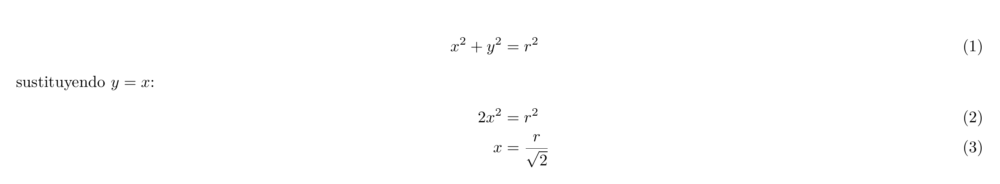

[📄 Ver PDF](assets/previews/ECUACIONES_034.pdf)


---

## Recursos adicionales

- [Documentación de amsmath](https://ctan.org/pkg/amsmath)
- [Documentación de mathtools](https://ctan.org/pkg/mathtools)
- [LaTeX Math Symbols](https://oeis.org/wiki/List_of_LaTeX_mathematical_symbols)
- [Detexify](https://detexify.kirelabs.org/) - Dibuja símbolos para encontrar su código

---

## Ver también

- [TEXTO_LISTAS.md](TEXTO_LISTAS.md) - Formato de texto
- [TABLAS.md](TABLAS.md) - Tablas (útil para matrices)
- [FIGURAS_GRAFICAS.md](FIGURAS_GRAFICAS.md) - Gráficas de funciones
