# 📊 Guía de Figuras y Gráficas con PGFPlots

Esta guía explica cómo crear gráficas profesionales usando **pgfplots** y **TikZ**, los paquetes más potentes para visualización de datos en LaTeX.

---

## 📋 Índice

- [📋 Índice](#-índice)
- [Introducción](#introducción)
  - [Estructura básica](#estructura-básica)
- [Gráficas básicas](#gráficas-básicas)
  - [Gráfica de línea simple](#gráfica-de-línea-simple)
  - [Gráfica de función matemática](#gráfica-de-función-matemática)
  - [Gráfica con barras de error](#gráfica-con-barras-de-error)
- [Tipos de gráficas](#tipos-de-gráficas)
  - [Gráfica de barras verticales](#gráfica-de-barras-verticales)
  - [Gráfica de barras horizontales](#gráfica-de-barras-horizontales)
  - [Gráfica de barras agrupadas](#gráfica-de-barras-agrupadas)
  - [Gráfica de barras apiladas](#gráfica-de-barras-apiladas)
  - [Histograma](#histograma)
  - [Gráfica de dispersión (scatter)](#gráfica-de-dispersión-scatter)
  - [Gráfica de área](#gráfica-de-área)
  - [Gráfica polar](#gráfica-polar)
  - [Box plot](#box-plot)
- [Personalización](#personalización)
  - [Opciones del eje (axis)](#opciones-del-eje-axis)
  - [Opciones de plot (addplot)](#opciones-de-plot-addplot)
  - [Estilos de línea predefinidos](#estilos-de-línea-predefinidos)
  - [Colores personalizados](#colores-personalizados)
  - [Mapas de colores (colormaps)](#mapas-de-colores-colormaps)
- [Múltiples gráficas](#múltiples-gráficas)
  - [Subfiguras con gráficas](#subfiguras-con-gráficas)
  - [Groupplots (múltiples ejes)](#groupplots-múltiples-ejes)
  - [Dos ejes Y](#dos-ejes-y)
- [Datos externos](#datos-externos)
  - [Desde archivo CSV](#desde-archivo-csv)
  - [Desde archivo con espacios](#desde-archivo-con-espacios)
  - [Con pgfplotstable](#con-pgfplotstable)
  - [Opciones de lectura de tabla](#opciones-de-lectura-de-tabla)
- [Gráficas 3D](#gráficas-3d)
  - [Superficie 3D](#superficie-3d)
  - [Malla 3D](#malla-3d)
  - [Contornos](#contornos)
  - [Scatter 3D](#scatter-3d)
- [Gráficas circulares](#gráficas-circulares)
  - [Pie chart básico](#pie-chart-básico)
  - [Pie chart con porcentajes](#pie-chart-con-porcentajes)
  - [Opciones de pgf-pie](#opciones-de-pgf-pie)
  - [Donut chart](#donut-chart)
- [Opciones avanzadas](#opciones-avanzadas)
  - [Área entre curvas (fill between)](#área-entre-curvas-fill-between)
  - [Anotaciones](#anotaciones)
  - [Líneas de referencia](#líneas-de-referencia)
  - [Estilos globales (cycle list)](#estilos-globales-cycle-list)
- [Solución de problemas](#solución-de-problemas)
  - [La gráfica es muy pequeña/grande](#la-gráfica-es-muy-pequeñagrande)
  - [Los números se superponen](#los-números-se-superponen)
  - [La leyenda tapa la gráfica](#la-leyenda-tapa-la-gráfica)
  - [Compilación muy lenta](#compilación-muy-lenta)
  - [Error "Dimension too large"](#error-dimension-too-large)
- [Ejemplos completos](#ejemplos-completos)
  - [Gráfica científica completa](#gráfica-científica-completa)
- [Recursos adicionales](#recursos-adicionales)
- [Ver también](#ver-también)

---

## Introducción

Esta plantilla carga los siguientes paquetes para gráficas:

```latex
% Ya incluidos en la clase eps-tfg
\RequirePackage{tikz}
\RequirePackage{pgfplots}
\pgfplotsset{compat=1.18}
\usepgfplotslibrary{patchplots,groupplots,fillbetween,polar}
\RequirePackage{pgfplotstable}
\RequirePackage{pgf-pie}  % Para gráficas circulares
```

### Estructura básica

```latex <!-- preview:2 -->
\begin{figure}[htbp]
    \centering
    \begin{tikzpicture}
        \begin{axis}[
            % opciones del eje
        ]
            % datos y plots
        \end{axis}
    \end{tikzpicture}
    \caption{Descripción de la gráfica}
    \label{fig:mi-grafica}
\end{figure}
```

**Resultado:**

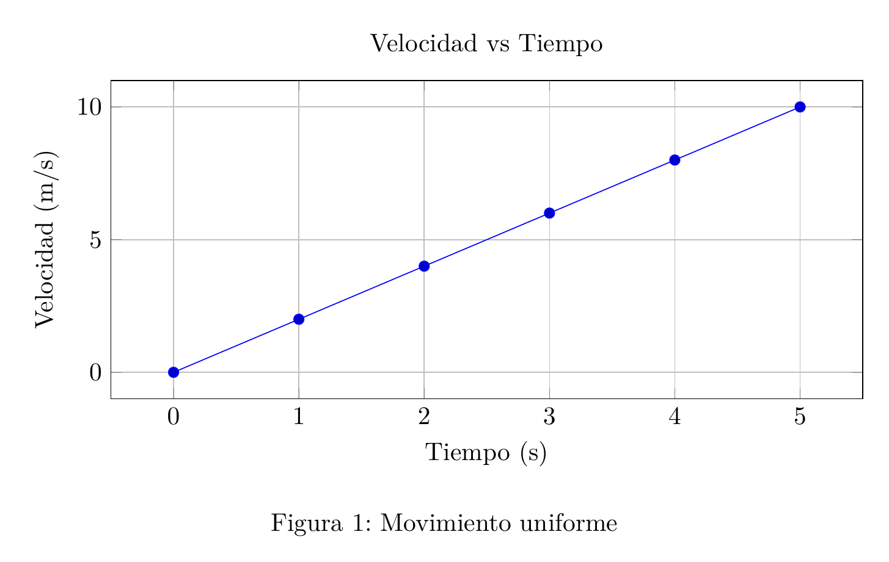

[📄 Ver PDF](assets/previews/FIGURAS_GRAFICAS_001.pdf)

---

## Gráficas básicas

### Gráfica de línea simple

```latex <!-- preview -->
\begin{figure}[htbp]
    \centering
    \begin{tikzpicture}
        \begin{axis}[
            xlabel={Tiempo (s)},
            ylabel={Velocidad (m/s)},
            title={Velocidad vs Tiempo},
            grid=major,
            width=0.8\textwidth,
            height=6cm,
        ]
            \addplot coordinates {
                (0, 0)
                (1, 2)
                (2, 4)
                (3, 6)
                (4, 8)
                (5, 10)
            };
        \end{axis}
    \end{tikzpicture}
    \caption{Movimiento uniforme}
    \label{fig:velocidad}
\end{figure}
```

**Resultado:**

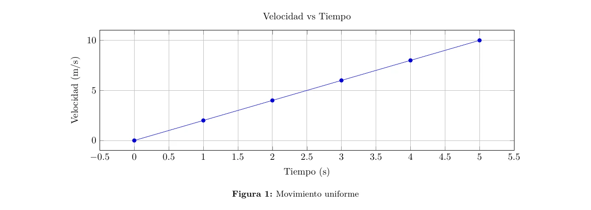

[📄 Ver PDF](assets/previews/FIGURAS_GRAFICAS_002.pdf)

### Gráfica de función matemática

```latex <!-- preview -->
\begin{figure}[htbp]
    \centering
    \begin{tikzpicture}
        \begin{axis}[
            xlabel={$x$},
            ylabel={$f(x)$},
            domain=-3:3,
            samples=100,
            grid=both,
            legend pos=north west,
        ]
            \addplot[blue, thick] {x^2};
            \addplot[red, thick, dashed] {x^3};
            \addplot[green!60!black, thick, dotted] {sin(deg(x))*3};
            \legend{$x^2$, $x^3$, $3\sin(x)$}
        \end{axis}
    \end{tikzpicture}
    \caption{Comparación de funciones}
    \label{fig:funciones}
\end{figure}
```

**Resultado:**

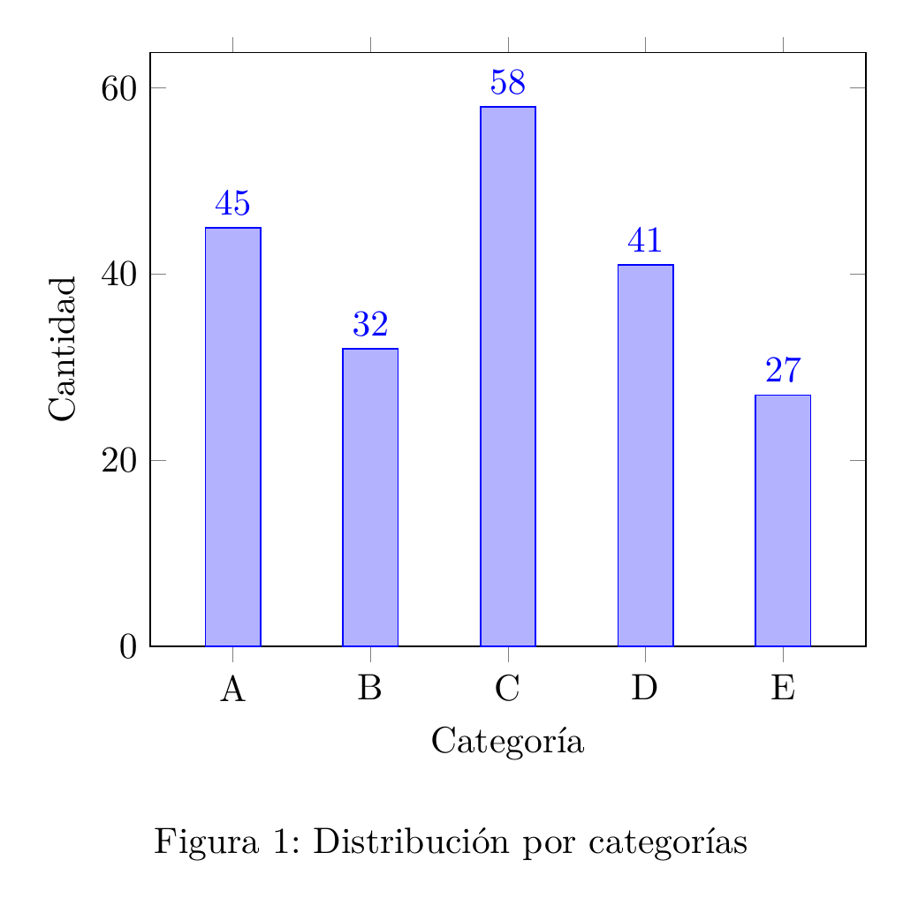

[📄 Ver PDF](assets/previews/FIGURAS_GRAFICAS_003.pdf)

### Gráfica con barras de error

```latex <!-- preview:2 -->
\begin{figure}[htbp]
    \centering
    \begin{tikzpicture}
        \begin{axis}[
            xlabel={Muestra},
            ylabel={Valor medido},
            ybar,
            error bars/y dir=both,
            error bars/y explicit,
        ]
            \addplot+[
                error bars/.cd,
                y dir=both,
                y explicit,
            ] coordinates {
                (1, 10) +- (0, 1.5)
                (2, 15) +- (0, 2.0)
                (3, 12) +- (0, 1.8)
                (4, 18) +- (0, 2.5)
                (5, 14) +- (0, 1.2)
            };
        \end{axis}
    \end{tikzpicture}
    \caption{Mediciones con incertidumbre}
    \label{fig:errores}
\end{figure}
```

**Resultado:**

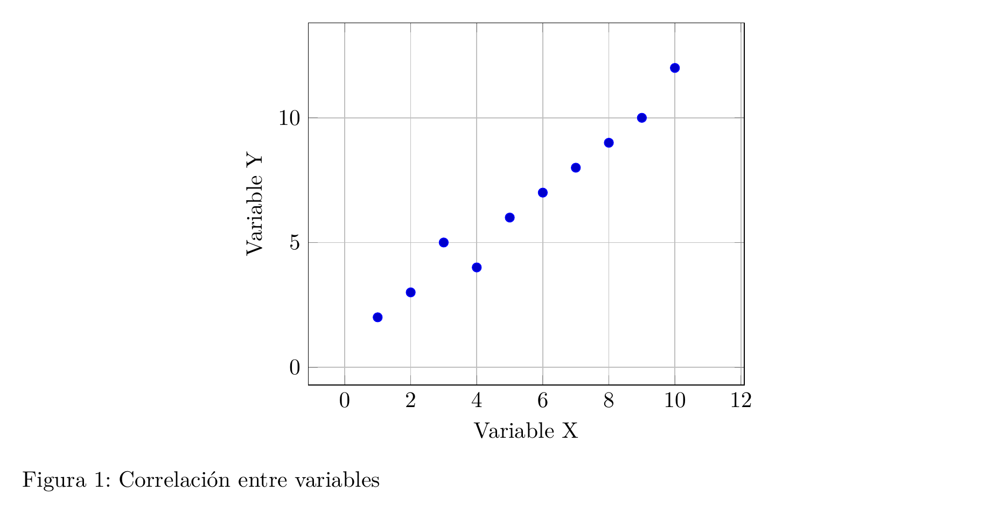

[📄 Ver PDF](assets/previews/FIGURAS_GRAFICAS_004.pdf)

---

## Tipos de gráficas

### Gráfica de barras verticales

```latex <!-- preview -->
\begin{figure}[htbp]
    \centering
    \begin{tikzpicture}
        \begin{axis}[
            ybar,
            xlabel={Categoría},
            ylabel={Cantidad},
            symbolic x coords={A, B, C, D, E},
            xtick=data,
            nodes near coords,
            nodes near coords align={vertical},
            ymin=0,
            bar width=15pt,
            enlarge x limits=0.15,
        ]
            \addplot coordinates {(A, 45) (B, 32) (C, 58) (D, 41) (E, 27)};
        \end{axis}
    \end{tikzpicture}
    \caption{Distribución por categorías}
    \label{fig:barras-verticales}
\end{figure}
```

**Resultado:**

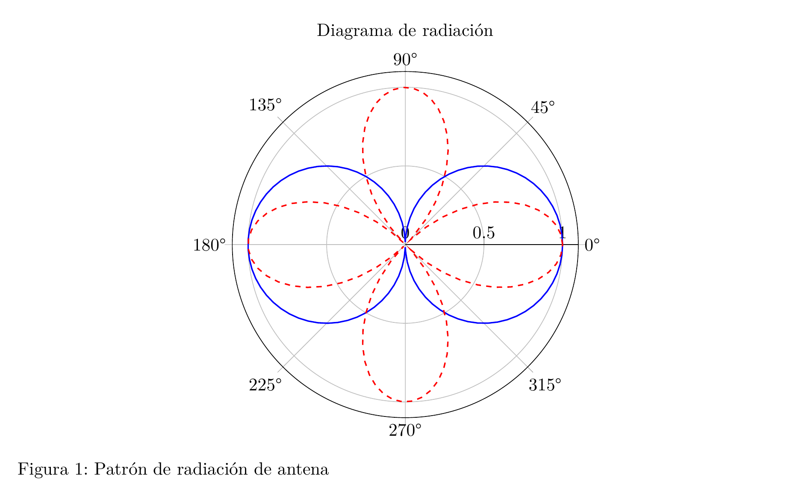

[📄 Ver PDF](assets/previews/FIGURAS_GRAFICAS_005.pdf)

### Gráfica de barras horizontales

```latex
\begin{figure}[htbp]
    \centering
    \begin{tikzpicture}
        \begin{axis}[
            xbar,
            xlabel={Porcentaje (\%)},
            symbolic y coords={Python, Java, JavaScript, C++, Go},
            ytick=data,
            nodes near coords,
            nodes near coords align={horizontal},
            xmin=0,
            xmax=100,
            bar width=12pt,
            enlarge y limits=0.15,
        ]
            \addplot coordinates {
                (35, Python)
                (28, Java)
                (22, JavaScript)
                (10, C++)
                (5, Go)
            };
        \end{axis}
    \end{tikzpicture}
    \caption{Popularidad de lenguajes de programación}
    \label{fig:barras-horizontales}
\end{figure}
```

**Resultado:**


[📄 Ver PDF](assets/previews/FIGURAS_GRAFICAS_005.pdf)

### Gráfica de barras agrupadas

```latex <!-- preview -->
\begin{figure}[htbp]
    \centering
    \begin{tikzpicture}
        \begin{axis}[
            ybar,
            xlabel={Trimestre},
            ylabel={Ventas (miles €)},
            symbolic x coords={Q1, Q2, Q3, Q4},
            xtick=data,
            legend style={at={(0.5,-0.2)}, anchor=north, legend columns=3},
            ymin=0,
            bar width=10pt,
            enlarge x limits=0.2,
        ]
            \addplot coordinates {(Q1, 45) (Q2, 52) (Q3, 48) (Q4, 61)};
            \addplot coordinates {(Q1, 38) (Q2, 45) (Q3, 50) (Q4, 55)};
            \addplot coordinates {(Q1, 30) (Q2, 35) (Q3, 42) (Q4, 48)};
            \legend{Producto A, Producto B, Producto C}
        \end{axis}
    \end{tikzpicture}
    \caption{Ventas trimestrales por producto}
    \label{fig:barras-agrupadas}
\end{figure}
```

**Resultado:**

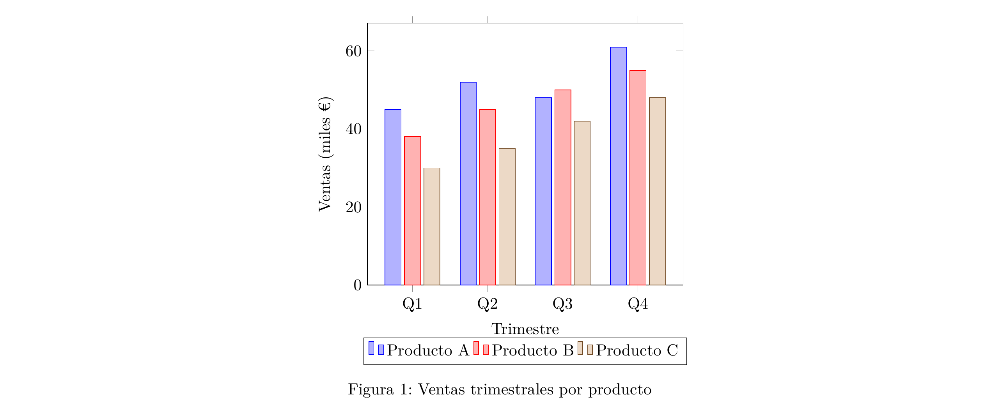

[📄 Ver PDF](assets/previews/FIGURAS_GRAFICAS_006.pdf)

### Gráfica de barras apiladas

```latex <!-- preview -->
\begin{figure}[htbp]
    \centering
    \begin{tikzpicture}
        \begin{axis}[
            ybar stacked,
            xlabel={Año},
            ylabel={Usuarios (millones)},
            symbolic x coords={2020, 2021, 2022, 2023, 2024},
            xtick=data,
            legend style={at={(1.02,0.5)}, anchor=west},
            ymin=0,
            bar width=20pt,
        ]
            \addplot+[fill=blue!60] coordinates {
                (2020, 10) (2021, 15) (2022, 20) (2023, 25) (2024, 30)
            };
            \addplot+[fill=red!60] coordinates {
                (2020, 5) (2021, 8) (2022, 12) (2023, 18) (2024, 22)
            };
            \addplot+[fill=green!60] coordinates {
                (2020, 3) (2021, 5) (2022, 8) (2023, 12) (2024, 15)
            };
            \legend{Móvil, Web, Desktop}
        \end{axis}
    \end{tikzpicture}
    \caption{Evolución de usuarios por plataforma}
    \label{fig:barras-apiladas}
\end{figure}
```

**Resultado:**

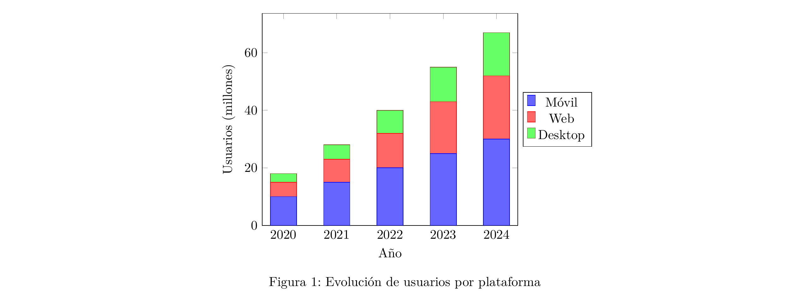

[📄 Ver PDF](assets/previews/FIGURAS_GRAFICAS_007.pdf)

### Histograma

```latex <!-- preview -->
\begin{figure}[htbp]
    \centering
    \begin{tikzpicture}
        \begin{axis}[
            ybar interval,
            xlabel={Rango de edad},
            ylabel={Frecuencia},
            xticklabel style={rotate=45, anchor=east},
            ymin=0,
        ]
            \addplot+[hist={bins=10, data min=0, data max=100}]
                table[row sep=\\, y index=0] {
                    data\\
                    23\\ 45\\ 32\\ 67\\ 54\\ 28\\ 41\\ 73\\ 
                    19\\ 55\\ 38\\ 62\\ 47\\ 31\\ 58\\ 44\\
                    26\\ 51\\ 69\\ 35\\ 42\\ 57\\ 33\\ 48\\
                };
        \end{axis}
    \end{tikzpicture}
    \caption{Distribución de edades}
    \label{fig:histograma}
\end{figure}
```

**Resultado:**

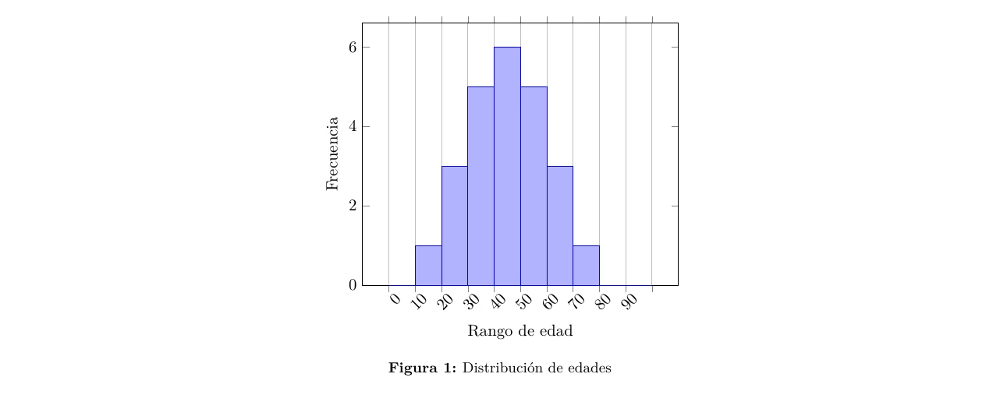

[📄 Ver PDF](assets/previews/FIGURAS_GRAFICAS_008.pdf)

### Gráfica de dispersión (scatter)

```latex <!-- preview -->
\begin{figure}[htbp]
    \centering
    \begin{tikzpicture}
        \begin{axis}[
            xlabel={Variable X},
            ylabel={Variable Y},
            only marks,
            mark=*,
            mark size=2pt,
            grid=major,
        ]
            \addplot+[blue] coordinates {
                (1,2) (2,3) (3,5) (4,4) (5,6)
                (6,7) (7,8) (8,9) (9,10) (10,12)
            };
            % Línea de tendencia
            \addplot[red, thick, domain=0:11] {1.1*x + 0.5};
        \end{axis}
    \end{tikzpicture}
    \caption{Correlación entre variables}
    \label{fig:scatter}
\end{figure}
```

**Resultado:**

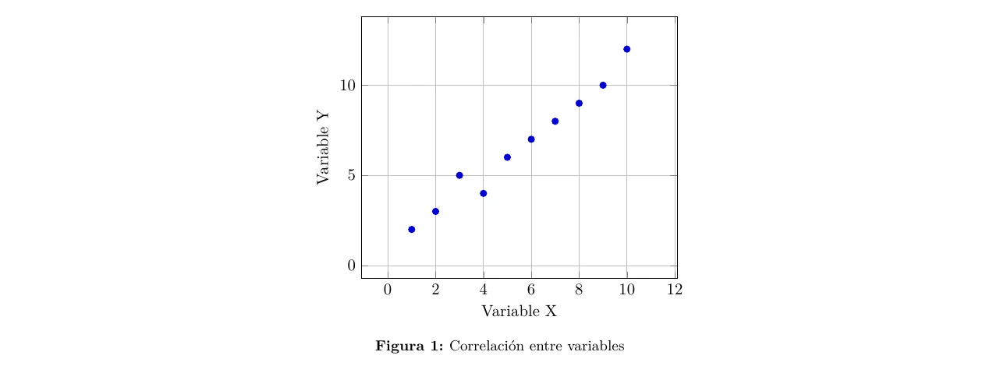

[📄 Ver PDF](assets/previews/FIGURAS_GRAFICAS_009.pdf)

### Gráfica de área

```latex <!-- preview -->
\begin{figure}[htbp]
    \centering
    \begin{tikzpicture}
        \begin{axis}[
            xlabel={Tiempo},
            ylabel={Valor},
            stack plots=y,
            area style,
            legend style={at={(0.5,-0.15)}, anchor=north, legend columns=3},
        ]
            \addplot+[fill=blue!30] coordinates {
                (0,1) (1,1) (2,2) (3,2) (4,3) (5,3)
            } \closedcycle;
            \addplot+[fill=red!30] coordinates {
                (0,2) (1,2) (2,3) (3,3) (4,4) (5,5)
            } \closedcycle;
            \addplot+[fill=green!30] coordinates {
                (0,1) (1,2) (2,1) (3,2) (4,2) (5,3)
            } \closedcycle;
            \legend{Serie A, Serie B, Serie C}
        \end{axis}
    \end{tikzpicture}
    \caption{Gráfica de áreas apiladas}
    \label{fig:area}
\end{figure}
```

**Resultado:**

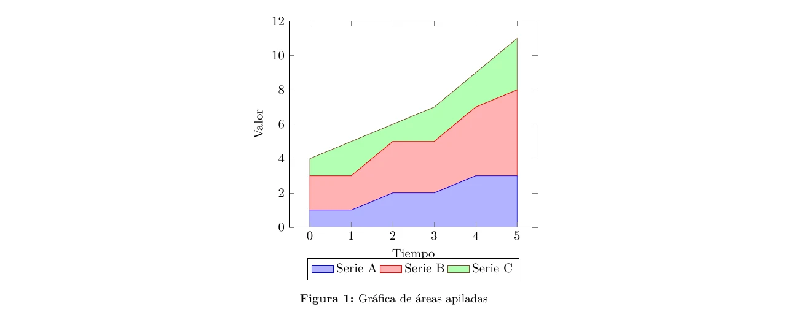

[📄 Ver PDF](assets/previews/FIGURAS_GRAFICAS_010.pdf)

### Gráfica polar

```latex <!-- preview -->
\begin{figure}[htbp]
    \centering
    \begin{tikzpicture}
        \begin{polaraxis}[
            title={Diagrama de radiación},
            xtick={0, 45, 90, 135, 180, 225, 270, 315},
            xticklabels={$0°$, $45°$, $90°$, $135°$, $180°$, $225°$, $270°$, $315°$},
        ]
            \addplot[blue, thick, domain=0:360, samples=100] 
                {abs(cos(x))};
            \addplot[red, thick, dashed, domain=0:360, samples=100] 
                {abs(cos(2*x))};
        \end{polaraxis}
    \end{tikzpicture}
    \caption{Patrón de radiación de antena}
    \label{fig:polar}
\end{figure}
```

**Resultado:**

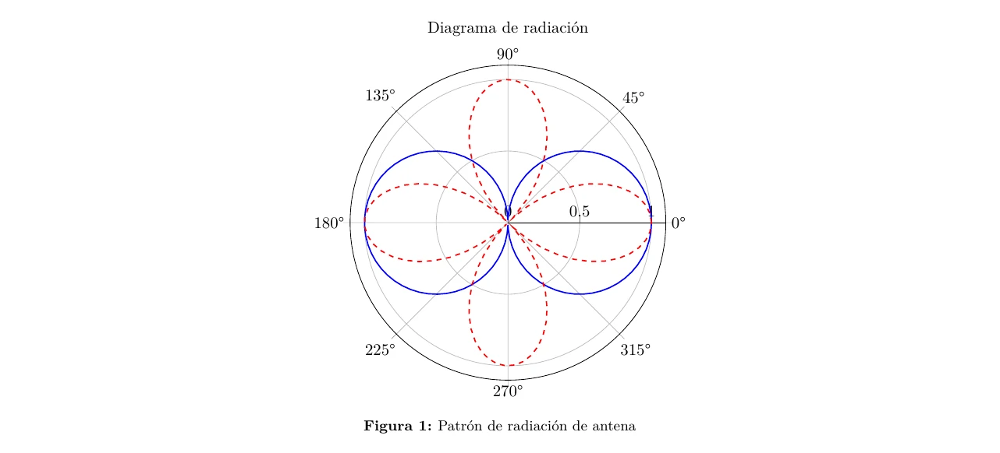

[📄 Ver PDF](assets/previews/FIGURAS_GRAFICAS_011.pdf)

### Box plot

```latex <!-- preview -->
\begin{figure}[htbp]
    \centering
    \begin{tikzpicture}
        \begin{axis}[
            boxplot/draw direction=y,
            xlabel={Grupo},
            ylabel={Valor},
            xtick={1,2,3},
            xticklabels={Control, Tratamiento A, Tratamiento B},
        ]
            \addplot+[boxplot prepared={
                median=5,
                upper quartile=6.5,
                lower quartile=3.5,
                upper whisker=9,
                lower whisker=1
            }] coordinates {};
            
            \addplot+[boxplot prepared={
                median=7,
                upper quartile=8.5,
                lower quartile=5.5,
                upper whisker=11,
                lower whisker=3
            }] coordinates {};
            
            \addplot+[boxplot prepared={
                median=8.5,
                upper quartile=10,
                lower quartile=7,
                upper whisker=12,
                lower whisker=5
            }] coordinates {};
        \end{axis}
    \end{tikzpicture}
    \caption{Comparación de tratamientos}
    \label{fig:boxplot}
\end{figure}
```

**Resultado:**

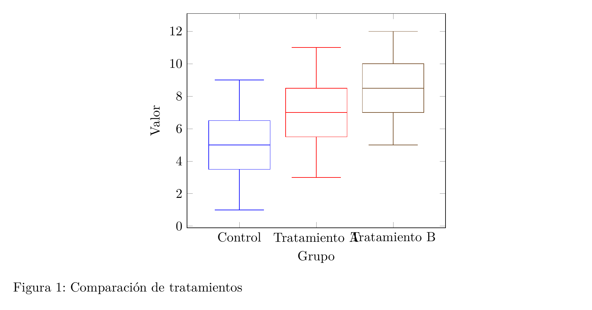

[📄 Ver PDF](assets/previews/FIGURAS_GRAFICAS_012.pdf)

---

## Personalización

### Opciones del eje (axis)

| Opción | Descripción | Valores |
| -------- | ------------- | --------- |
| `width` | Ancho de la gráfica | `10cm`, `0.8\textwidth` |
| `height` | Alto de la gráfica | `6cm`, `0.5\textwidth` |
| `xlabel` | Etiqueta eje X | Texto o matemáticas `{$x$}` |
| `ylabel` | Etiqueta eje Y | Texto o matemáticas `{$f(x)$}` |
| `title` | Título de la gráfica | Texto |
| `xmin`, `xmax` | Límites eje X | Números |
| `ymin`, `ymax` | Límites eje Y | Números |
| `xtick` | Marcas en eje X | `{0, 2, 4, 6}` o `data` |
| `ytick` | Marcas en eje Y | `{0, 50, 100}` |
| `xticklabels` | Etiquetas en eje X | `{A, B, C}` |
| `grid` | Rejilla | `none`, `major`, `minor`, `both` |
| `legend pos` | Posición leyenda | `north west`, `south east`, etc. |
| `axis lines` | Estilo de ejes | `box`, `left`, `center`, `middle` |

### Opciones de plot (addplot)

| Opción | Descripción | Valores |
| -------- | ------------- | --------- |
| `color` | Color de la línea | `blue`, `red`, `rgb,255:red,100;green,50;blue,0` |
| `thick` | Grosor de línea | `ultra thin`, `thin`, `thick`, `ultra thick` |
| `line width` | Grosor específico | `1pt`, `2mm` |
| `mark` | Marcador | `*`, `o`, `x`, `+`, `square`, `triangle`, `diamond` |
| `mark size` | Tamaño marcador | `2pt`, `3pt` |
| `mark options` | Opciones marcador | `{fill=white}` |
| `dashed` | Línea discontinua | (sin valor) |
| `dotted` | Línea punteada | (sin valor) |
| `dashdotted` | Punto-raya | (sin valor) |
| `smooth` | Suavizar línea | (sin valor) |
| `fill` | Relleno | `blue!20`, `gray!30` |
| `opacity` | Transparencia | `0.5` (0 a 1) |
| `only marks` | Solo marcadores | (sin valor) |
| `domain` | Dominio de función | `-5:5` |
| `samples` | Número de puntos | `100` |

### Estilos de línea predefinidos

```latex
\begin{axis}
    \addplot[blue, thick] ...;           % Línea azul gruesa
    \addplot[red, dashed] ...;           % Línea roja discontinua
    \addplot[green!60!black, dotted] ...; % Verde oscuro punteada
    \addplot[orange, dashdotted] ...;    % Naranja punto-raya
    \addplot[purple, densely dashed] ...; % Púrpura muy discontinua
    \addplot[cyan, loosely dotted] ...;   % Cian poco punteada
\end{axis}
```

### Colores personalizados

```latex
% Definir colores
\definecolor{miazul}{RGB}{66, 133, 244}
\definecolor{mirojo}{RGB}{219, 68, 55}
\definecolor{miverde}{RGB}{15, 157, 88}
\definecolor{minaranja}{RGB}{244, 160, 0}

% Usar en gráficas
\begin{axis}
    \addplot[miazul, thick] {x^2};
    \addplot[mirojo, thick] {x^3};
\end{axis}
```

### Mapas de colores (colormaps)

```latex
% Colormaps disponibles
\pgfplotsset{colormap/viridis}      % Por defecto en la plantilla
\pgfplotsset{colormap/hot}          % Caliente
\pgfplotsset{colormap/cool}         % Frío
\pgfplotsset{colormap/jet}          % Arcoíris (MATLAB)
\pgfplotsset{colormap/bluered}      % Azul a rojo
\pgfplotsset{colormap/greenyellow}  % Verde a amarillo
```

---

## Múltiples gráficas

### Subfiguras con gráficas

```latex <!-- preview -->
\begin{figure}[htbp]
    \centering
    \begin{subfigure}[b]{0.48\textwidth}
        \centering
        \begin{tikzpicture}
            \begin{axis}[
                width=\textwidth,
                height=5cm,
                xlabel={$x$},
                ylabel={$y$},
                title={Función lineal}
            ]
                \addplot[blue, thick, domain=0:10] {2*x + 1};
            \end{axis}
        \end{tikzpicture}
        \caption{$y = 2x + 1$}
        \label{fig:lineal}
    \end{subfigure}
    \hfill
    \begin{subfigure}[b]{0.48\textwidth}
        \centering
        \begin{tikzpicture}
            \begin{axis}[
                width=\textwidth,
                height=5cm,
                xlabel={$x$},
                ylabel={$y$},
                title={Función cuadrática}
            ]
                \addplot[red, thick, domain=-3:3] {x^2};
            \end{axis}
        \end{tikzpicture}
        \caption{$y = x^2$}
        \label{fig:cuadratica}
    \end{subfigure}
    \caption{Comparación de funciones}
    \label{fig:comparacion}
\end{figure}
```

**Resultado:**

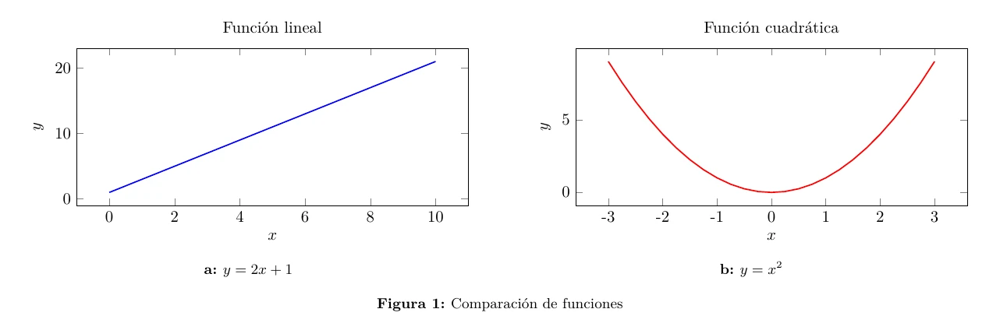

[📄 Ver PDF](assets/previews/FIGURAS_GRAFICAS_013.pdf)

### Groupplots (múltiples ejes)

```latex <!-- preview -->
\begin{figure}[htbp]
    \centering
    \begin{tikzpicture}
        \begin{groupplot}[
            group style={
                group size=2 by 2,
                horizontal sep=1.5cm,
                vertical sep=1.5cm,
            },
            width=0.45\textwidth,
            height=4cm,
        ]
            \nextgroupplot[title={Seno}]
            \addplot[blue, domain=0:360, samples=100] {sin(x)};
            
            \nextgroupplot[title={Coseno}]
            \addplot[red, domain=0:360, samples=100] {cos(x)};
            
            \nextgroupplot[title={Tangente}]
            \addplot[green!60!black, domain=-80:80, samples=100] {tan(x)};
            
            \nextgroupplot[title={Exponencial}]
            \addplot[orange, domain=-2:2, samples=100] {exp(x)};
        \end{groupplot}
    \end{tikzpicture}
    \caption{Funciones trigonométricas y exponencial}
    \label{fig:groupplot}
\end{figure}
```

**Resultado:**

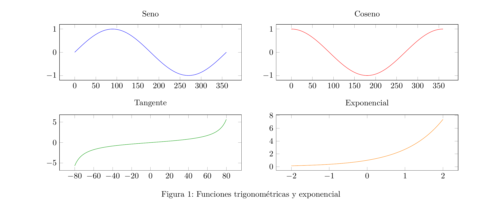

[📄 Ver PDF](assets/previews/FIGURAS_GRAFICAS_014.pdf)

### Dos ejes Y

```latex <!-- preview:2 -->
\begin{figure}[htbp]
    \centering
    \begin{tikzpicture}
        \begin{axis}[
            xlabel={Tiempo (h)},
            ylabel={Temperatura (°C)},
            axis y line*=left,
            ymin=0, ymax=100,
        ]
            \addplot[blue, thick, mark=*] coordinates {
                (0,20) (2,35) (4,50) (6,65) (8,75) (10,80)
            };
            \label{plot:temp}
        \end{axis}
        
        \begin{axis}[
            ylabel={Presión (bar)},
            axis y line*=right,
            axis x line=none,
            ymin=0, ymax=10,
        ]
            \addplot[red, thick, mark=square, dashed] coordinates {
                (0,1) (2,2) (4,3.5) (6,5) (8,7) (10,8.5)
            };
            \label{plot:presion}
        \end{axis}
    \end{tikzpicture}
    
    % Leyenda manual
    \ref{plot:temp} Temperatura \quad
    \ref{plot:presion} Presión
    
    \caption{Evolución de temperatura y presión}
    \label{fig:dos-ejes}
\end{figure}
```

**Resultado:**

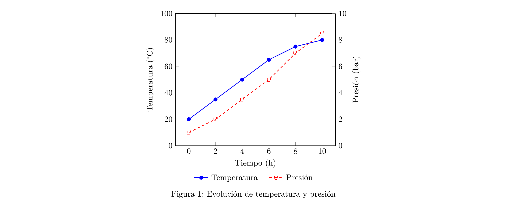

[📄 Ver PDF](assets/previews/FIGURAS_GRAFICAS_015.pdf)

---

## Datos externos

### Desde archivo CSV

```latex
% Archivo: datos/mediciones.csv
% tiempo,valor1,valor2
% 0,10,5
% 1,15,8
% 2,22,12
% ...

\begin{figure}[htbp]
    \centering
    \begin{tikzpicture}
        \begin{axis}[
            xlabel={Tiempo},
            ylabel={Valor},
            legend pos=north west,
        ]
            \addplot table[
                col sep=comma,
                x=tiempo,
                y=valor1
            ]{datos/mediciones.csv};
            
            \addplot table[
                col sep=comma,
                x=tiempo,
                y=valor2
            ]{datos/mediciones.csv};
            
            \legend{Serie 1, Serie 2}
        \end{axis}
    \end{tikzpicture}
    \caption{Datos desde archivo CSV}
    \label{fig:csv}
\end{figure}
```

### Desde archivo con espacios

```latex
% Archivo: datos/mediciones.dat
% tiempo valor
% 0 10
% 1 15
% 2 22

\addplot table[x=tiempo, y=valor]{datos/mediciones.dat};
```

### Con pgfplotstable

```latex
% Cargar tabla una vez
\pgfplotstableread[col sep=comma]{datos/mediciones.csv}\datatable

% Usar en múltiples gráficas
\begin{axis}
    \addplot table[x=tiempo, y=valor1]{\datatable};
    \addplot table[x=tiempo, y=valor2]{\datatable};
\end{axis}
```

### Opciones de lectura de tabla

| Opción | Descripción | Ejemplo |
| -------- | ------------- | --------- |
| `col sep` | Separador de columnas | `comma`, `space`, `tab`, `semicolon` |
| `x` | Columna para X | `tiempo` |
| `y` | Columna para Y | `valor` |
| `x index` | Índice columna X | `0` (primera) |
| `y index` | Índice columna Y | `1` (segunda) |
| `header` | Tiene cabecera | `true`, `false` |
| `skip first n` | Saltar líneas | `2` |
| `comment chars` | Caracteres comentario | `#` |

---

## Gráficas 3D

### Superficie 3D

```latex <!-- preview -->
\begin{figure}[htbp]
    \centering
    \begin{tikzpicture}
        \begin{axis}[
            view={60}{30},
            xlabel={$x$},
            ylabel={$y$},
            zlabel={$z$},
            colormap/viridis,
            colorbar,
        ]
            \addplot3[
                surf,
                domain=-2:2,
                domain y=-2:2,
                samples=30,
            ] {exp(-(x^2 + y^2))};
        \end{axis}
    \end{tikzpicture}
    \caption{Función gaussiana 3D}
    \label{fig:superficie3d}
\end{figure}
```

**Resultado:**

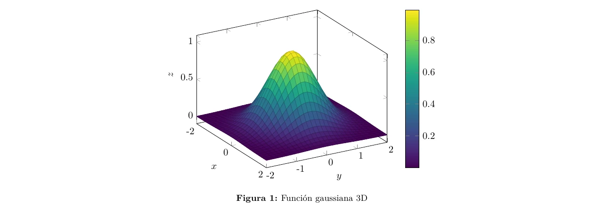

[📄 Ver PDF](assets/previews/FIGURAS_GRAFICAS_016.pdf)

### Malla 3D

```latex <!-- preview:2 -->
\begin{figure}[htbp]
    \centering
    \begin{tikzpicture}
        \begin{axis}[
            view={45}{45},
            xlabel={$x$},
            ylabel={$y$},
            zlabel={$z$},
        ]
            \addplot3[
                mesh,
                domain=-2:2,
                domain y=-2:2,
                samples=20,
            ] {sin(deg(x))*cos(deg(y))};
        \end{axis}
    \end{tikzpicture}
    \caption{Superficie con malla}
    \label{fig:malla3d}
\end{figure}
```

**Resultado:**

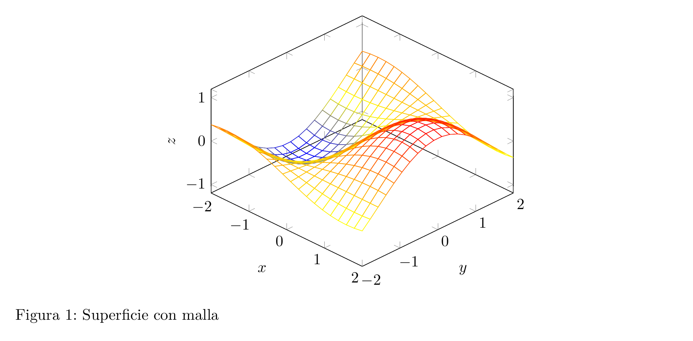

[📄 Ver PDF](assets/previews/FIGURAS_GRAFICAS_017.pdf)

### Contornos

```latex <!-- preview -->
\begin{figure}[htbp]
    \centering
    \begin{tikzpicture}
        \begin{axis}[
            view={0}{90},
            xlabel={$x$},
            ylabel={$y$},
            colormap/viridis,
            colorbar,
        ]
            \addplot3[
                contour filled={number=15},
                domain=-2:2,
                domain y=-2:2,
                samples=50,
            ] {exp(-(x^2 + y^2))};
        \end{axis}
    \end{tikzpicture}
    \caption{Contornos de la función gaussiana}
    \label{fig:contornos}
\end{figure}
```

**Resultado:**

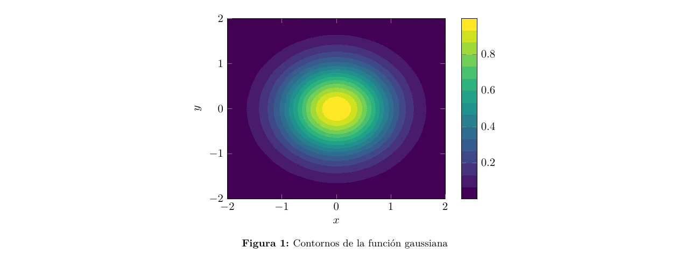

[📄 Ver PDF](assets/previews/FIGURAS_GRAFICAS_018.pdf)

### Scatter 3D

```latex <!-- preview:2 -->
\begin{figure}[htbp]
    \centering
    \begin{tikzpicture}
        \begin{axis}[
            view={60}{30},
            xlabel={$x$},
            ylabel={$y$},
            zlabel={$z$},
        ]
            \addplot3[
                only marks,
                mark=*,
                mark size=1.5pt,
                scatter,
                scatter src=z,
            ] coordinates {
                (0,0,1) (1,0,2) (0,1,3) (1,1,4)
                (2,0,3) (0,2,4) (2,1,5) (1,2,6)
                (2,2,7)
            };
        \end{axis}
    \end{tikzpicture}
    \caption{Puntos en 3D}
    \label{fig:scatter3d}
\end{figure}
```

**Resultado:**

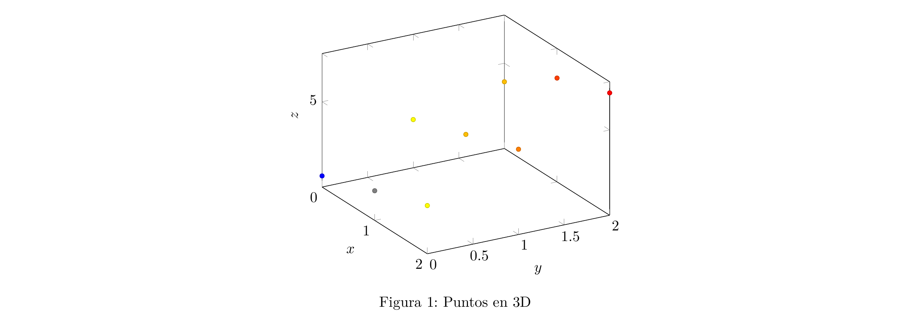

[📄 Ver PDF](assets/previews/FIGURAS_GRAFICAS_019.pdf)

---

## Gráficas circulares

La plantilla incluye el paquete `pgf-pie` para gráficas circulares.

### Pie chart básico

```latex <!-- preview -->
\begin{figure}[htbp]
    \centering
    \begin{tikzpicture}
        \pie[
            text=legend,
            radius=3,
        ]{
            35/Python,
            28/JavaScript,
            18/Java,
            12/C++,
            7/Otros
        }
    \end{tikzpicture}
    \caption{Distribución de lenguajes de programación}
    \label{fig:pie-basico}
\end{figure}
```

**Resultado:**

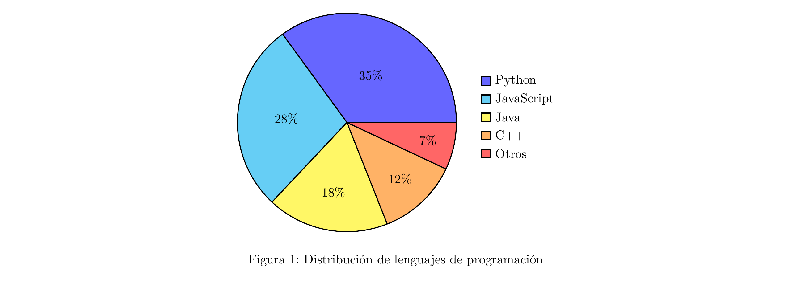

[📄 Ver PDF](assets/previews/FIGURAS_GRAFICAS_020.pdf)

### Pie chart con porcentajes

```latex <!-- preview -->
\begin{figure}[htbp]
    \centering
    \begin{tikzpicture}
        \pie[
            text=pin,
            explode=0.1,
            radius=2.5,
            color={blue!60, red!60, green!60, orange!60, purple!60},
        ]{
            40/Desarrollo,
            25/Testing,
            15/Diseño,
            12/Documentación,
            8/Reuniones
        }
    \end{tikzpicture}
    \caption{Distribución del tiempo de trabajo}
    \label{fig:pie-porcentajes}
\end{figure}
```

**Resultado:**

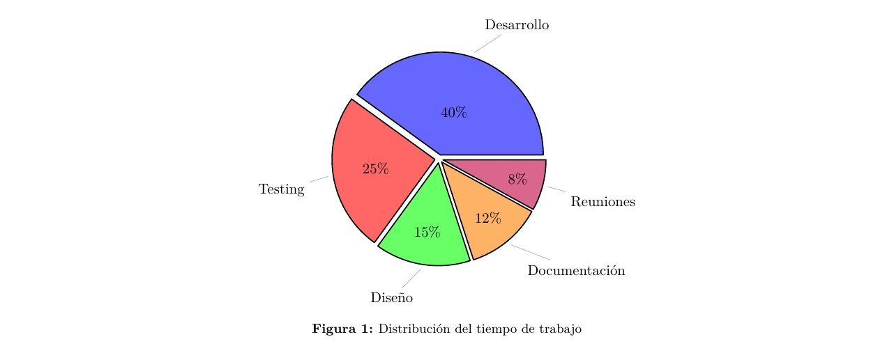

[📄 Ver PDF](assets/previews/FIGURAS_GRAFICAS_021.pdf)

### Opciones de pgf-pie

| Opción | Descripción | Valores |
| -------- | ------------- | --------- |
| `text` | Posición del texto | `label`, `pin`, `legend`, `inside` |
| `radius` | Radio del círculo | `2`, `3cm` |
| `explode` | Separación de sectores | `0.1` |
| `rotate` | Ángulo inicial | `90` |
| `hide number` | Ocultar números | (sin valor) |
| `sum` | Suma total | `100`, `auto` |
| `color` | Lista de colores | `{blue, red, green}` |
| `before number` | Texto antes del número | `\euro` |
| `after number` | Texto después | `\%` |
| `pos` | Posición del texto | `0.5` (0 a 1) |

### Donut chart

```latex <!-- preview:2 -->
\begin{figure}[htbp]
    \centering
    \begin{tikzpicture}
        \pie[
            text=legend,
            radius=2.5,
            /tikz/nodes={opacity=0, overlay},
        ]{
            35/A, 28/B, 18/C, 12/D, 7/E
        }
        % Círculo blanco en el centro
        \fill[white] (0,0) circle (1.2cm);
        \node at (0,0) {\large\bfseries 100\%};
    \end{tikzpicture}
    \caption{Gráfica de dona}
    \label{fig:donut}
\end{figure}
```

**Resultado:**


[📄 Ver PDF](assets/previews/FIGURAS_GRAFICAS_022.pdf)

---

## Opciones avanzadas

### Área entre curvas (fill between)

```latex <!-- preview:2 -->
\begin{figure}[htbp]
    \centering
    \begin{tikzpicture}
        \begin{axis}[
            domain=0:4,
            samples=100,
            xlabel={$x$},
            ylabel={$y$},
        ]
            \addplot[name path=A, blue, thick] {x^2};
            \addplot[name path=B, red, thick] {4*x - 4};
            
            \addplot[fill=blue!20] fill between[
                of=A and B,
                soft clip={domain=2:4}
            ];
        \end{axis}
    \end{tikzpicture}
    \caption{Área entre curvas}
    \label{fig:fill-between}
\end{figure}
```

**Resultado:**

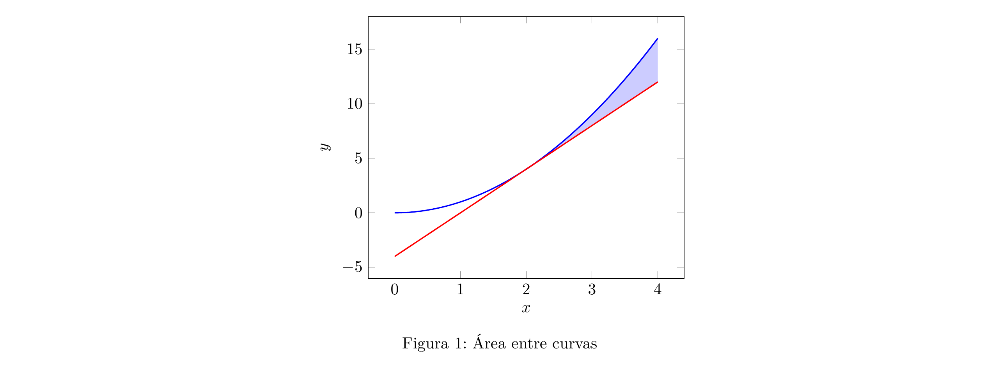

[📄 Ver PDF](assets/previews/FIGURAS_GRAFICAS_023.pdf)

### Anotaciones

```latex <!-- preview:2 -->
\begin{figure}[htbp]
    \centering
    \begin{tikzpicture}
        \begin{axis}[
            domain=0:5,
            samples=100,
        ]
            \addplot[blue, thick] {x^2};
            
            % Punto con etiqueta
            \node[circle, fill=red, inner sep=2pt, label={above:Máximo}] 
                at (axis cs:4, 16) {};
            
            % Flecha con texto
            \draw[->, thick] (axis cs:2.5, 10) -- (axis cs:3, 9);
            \node at (axis cs:2, 11) {Punto de interés};
            
            % Región resaltada
            \draw[dashed, fill=yellow, fill opacity=0.3] 
                (axis cs:1, 0) rectangle (axis cs:2, 4);
        \end{axis}
    \end{tikzpicture}
    \caption{Gráfica con anotaciones}
    \label{fig:anotaciones}
\end{figure}
```

**Resultado:**

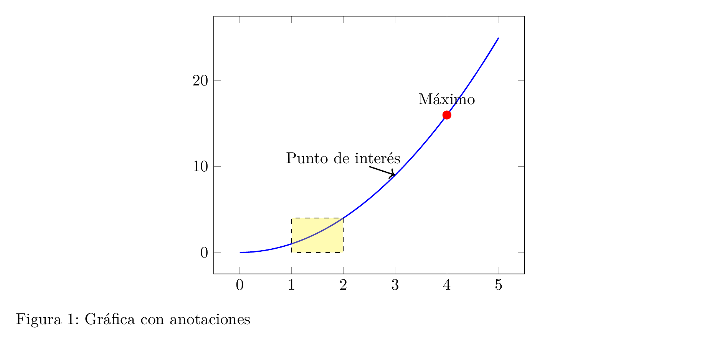

[📄 Ver PDF](assets/previews/FIGURAS_GRAFICAS_024.pdf)

### Líneas de referencia

```latex
\begin{axis}[
    extra x ticks={2.5},
    extra x tick style={grid=major, grid style={red, thick}},
    extra x tick labels={Umbral},
    extra y ticks={50},
    extra y tick style={grid=major, grid style={blue, dashed}},
]
```

### Estilos globales (cycle list)

```latex
% En el preámbulo
\pgfplotscreateplotcyclelist{miscolores}{
    {blue, thick, mark=*},
    {red, thick, mark=square},
    {green!60!black, thick, mark=triangle},
    {orange, thick, mark=diamond},
}

% En la gráfica
\begin{axis}[cycle list name=miscolores]
    \addplot coordinates {...};  % Usa primer estilo
    \addplot coordinates {...};  % Usa segundo estilo
    \addplot coordinates {...};  % Usa tercer estilo
\end{axis}
```

---

## Solución de problemas

### La gráfica es muy pequeña/grande

**Solución**: Ajusta `width` y `height`:

```latex
\begin{axis}[
    width=0.9\textwidth,
    height=8cm,
]
```

### Los números se superponen

**Solución**: Rota las etiquetas o reduce el tamaño:

```latex
\begin{axis}[
    xticklabel style={rotate=45, anchor=east, font=\small},
]
```

### La leyenda tapa la gráfica

**Solución**: Mueve la leyenda fuera:

```latex
\begin{axis}[
    legend style={
        at={(0.5,-0.15)},
        anchor=north,
        legend columns=3
    },
]
```

### Compilación muy lenta

**Solución**: Reduce el número de muestras o usa externalización:

```latex
% Menos muestras
\addplot[domain=-5:5, samples=50] {sin(deg(x))};

% O habilita externalización en el preámbulo
\usepgfplotslibrary{external}
\tikzexternalize[prefix=cache/]
```

### Error "Dimension too large"

**Causa**: Valores muy grandes o muy pequeños.

**Solución**: Usa escala logarítmica o ajusta los datos:

```latex
\begin{axis}[
    ymode=log,  % Escala logarítmica en Y
]
```

---

## Ejemplos completos

### Gráfica científica completa

```latex <!-- preview:2 -->
\begin{figure}[htbp]
    \centering
    \begin{tikzpicture}
        \begin{axis}[
            width=0.85\textwidth,
            height=7cm,
            xlabel={Frecuencia (Hz)},
            ylabel={Amplitud (dB)},
            title={Respuesta en frecuencia del filtro},
            xmode=log,
            grid=both,
            grid style={line width=.1pt, draw=gray!20},
            major grid style={line width=.2pt, draw=gray!50},
            legend pos=south west,
            legend style={font=\small},
            minor tick num=4,
        ]
            \addplot[blue, thick, mark=none, samples=200, domain=10:10000] 
                {-20*log10(sqrt(1+(x/1000)^2))};
            \addplot[red, dashed, thick] coordinates {(10,-3) (10000,-3)};
            \addplot[green!60!black, dotted, thick] coordinates {(1000,0) (1000,-40)};
            
            \legend{
                Respuesta real,
                Nivel -3dB,
                Frecuencia de corte
            }
        \end{axis}
    \end{tikzpicture}
    \caption{Respuesta en frecuencia de un filtro paso bajo de primer orden}
    \label{fig:filtro}
\end{figure}
```

**Resultado:**

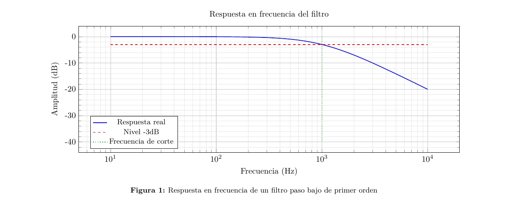

[📄 Ver PDF](assets/previews/FIGURAS_GRAFICAS_025.pdf)

---

## Recursos adicionales

### Documentación oficial

| Recurso | Descripción |
| --------- | ------------- |
| [PGFPlots Manual](https://ctan.org/pkg/pgfplots) | Documentación completa |
| [TikZ & PGF Manual](https://tikz.dev/) | Documentación oficial interactiva |
| [TikZ en CTAN](https://ctan.org/pkg/pgf) | Paquete base |
| [circuitikz](https://ctan.org/pkg/circuitikz) | Circuitos eléctricos |
| [tikz-3dplot](https://ctan.org/pkg/tikz-3dplot) | Gráficos 3D |

### Galerías y ejemplos

| Recurso | Descripción |
| --------- | ------------- |
| [TeXample.net TikZ](https://texample.net/tikz/examples/) | Galería de ejemplos TikZ |
| [pgfplots.net](http://pgfplots.net/) | Ejemplos de PGFPlots |
| [Overleaf: TikZ](https://www.overleaf.com/learn/latex/TikZ_package) | Tutorial completo |
| [Overleaf: Pgfplots](https://www.overleaf.com/learn/latex/Pgfplots_package) | Tutorial de gráficas |

### Versiones actuales (TeX Live 2025)

| Componente | Versión |
| ------------ | ---------- |
| TikZ/PGF | 3.1.11a |
| PGFPlots | 1.18.2 |

---

## Ver también

- [IMAGENES_SUBFIGURAS.md](IMAGENES_SUBFIGURAS.md) - Incluir imágenes
- [TABLAS.md](TABLAS.md) - Guía de tablas
- [ECUACIONES.md](ECUACIONES.md) - Guía de ecuaciones
