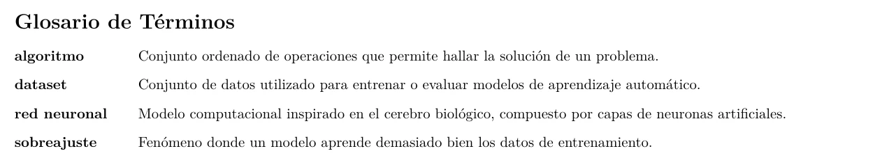
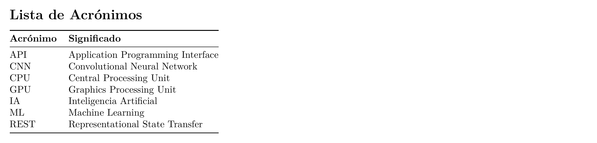
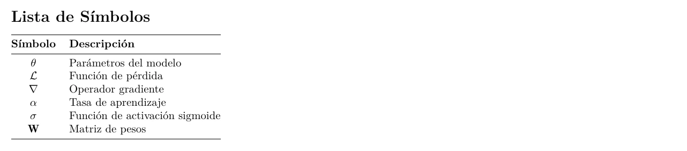
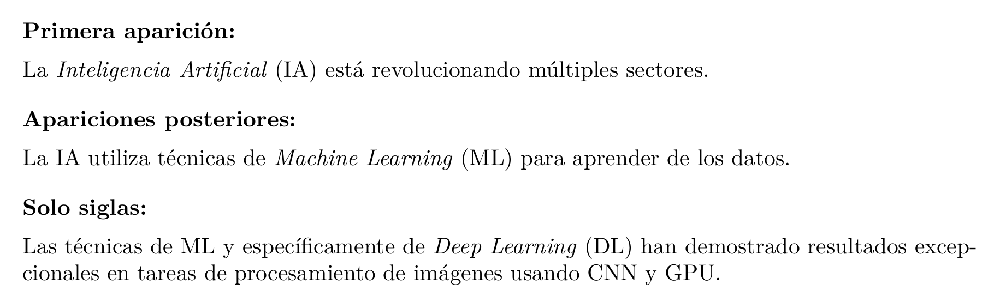

# 📖 Guía de Glosarios y Acrónimos

Esta guía explica cómo gestionar glosarios, acrónimos y símbolos usando el paquete **glossaries** en esta plantilla.

---

## 📋 Índice

- [📋 Índice](#-índice)
- [Introducción](#introducción)
  - [Ventajas](#ventajas)
- [Configuración básica](#configuración-básica)
  - [Cargar el paquete](#cargar-el-paquete)
  - [Opciones del paquete](#opciones-del-paquete)
  - [Archivo separado para definiciones](#archivo-separado-para-definiciones)
- [Definir términos](#definir-términos)
  - [Término simple](#término-simple)
  - [Ejemplo](#ejemplo)
  - [Con plural personalizado](#con-plural-personalizado)
  - [Con símbolo asociado](#con-símbolo-asociado)
  - [Campos disponibles](#campos-disponibles)
  - [Términos jerárquicos](#términos-jerárquicos)
- [Usar términos](#usar-términos)
  - [Comandos básicos](#comandos-básicos)
  - [Ejemplos de uso](#ejemplos-de-uso)
  - [Acceder a campos específicos](#acceder-a-campos-específicos)
  - [Sin crear enlace](#sin-crear-enlace)
  - [Forzar primera/siguiente aparición](#forzar-primerasiguiente-aparición)
- [Acrónimos](#acrónimos)
  - [Definir acrónimos](#definir-acrónimos)
  - [Ejemplos](#ejemplos)
  - [Usar acrónimos](#usar-acrónimos)
  - [Con descripción adicional](#con-descripción-adicional)
  - [Con plural diferente](#con-plural-diferente)
- [Símbolos](#símbolos)
  - [Definir símbolos](#definir-símbolos)
  - [Símbolos con unidades](#símbolos-con-unidades)
  - [Usar símbolos](#usar-símbolos)
- [Imprimir glosarios](#imprimir-glosarios)
  - [Glosario principal](#glosario-principal)
  - [Lista de acrónimos](#lista-de-acrónimos)
  - [Lista de símbolos](#lista-de-símbolos)
  - [Todos los glosarios](#todos-los-glosarios)
  - [Opciones de impresión](#opciones-de-impresión)
- [Personalización](#personalización)
  - [Estilos predefinidos](#estilos-predefinidos)
  - [Personalizar formato de acrónimos](#personalizar-formato-de-acrónimos)
  - [Personalizar separadores](#personalizar-separadores)
  - [Estilo personalizado](#estilo-personalizado)
- [Compilación](#compilación)
  - [Proceso completo](#proceso-completo)
  - [Con latexmk](#con-latexmk)
  - [Comandos makeglossaries](#comandos-makeglossaries)
  - [Alternativa: bib2gls](#alternativa-bib2gls)
- [Solución de problemas](#solución-de-problemas)
  - [Términos no aparecen en el glosario](#términos-no-aparecen-en-el-glosario)
  - [Acrónimo siempre muestra forma larga](#acrónimo-siempre-muestra-forma-larga)
  - [Error "Glossary entry undefined"](#error-glossary-entry-undefined)
  - [Glosario vacío](#glosario-vacío)
  - [Ordenación incorrecta](#ordenación-incorrecta)
  - [Caracteres especiales en nombres](#caracteres-especiales-en-nombres)
- [Ejemplos completos](#ejemplos-completos)
  - [Archivo glosario.tex](#archivo-glosariotex)
  - [En el documento](#en-el-documento)
- [Ejemplos visuales](#ejemplos-visuales)
  - [Ejemplo de glosario renderizado](#ejemplo-de-glosario-renderizado)
  - [Ejemplo de lista de acrónimos renderizada](#ejemplo-de-lista-de-acrónimos-renderizada)
  - [Ejemplo de lista de símbolos renderizada](#ejemplo-de-lista-de-símbolos-renderizada)
  - [Uso de acrónimos en texto](#uso-de-acrónimos-en-texto)
- [Recursos adicionales](#recursos-adicionales)
- [Ver también](#ver-también)

---

## Introducción

El paquete `glossaries` permite:

- **Glosario**: Lista de términos con sus definiciones
- **Lista de acrónimos**: Siglas con su expansión
- **Lista de símbolos**: Notación matemática con descripción

### Ventajas

- Enlaces automáticos al glosario
- Primera aparición expandida para acrónimos
- Ordenación automática
- Múltiples glosarios

---

## Configuración básica

### Cargar el paquete

```latex
% En el preámbulo
\usepackage[
    acronym,           % Crear lista de acrónimos
    symbols,           % Crear lista de símbolos
    toc,               % Añadir al índice
    section=chapter,   % Nivel de título
    nogroupskip        % Sin espacio entre grupos
]{glossaries}

% Crear los archivos de índices
\makeglossaries
```

### Opciones del paquete

| Opción | Descripción |
|--------|-------------|
| `acronym` | Crear lista separada de acrónimos |
| `symbols` | Crear lista separada de símbolos |
| `toc` | Incluir glosarios en el índice |
| `nonumberlist` | No mostrar números de página |
| `nopostdot` | Sin punto al final de descripciones |
| `nogroupskip` | Sin espacio entre letras |
| `section=chapter` | Glosario como capítulo |
| `numberedsection` | Glosarios numerados |
| `shortcuts` | Habilitar comandos cortos |

### Archivo separado para definiciones

Es recomendable crear un archivo separado:

```latex
% archivo: glosario.tex

% Términos
\newglossaryentry{latex}{
    name={\LaTeX},
    description={Sistema de preparación de documentos}
}

% Acrónimos
\newacronym{ua}{UA}{Universidad de Alicante}
```

Y cargarlo en el preámbulo:

```latex
\input{glosario}
```

---

## Definir términos

### Término simple

```latex
\newglossaryentry{clave}{
    name={término},
    description={definición del término}
}
```

### Ejemplo

```latex
\newglossaryentry{algoritmo}{
    name={algoritmo},
    description={Conjunto ordenado de operaciones sistemáticas que 
                 permite hacer un cálculo y hallar la solución de 
                 un tipo de problema}
}
```

### Con plural personalizado

```latex
\newglossaryentry{matriz}{
    name={matriz},
    plural={matrices},
    description={Arreglo rectangular de números dispuestos en filas 
                 y columnas}
}
```

### Con símbolo asociado

```latex
\newglossaryentry{pi}{
    name={pi},
    symbol={\ensuremath{\pi}},
    description={Razón entre la longitud de una circunferencia y 
                 su diámetro, aproximadamente 3.14159}
}
```

### Campos disponibles

| Campo | Descripción |
|-------|-------------|
| `name` | Nombre del término (obligatorio) |
| `description` | Definición (obligatorio) |
| `plural` | Forma plural |
| `text` | Texto mostrado en el documento |
| `first` | Texto en primera aparición |
| `symbol` | Símbolo asociado |
| `sort` | Clave de ordenación |
| `parent` | Entrada padre (para jerarquía) |
| `see` | Referencias cruzadas |

### Términos jerárquicos

```latex
% Término padre
\newglossaryentry{red}{
    name={red},
    description={Sistema de elementos interconectados}
}

% Términos hijos
\newglossaryentry{red_neuronal}{
    name={red neuronal},
    description={Red de neuronas artificiales},
    parent={red}
}

\newglossaryentry{red_social}{
    name={red social},
    description={Estructura social de relaciones},
    parent={red}
}
```

---

## Usar términos

### Comandos básicos

```latex
\gls{clave}      % término (automático singular/plural)
\Gls{clave}      % Término (primera letra mayúscula)
\GLS{clave}      % TÉRMINO (todo mayúsculas)

\glspl{clave}    % términos (plural)
\Glspl{clave}    % Términos (plural con mayúscula)
\GLSpl{clave}    % TÉRMINOS (plural en mayúsculas)
```

### Ejemplos de uso

```latex
El \gls{algoritmo} propuesto mejora el rendimiento.
Los \glspl{algoritmo} de ordenación son fundamentales.
\Gls{algoritmo} de búsqueda binaria.
```

**Resultado**:

- El algoritmo propuesto mejora el rendimiento.
- Los algoritmos de ordenación son fundamentales.
- Algoritmo de búsqueda binaria.

### Acceder a campos específicos

```latex
\glsname{clave}        % Solo el nombre
\glsdesc{clave}        % Solo la descripción
\glssymbol{clave}      % Solo el símbolo
\glstext{clave}        % Texto del documento
```

### Sin crear enlace

```latex
\glstext*{clave}       % Texto sin hiperenlace
\gls*{clave}           % Término sin hiperenlace
```

### Forzar primera/siguiente aparición

```latex
\glsfirst{clave}       % Siempre como primera aparición
\glsreset{clave}       % Resetear para que siguiente sea "primera"
\glsunset{clave}       % Marcar como ya usado
\glsresetall           % Resetear todos los términos
```

---

## Acrónimos

### Definir acrónimos

```latex
\newacronym{sigla}{SIGLA}{Expansión completa}
```

### Ejemplos

```latex
\newacronym{ua}{UA}{Universidad de Alicante}
\newacronym{eps}{EPS}{Escuela Politécnica Superior}
\newacronym{ia}{IA}{Inteligencia Artificial}
\newacronym{tfg}{TFG}{Trabajo Fin de Grado}
\newacronym{tfm}{TFM}{Trabajo Fin de Máster}
\newacronym{api}{API}{Application Programming Interface}
\newacronym{sql}{SQL}{Structured Query Language}
\newacronym{html}{HTML}{HyperText Markup Language}
\newacronym{css}{CSS}{Cascading Style Sheets}
\newacronym{url}{URL}{Uniform Resource Locator}
```

### Usar acrónimos

```latex
% Primera aparición: "Inteligencia Artificial (IA)"
% Siguientes apariciones: "IA"
La \gls{ia} ha revolucionado la tecnología.
Los avances en \gls{ia} son notables.

% Forzar forma larga
\acrlong{ia}   % Inteligencia Artificial
\Acrlong{ia}   % Inteligencia Artificial (mayúscula)

% Forzar forma corta
\acrshort{ia}  % IA
\Acrshort{ia}  % IA

% Forzar forma completa
\acrfull{ia}   % Inteligencia Artificial (IA)
\Acrfull{ia}   % Inteligencia Artificial (IA)
```

### Con descripción adicional

```latex
\newacronym[description={Sistema de gestión de bases de datos}]
    {sgbd}{SGBD}{Sistema Gestor de Base de Datos}
```

### Con plural diferente

```latex
\newacronym[
    longplural={Application Programming Interfaces},
    shortplural={APIs}
]{api}{API}{Application Programming Interface}

% Uso
La \gls{api} de Google...    % Primera: Application Programming Interface (API)
Las \glspl{api} modernas...  % APIs
```

---

## Símbolos

### Definir símbolos

```latex
\newglossaryentry{sym:pi}{
    type=symbols,
    name={\ensuremath{\pi}},
    sort={pi},
    description={Número pi, aproximadamente 3.14159}
}

\newglossaryentry{sym:euler}{
    type=symbols,
    name={\ensuremath{e}},
    sort={e},
    description={Número de Euler, aproximadamente 2.71828}
}

\newglossaryentry{sym:integral}{
    type=symbols,
    name={\ensuremath{\int}},
    sort={integral},
    description={Operador integral}
}
```

### Símbolos con unidades

```latex
\newglossaryentry{sym:velocidad}{
    type=symbols,
    name={\ensuremath{v}},
    sort={v},
    description={Velocidad},
    symbol={\si{\meter\per\second}}
}

\newglossaryentry{sym:aceleracion}{
    type=symbols,
    name={\ensuremath{a}},
    sort={a},
    description={Aceleración},
    symbol={\si{\meter\per\second\squared}}
}
```

### Usar símbolos

```latex
El valor de \gls{sym:pi} es fundamental en geometría.
La velocidad \gls{sym:velocidad} se mide en m/s.
```

---

## Imprimir glosarios

### Glosario principal

```latex
\printglossary[title={Glosario}]
```

### Lista de acrónimos

```latex
\printglossary[type=\acronymtype, title={Lista de Acrónimos}]
```

### Lista de símbolos

```latex
\printglossary[type=symbols, title={Lista de Símbolos}]
```

### Todos los glosarios

```latex
\printglossaries
```

### Opciones de impresión

```latex
\printglossary[
    type=main,           % Tipo de glosario
    title={Glosario},    % Título personalizado
    toctitle={Glosario}, % Título en el índice
    style=long,          % Estilo de presentación
    nonumberlist         % Sin números de página
]
```

---

## Personalización

### Estilos predefinidos

```latex
% Cambiar estilo globalmente
\setglossarystyle{long}

% O por glosario individual
\printglossary[style=long]
```

| Estilo | Descripción |
|--------|-------------|
| `list` | Lista simple |
| `listgroup` | Lista con grupos por letra |
| `long` | Tabla con dos columnas |
| `long3col` | Tabla con tres columnas |
| `long4col` | Tabla con cuatro columnas |
| `longragged` | Como long pero alineado a izquierda |
| `altlong4col` | Alternativo de 4 columnas |
| `super` | Usando supertabular |
| `tree` | Formato de árbol (jerárquico) |

### Personalizar formato de acrónimos

```latex
% Cambiar cómo se muestran los acrónimos en primera aparición
\setacronymstyle{long-short}     % "Expansión (SIGLA)"
\setacronymstyle{short-long}     % "SIGLA (Expansión)"
\setacronymstyle{long-short-desc}% Con descripción
```

### Personalizar separadores

```latex
% Separador entre nombre y descripción
\renewcommand*{\glsnamefont}[1]{\textbf{#1}}

% Formato de descripción
\renewcommand*{\glsdescriptionfont}[1]{\textit{#1}}
```

### Estilo personalizado

```latex
\newglossarystyle{mystyle}{
    \setglossarystyle{long}% Basar en estilo existente
    \renewenvironment{theglossary}%
        {\begin{longtable}{lp{.7\textwidth}}}%
        {\end{longtable}}%
    \renewcommand*{\glossentry}[2]{%
        \glsentryitem{##1}\glstarget{##1}{\glossentryname{##1}} &
        \glossentrydesc{##1}\glspostdescription\space ##2\\}%
}
```

---

## Compilación

### Proceso completo

El uso de glosarios requiere pasos adicionales de compilación:

```bash
# 1. Primera compilación
lualatex main

# 2. Generar índices de glosario
makeglossaries main

# 3. Compilar de nuevo
lualatex main
lualatex main
```

### Con latexmk

La receta de latexmk en VS Code gestiona esto automáticamente.

### Comandos makeglossaries

```bash
# Básico
makeglossaries main

# Ver opciones
makeglossaries --help

# Modo silencioso
makeglossaries -q main
```

### Alternativa: bib2gls

Para proyectos grandes, `bib2gls` ofrece más control:

```latex
% En el preámbulo
\usepackage[record]{glossaries-extra}

% Cargar desde archivo .bib
\GlsXtrLoadResources[
    src={glossary},  % archivo glossary.bib
    sort={es-ES}     % ordenación en español
]
```

---

## Solución de problemas

### Términos no aparecen en el glosario

**Causa**: Solo aparecen términos usados con `\gls` o similar.

**Solución**:

```latex
% Añadir todos los términos aunque no se usen
\glsaddall

% O términos específicos
\glsadd{termino1}
\glsadd{termino2}
```

### Acrónimo siempre muestra forma larga

**Causa**: Se resetea entre compilaciones o hay error.

**Solución**:

```latex
% Verificar que usas \gls{} no \acrlong{}
\gls{ia}  % Correcto - gestiona automáticamente

% Resetear solo si es necesario
% \glsreset{ia}
```

### Error "Glossary entry undefined"

**Causa**: El término no está definido o hay error tipográfico.

**Solución**:

```latex
% Verificar que la clave existe
\newglossaryentry{mi_termino}{...}
\gls{mi_termino}  % Clave exacta
```

### Glosario vacío

**Causas**:

1. No se ejecutó `makeglossaries`
2. No hay términos usados en el documento

**Solución**:

```bash
# Ejecutar makeglossaries
makeglossaries main

# O añadir todos los términos
\glsaddall
```

### Ordenación incorrecta

```latex
% Especificar clave de ordenación
\newglossaryentry{latex}{
    name={\LaTeX},
    sort={latex},  % Clave para ordenar
    description={...}
}
```

### Caracteres especiales en nombres

```latex
% Usar sort para evitar problemas
\newglossaryentry{alfa}{
    name={\ensuremath{\alpha}},
    sort={alfa},
    description={Letra griega alfa}
}
```

---

## Ejemplos completos

### Archivo glosario.tex

```latex
% ========================================
% TÉRMINOS DEL GLOSARIO
% ========================================

\newglossaryentry{aprendizaje_automatico}{
    name={aprendizaje automático},
    description={Rama de la inteligencia artificial que permite 
                 a los sistemas aprender de los datos}
}

\newglossaryentry{red_neuronal}{
    name={red neuronal},
    plural={redes neuronales},
    description={Modelo computacional inspirado en el cerebro biológico}
}

\newglossaryentry{dataset}{
    name={dataset},
    description={Conjunto de datos utilizado para entrenar o evaluar 
                 modelos de aprendizaje automático}
}

\newglossaryentry{sobreajuste}{
    name={sobreajuste},
    description={Fenómeno donde un modelo aprende demasiado bien 
                 los datos de entrenamiento, perdiendo capacidad 
                 de generalización}
}

% ========================================
% ACRÓNIMOS
% ========================================

\newacronym{ia}{IA}{Inteligencia Artificial}
\newacronym{ml}{ML}{Machine Learning}
\newacronym{dl}{DL}{Deep Learning}
\newacronym{cnn}{CNN}{Convolutional Neural Network}
\newacronym{rnn}{RNN}{Recurrent Neural Network}
\newacronym{lstm}{LSTM}{Long Short-Term Memory}
\newacronym{gpu}{GPU}{Graphics Processing Unit}
\newacronym{cpu}{CPU}{Central Processing Unit}
\newacronym{api}{API}{Application Programming Interface}
\newacronym{rest}{REST}{Representational State Transfer}

% ========================================
% SÍMBOLOS
% ========================================

\newglossaryentry{sym:theta}{
    type=symbols,
    name={\ensuremath{\theta}},
    sort={theta},
    description={Parámetros del modelo}
}

\newglossaryentry{sym:loss}{
    type=symbols,
    name={\ensuremath{\mathcal{L}}},
    sort={L},
    description={Función de pérdida}
}

\newglossaryentry{sym:gradient}{
    type=symbols,
    name={\ensuremath{\nabla}},
    sort={nabla},
    description={Operador gradiente}
}
```

### En el documento

```latex
% Preámbulo
\usepackage[acronym, symbols, toc]{glossaries}
\makeglossaries
\input{glosario}

% En el texto
\chapter{Introducción}

El \gls{aprendizaje_automatico} es una rama de la \gls{ia} que ha 
experimentado un gran avance en los últimos años. Las \glspl{red_neuronal}, 
en particular las \gls{cnn}, han demostrado resultados excepcionales.

Para entrenar estos modelos se necesita un \gls{dataset} adecuado y 
hardware especializado como \glspl{gpu}. El objetivo es minimizar 
la función de pérdida \gls{sym:loss} ajustando los parámetros 
\gls{sym:theta} mediante el \gls{sym:gradient}.

% Al final del documento
\printglossary[title={Glosario de Términos}]
\printglossary[type=\acronymtype, title={Lista de Acrónimos}]
\printglossary[type=symbols, title={Lista de Símbolos}]
```

---

## Ejemplos visuales

Estos ejemplos muestran cómo se visualizan los glosarios y acrónimos en el documento final.

### Ejemplo de glosario renderizado

```latex <!-- preview -->
% Simulación visual de un glosario
\section*{Glosario de Términos}

\begin{description}[leftmargin=3cm, style=nextline, font=\bfseries]
    \item[algoritmo] Conjunto ordenado de operaciones que permite 
        hallar la solución de un problema.
    \item[dataset] Conjunto de datos utilizado para entrenar o evaluar 
        modelos de aprendizaje automático.
    \item[red neuronal] Modelo computacional inspirado en el cerebro 
        biológico, compuesto por capas de neuronas artificiales.
    \item[sobreajuste] Fenómeno donde un modelo aprende demasiado bien 
        los datos de entrenamiento.
\end{description}
```

**Resultado:**



[📄 Ver PDF](assets/previews/GLOSARIOS_ACRONIMOS_001.pdf)

### Ejemplo de lista de acrónimos renderizada

```latex <!-- preview -->
% Simulación visual de lista de acrónimos
\section*{Lista de Acrónimos}

\begin{tabular}{@{}ll@{}}
    \toprule
    \textbf{Acrónimo} & \textbf{Significado} \\
    \midrule
    API  & Application Programming Interface \\
    CNN  & Convolutional Neural Network \\
    CPU  & Central Processing Unit \\
    GPU  & Graphics Processing Unit \\
    IA   & Inteligencia Artificial \\
    ML   & Machine Learning \\
    REST & Representational State Transfer \\
    \bottomrule
\end{tabular}
```

**Resultado:**



[📄 Ver PDF](assets/previews/GLOSARIOS_ACRONIMOS_002.pdf)

### Ejemplo de lista de símbolos renderizada

```latex <!-- preview -->
% Simulación visual de lista de símbolos
\section*{Lista de Símbolos}

\begin{tabular}{@{}cl@{}}
    \toprule
    \textbf{Símbolo} & \textbf{Descripción} \\
    \midrule
    $\theta$ & Parámetros del modelo \\
    $\mathcal{L}$ & Función de pérdida \\
    $\nabla$ & Operador gradiente \\
    $\alpha$ & Tasa de aprendizaje \\
    $\sigma$ & Función de activación sigmoide \\
    $\mathbf{W}$ & Matriz de pesos \\
    \bottomrule
\end{tabular}
```

**Resultado:**



[📄 Ver PDF](assets/previews/GLOSARIOS_ACRONIMOS_003.pdf)

### Uso de acrónimos en texto

```latex <!-- preview -->
% Ejemplo de cómo aparecen los acrónimos en el texto
\noindent
\textbf{Primera aparición:}\\[0.5em]
La \textit{Inteligencia Artificial} (IA) está revolucionando 
múltiples sectores.

\vspace{1em}
\textbf{Apariciones posteriores:}\\[0.5em]
La IA utiliza técnicas de \textit{Machine Learning} (ML) 
para aprender de los datos.

\vspace{1em}
\textbf{Solo siglas:}\\[0.5em]
Las técnicas de ML y específicamente de \textit{Deep Learning} (DL) 
han demostrado resultados excepcionales en tareas de 
procesamiento de imágenes usando CNN y GPU.
```

**Resultado:**



[📄 Ver PDF](assets/previews/GLOSARIOS_ACRONIMOS_004.pdf)

---

## Recursos adicionales

- [Documentación de glossaries](https://ctan.org/pkg/glossaries)
- [Guía de usuario de glossaries](https://mirrors.ctan.org/macros/latex/contrib/glossaries/glossaries-user.pdf)
- [glossaries-extra](https://ctan.org/pkg/glossaries-extra) - Extensión con más opciones

---

## Ver también

- [BIBLIOGRAFIA.md](BIBLIOGRAFIA.md) - Gestión de referencias
- [REFERENCIAS_CRUZADAS.md](REFERENCIAS_CRUZADAS.md) - Referencias internas
- [ECUACIONES.md](ECUACIONES.md) - Símbolos matemáticos
