# 🖼️ Guía de Imágenes y Subfiguras

Esta guía explica cómo incluir imágenes, organizarlas en subfiguras, y controlar su posicionamiento en el documento.

---

## 📋 Índice

- [📋 Índice](#-índice)
- [Introducción](#introducción)
  - [Formatos soportados](#formatos-soportados)
  - [Dónde guardar las imágenes](#dónde-guardar-las-imágenes)
- [Insertar imagen básica](#insertar-imagen-básica)
  - [Sintaxis mínima](#sintaxis-mínima)
  - [Con tamaño específico](#con-tamaño-específico)
  - [Escalar proporcionalmente](#escalar-proporcionalmente)
- [Opciones de includegraphics](#opciones-de-includegraphics)
  - [Todas las opciones disponibles](#todas-las-opciones-disponibles)
  - [Ejemplos de opciones](#ejemplos-de-opciones)
- [Entorno figure](#entorno-figure)
  - [Estructura básica](#estructura-básica)
  - [Referenciar figuras](#referenciar-figuras)
  - [Caption largo y corto](#caption-largo-y-corto)
  - [Personalizar caption](#personalizar-caption)
  - [Opciones de captionsetup](#opciones-de-captionsetup)
- [Subfiguras](#subfiguras)
  - [Dos subfiguras lado a lado](#dos-subfiguras-lado-a-lado)
  - [Tres subfiguras](#tres-subfiguras)
  - [Cuadrícula 2x2](#cuadrícula-2x2)
  - [Subfiguras con diferentes tamaños](#subfiguras-con-diferentes-tamaños)
  - [Personalizar numeración de subfiguras](#personalizar-numeración-de-subfiguras)
  - [Referenciar subfiguras](#referenciar-subfiguras)
- [Posicionamiento](#posicionamiento)
  - [Especificadores de posición](#especificadores-de-posición)
  - [Ejemplos de posicionamiento](#ejemplos-de-posicionamiento)
  - [Controlar flotantes](#controlar-flotantes)
  - [Ajustar parámetros de flotantes](#ajustar-parámetros-de-flotantes)
- [Figuras anchas](#figuras-anchas)
  - [Usar todo el ancho (en documentos a dos columnas)](#usar-todo-el-ancho-en-documentos-a-dos-columnas)
  - [Figura más ancha que el texto](#figura-más-ancha-que-el-texto)
  - [Figura en el margen](#figura-en-el-margen)
- [Texto alrededor de figuras](#texto-alrededor-de-figuras)
  - [Usando wrapfigure](#usando-wrapfigure)
  - [Opciones de wrapfigure](#opciones-de-wrapfigure)
- [Rotación de imágenes](#rotación-de-imágenes)
  - [Rotar con includegraphics](#rotar-con-includegraphics)
  - [Rotar figura completa (con caption)](#rotar-figura-completa-con-caption)
  - [Rotar solo la imagen dentro de figure](#rotar-solo-la-imagen-dentro-de-figure)
- [Marcos y bordes](#marcos-y-bordes)
  - [Borde simple con fbox](#borde-simple-con-fbox)
  - [Personalizar el borde](#personalizar-el-borde)
  - [Borde con color](#borde-con-color)
  - [Sombra con TikZ](#sombra-con-tikz)
  - [Marco decorativo con tcolorbox](#marco-decorativo-con-tcolorbox)
- [Solución de problemas](#solución-de-problemas)
  - ["File not found"](#file-not-found)
  - [Imagen borrosa o pixelada](#imagen-borrosa-o-pixelada)
  - [La figura aparece en otro lugar](#la-figura-aparece-en-otro-lugar)
  - [Espacio excesivo alrededor de figuras](#espacio-excesivo-alrededor-de-figuras)
  - [Subfiguras desalineadas](#subfiguras-desalineadas)
  - [Caption demasiado ancho](#caption-demasiado-ancho)
- [Ejemplos completos](#ejemplos-completos)
  - [Figura con múltiples elementos](#figura-con-múltiples-elementos)
  - [Galería de imágenes](#galería-de-imágenes)
- [Recursos adicionales](#recursos-adicionales)
- [Ver también](#ver-también)

---

## Introducción

Esta plantilla utiliza los siguientes paquetes para manejo de imágenes:

```latex
% Ya incluidos en la clase eps-tfg
\RequirePackage{graphicx}      % Insertar imágenes
\RequirePackage{subcaption}    % Subfiguras
\RequirePackage{caption}       % Personalizar captions
\RequirePackage{float}         % Control de posicionamiento [H]
\RequirePackage{rotating}      % Rotar figuras
\RequirePackage{wrapfig}       % Texto alrededor (si necesario)
```

### Formatos soportados

Con LuaLaTeX (usado por esta plantilla) puedes incluir:

| Formato | Extensión | Notas |
|---------|-----------|-------|
| PDF | `.pdf` | **Recomendado** para diagramas vectoriales |
| PNG | `.png` | Bueno para capturas, diagramas |
| JPG/JPEG | `.jpg`, `.jpeg` | Bueno para fotografías |
| EPS | `.eps` | Se convierte automáticamente |
| SVG | `.svg` | Requiere paquete adicional |

### Dónde guardar las imágenes

```
recursos/
├── imagenes/        ← Imágenes generales
│   ├── foto1.jpg
│   └── diagrama.pdf
└── logos/           ← Logos (ya incluidos)
    ├── universidad/
    └── titulaciones/
```

---

## Insertar imagen básica

### Sintaxis mínima

```latex
\includegraphics{recursos/imagenes/mi-imagen.png}
```

### Con tamaño específico

```latex
% Por ancho
\includegraphics[width=8cm]{recursos/imagenes/foto.jpg}

% Por ancho relativo al texto
\includegraphics[width=0.7\textwidth]{recursos/imagenes/foto.jpg}

% Por altura
\includegraphics[height=5cm]{recursos/imagenes/foto.jpg}

% Ambos (puede distorsionar)
\includegraphics[width=6cm, height=4cm]{recursos/imagenes/foto.jpg}

% Mantener proporción con límites
\includegraphics[width=6cm, height=4cm, keepaspectratio]{recursos/imagenes/foto.jpg}
```

### Escalar proporcionalmente

```latex
% Al 50% del tamaño original
\includegraphics[scale=0.5]{recursos/imagenes/foto.jpg}

% Al 150%
\includegraphics[scale=1.5]{recursos/imagenes/foto.jpg}
```

---

## Opciones de includegraphics

### Todas las opciones disponibles

| Opción | Descripción | Ejemplo |
|--------|-------------|---------|
| `width` | Ancho de la imagen | `5cm`, `0.8\textwidth` |
| `height` | Alto de la imagen | `4cm`, `0.5\textheight` |
| `scale` | Escala proporcional | `0.5`, `1.2` |
| `keepaspectratio` | Mantener proporción | (sin valor) |
| `angle` | Rotación en grados | `90`, `-45` |
| `origin` | Centro de rotación | `c`, `tl`, `br` |
| `trim` | Recortar bordes | `{1cm 2cm 1cm 0cm}` |
| `clip` | Activar recorte | (requiere `trim`) |
| `page` | Página de PDF | `2` |
| `draft` | Modo borrador | (sin valor) |
| `bb` | Bounding box | `0 0 100 100` |
| `resolution` | Resolución | `300` |

### Ejemplos de opciones

#### Rotar imagen

```latex
% Rotar 90° (vertical a horizontal)
\includegraphics[width=6cm, angle=90]{recursos/imagenes/grafico.pdf}

% Rotar desde la esquina superior izquierda
\includegraphics[width=6cm, angle=45, origin=tl]{recursos/imagenes/foto.jpg}
```

#### Recortar imagen

```latex
% Recortar: izquierda, abajo, derecha, arriba
\includegraphics[
    width=0.8\textwidth,
    trim={2cm 1cm 2cm 3cm},
    clip
]{recursos/imagenes/captura.png}
```

#### Seleccionar página de PDF

```latex
% Insertar página 3 de un PDF multipágina
\includegraphics[page=3, width=\textwidth]{recursos/documentos/manual.pdf}
```

---

## Entorno figure

El entorno `figure` permite:
- Añadir un título (caption)
- Numerar automáticamente
- Crear una etiqueta para referencias
- Posicionar la figura flotante

### Estructura básica

```latex <!-- preview -->
\begin{figure}[htbp]
    \centering
    \includegraphics[width=0.7\textwidth]{example-image-a}
    \caption{Descripción de la imagen}
    \label{fig:mi-figura}
\end{figure}
```

**Resultado:**

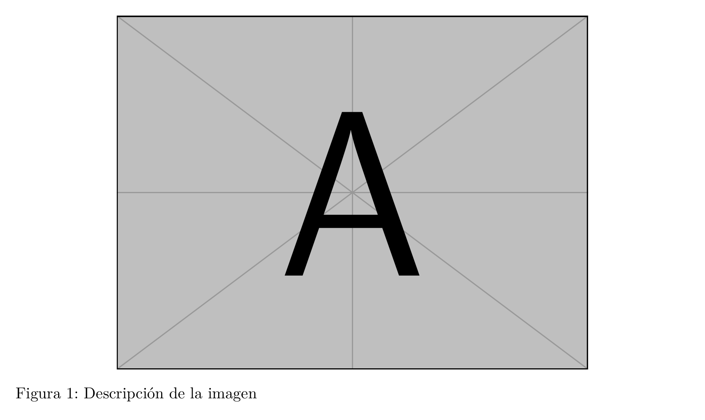

[📄 Ver PDF](assets/previews/IMAGENES_SUBFIGURAS_001.pdf)

### Referenciar figuras

```latex
Como se muestra en la Figura~\ref{fig:mi-figura}, el sistema...

% Con hyperref (incluido en la plantilla)
La \autoref{fig:mi-figura} ilustra el proceso.
```

### Caption largo y corto

```latex <!-- preview -->
\begin{figure}[htbp]
    \centering
    \includegraphics[width=0.8\textwidth]{example-image-a}
    \caption[Título corto para el índice]{%
        Título largo con descripción detallada que aparece bajo la figura.
        Puede incluir varias oraciones explicando el contenido.%
    }
    \label{fig:diagrama}
\end{figure}
```

**Resultado:**

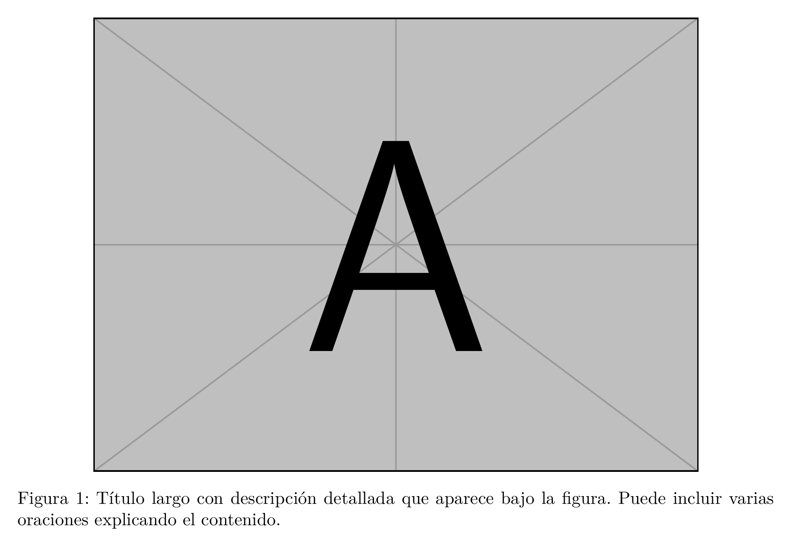

[📄 Ver PDF](assets/previews/IMAGENES_SUBFIGURAS_002.pdf)

### Personalizar caption

```latex
% Cambiar formato globalmente (en preámbulo o configuracion.tex)
\captionsetup{
    font=small,              % Tamaño de fuente
    labelfont=bf,           % Etiqueta en negrita
    labelsep=period,        % Separador: punto
    justification=centering, % Centrado
    format=hang,            % Formato colgante
    margin=2cm,             % Márgenes laterales
}

% O solo para una figura
\begin{figure}[htbp]
    \centering
    \captionsetup{font=footnotesize, labelfont=it}
    \includegraphics[width=0.6\textwidth]{imagen.jpg}
    \caption{Esta caption tiene formato diferente}
\end{figure}
```

### Opciones de captionsetup

| Opción | Descripción | Valores |
|--------|-------------|---------|
| `font` | Fuente del texto | `small`, `footnotesize`, `sf` |
| `labelfont` | Fuente de etiqueta | `bf`, `it`, `sf`, `sc` |
| `textfont` | Fuente del texto | `it`, `sl`, `sf` |
| `labelsep` | Separador | `colon`, `period`, `space`, `quad`, `newline` |
| `justification` | Alineación | `centering`, `raggedright`, `raggedleft`, `justified` |
| `format` | Formato general | `plain`, `hang` |
| `margin` | Márgenes | `2cm`, `{1cm, 2cm}` |
| `width` | Ancho del caption | `0.8\textwidth` |
| `position` | Posición | `top`, `bottom`, `auto` |
| `skip` | Espacio al caption | `10pt` |

---

## Subfiguras

### Dos subfiguras lado a lado

```latex <!-- preview -->
\begin{figure}[htbp]
    \centering
    \begin{subfigure}[b]{0.48\textwidth}
        \centering
        \includegraphics[width=\textwidth]{example-image-a}
        \caption{Antes del tratamiento}
        \label{fig:antes}
    \end{subfigure}
    \hfill
    \begin{subfigure}[b]{0.48\textwidth}
        \centering
        \includegraphics[width=\textwidth]{example-image-b}
        \caption{Después del tratamiento}
        \label{fig:despues}
    \end{subfigure}
    \caption{Comparación del efecto del tratamiento}
    \label{fig:comparacion}
\end{figure}
```

**Resultado:**

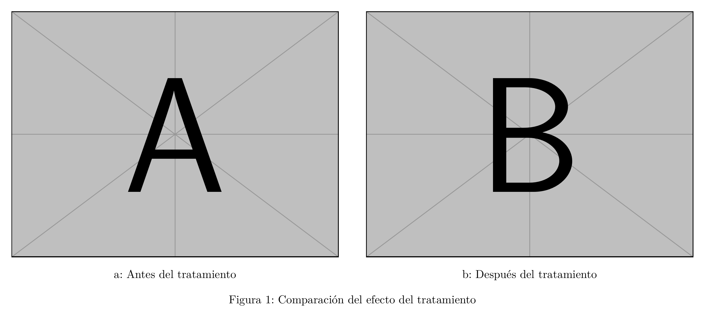

[📄 Ver PDF](assets/previews/IMAGENES_SUBFIGURAS_003.pdf)

### Tres subfiguras

```latex <!-- preview -->
\begin{figure}[htbp]
    \centering
    \begin{subfigure}[b]{0.32\textwidth}
        \centering
        \includegraphics[width=\textwidth]{example-image-a}
        \caption{Caso A}
        \label{fig:caso-a}
    \end{subfigure}
    \hfill
    \begin{subfigure}[b]{0.32\textwidth}
        \centering
        \includegraphics[width=\textwidth]{example-image-b}
        \caption{Caso B}
        \label{fig:caso-b}
    \end{subfigure}
    \hfill
    \begin{subfigure}[b]{0.32\textwidth}
        \centering
        \includegraphics[width=\textwidth]{example-image-c}
        \caption{Caso C}
        \label{fig:caso-c}
    \end{subfigure}
    \caption{Comparación de los tres casos}
    \label{fig:tres-casos}
\end{figure}
```

**Resultado:**

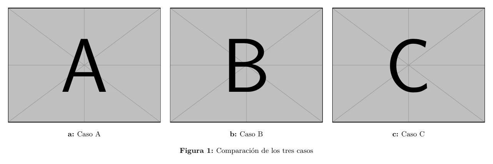

[📄 Ver PDF](assets/previews/IMAGENES_SUBFIGURAS_004.pdf)

### Cuadrícula 2x2

```latex <!-- preview -->
\begin{figure}[htbp]
    \centering
    \begin{subfigure}[b]{0.48\textwidth}
        \centering
        \includegraphics[width=\textwidth]{example-image-a}
        \caption{Superior izquierda}
    \end{subfigure}
    \hfill
    \begin{subfigure}[b]{0.48\textwidth}
        \centering
        \includegraphics[width=\textwidth]{example-image-b}
        \caption{Superior derecha}
    \end{subfigure}
    
    \vspace{0.5cm} % Espacio vertical
    
    \begin{subfigure}[b]{0.48\textwidth}
        \centering
        \includegraphics[width=\textwidth]{example-image-c}
        \caption{Inferior izquierda}
    \end{subfigure}
    \hfill
    \begin{subfigure}[b]{0.48\textwidth}
        \centering
        \includegraphics[width=\textwidth]{example-image}
        \caption{Inferior derecha}
    \end{subfigure}
    \caption{Cuadrícula de cuatro imágenes}
    \label{fig:cuadricula}
\end{figure}
```

**Resultado:**

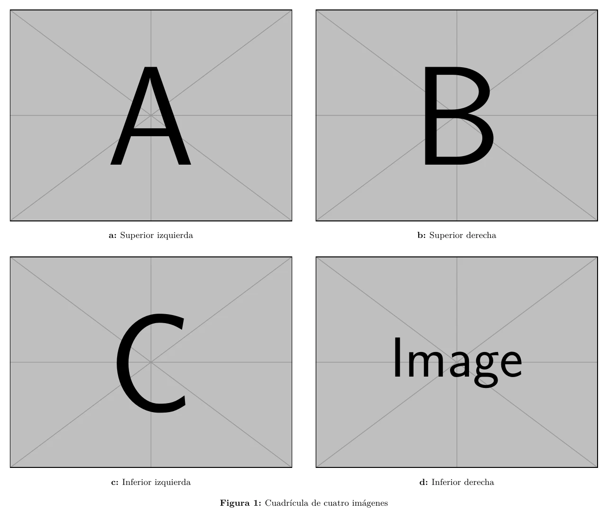

[📄 Ver PDF](assets/previews/IMAGENES_SUBFIGURAS_005.pdf)

### Subfiguras con diferentes tamaños

```latex <!-- preview -->
\begin{figure}[htbp]
    \centering
    \begin{subfigure}[b]{0.6\textwidth}
        \centering
        \includegraphics[width=\textwidth]{example-image-a}
        \caption{Imagen principal}
        \label{fig:principal}
    \end{subfigure}
    
    \vspace{0.3cm}
    
    \begin{subfigure}[b]{0.28\textwidth}
        \centering
        \includegraphics[width=\textwidth]{example-image-b}
        \caption{Detalle 1}
    \end{subfigure}
    \hfill
    \begin{subfigure}[b]{0.28\textwidth}
        \centering
        \includegraphics[width=\textwidth]{example-image-c}
        \caption{Detalle 2}
    \end{subfigure}
    \hfill
    \begin{subfigure}[b]{0.28\textwidth}
        \centering
        \includegraphics[width=\textwidth]{example-image}
        \caption{Detalle 3}
    \end{subfigure}
    \caption{Imagen principal con detalles ampliados}
    \label{fig:con-detalles}
\end{figure}
```

**Resultado:**

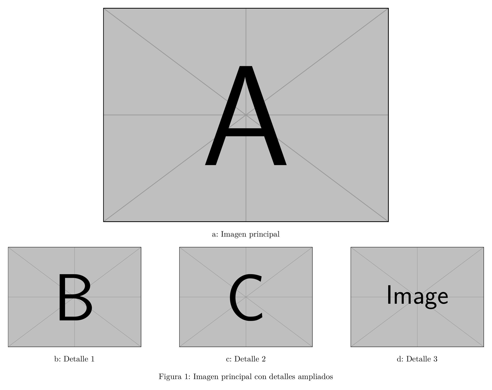

[📄 Ver PDF](assets/previews/IMAGENES_SUBFIGURAS_006.pdf)

### Personalizar numeración de subfiguras

```latex
% En el preámbulo
\renewcommand{\thesubfigure}{\roman{subfigure}}  % i, ii, iii
% O
\renewcommand{\thesubfigure}{\Alph{subfigure}}   % A, B, C
% O
\renewcommand{\thesubfigure}{\arabic{subfigure}} % 1, 2, 3
```

### Referenciar subfiguras

```latex
Como se observa en la Figura~\ref{fig:comparacion}, 
específicamente en la subfigura~\ref{fig:antes}...

% También funciona
Ver Figuras~\ref{fig:antes} y \ref{fig:despues}.
```

---

## Posicionamiento

### Especificadores de posición

| Especificador | Significado |
|--------------|-------------|
| `h` | Here - Aquí, si hay espacio |
| `t` | Top - Arriba de la página |
| `b` | Bottom - Abajo de la página |
| `p` | Page - Página de flotantes |
| `H` | HERE - Exactamente aquí (requiere `float`) |
| `!` | Override - Ignorar restricciones |

### Ejemplos de posicionamiento

```latex <!-- preview -->
% Intenta aquí, luego arriba, luego abajo, luego página especial
\begin{figure}[htbp]
    ...
\end{figure}

% Forzar exactamente aquí (puede dejar espacios)
\begin{figure}[H]
    ...
\end{figure}

% Solo arriba de página
\begin{figure}[t]
    ...
\end{figure}

% Ignorar restricciones, intentar aquí primero
\begin{figure}[!h]
    ...
\end{figure}
```

**Resultado:**


[📄 Ver PDF](assets/previews/IMAGENES_SUBFIGURAS_007.pdf)

### Controlar flotantes

```latex
% Forzar que todos los flotantes pendientes se coloquen
\FloatBarrier

% O después de una sección
\section{Nueva sección}
\FloatBarrier
```

### Ajustar parámetros de flotantes

```latex
% En el preámbulo para permitir más flotantes por página
\renewcommand{\topfraction}{0.9}      % Max fracción superior
\renewcommand{\bottomfraction}{0.9}    % Max fracción inferior
\renewcommand{\textfraction}{0.1}      % Min fracción de texto
\renewcommand{\floatpagefraction}{0.8} % Min para página de floats

% Permitir más flotantes
\setcounter{topnumber}{3}      % Max flotantes arriba
\setcounter{bottomnumber}{3}   % Max flotantes abajo
\setcounter{totalnumber}{5}    % Max total por página
```

---

## Figuras anchas

### Usar todo el ancho (en documentos a dos columnas)

```latex
\begin{figure*}[htbp]
    \centering
    \includegraphics[width=\textwidth]{imagen-ancha.jpg}
    \caption{Figura que ocupa ambas columnas}
    \label{fig:ancha}
\end{figure*}
```

### Figura más ancha que el texto

```latex
\begin{figure}[htbp]
    \centering
    \makebox[\textwidth][c]{%
        \includegraphics[width=1.2\textwidth]{imagen-panoramica.jpg}%
    }
    \caption{Imagen panorámica extendida}
    \label{fig:panoramica}
\end{figure}
```

### Figura en el margen

```latex
\begin{figure}[htbp]
    \centering
    \hspace*{-2cm}  % Extender hacia el margen izquierdo
    \includegraphics[width=\textwidth+4cm]{imagen.jpg}
    \caption{Figura extendida a los márgenes}
\end{figure}
```

---

## Texto alrededor de figuras

### Usando wrapfigure

```latex <!-- preview -->
% En el documento
\begin{wrapfigure}{r}{0.4\textwidth}
    \centering
    \includegraphics[width=0.38\textwidth]{example-image-a}
    \caption{Imagen con texto alrededor}
    \label{fig:wrap}
\end{wrapfigure}

Este es el texto que fluirá alrededor de la imagen. 
La imagen está posicionada a la derecha (r) y ocupa 
el 40\% del ancho del texto. El texto continuará 
fluyendo hasta que pase la altura de la imagen.

Más texto aquí que seguirá fluyendo normalmente 
una vez que pase la imagen.
```

**Resultado:**

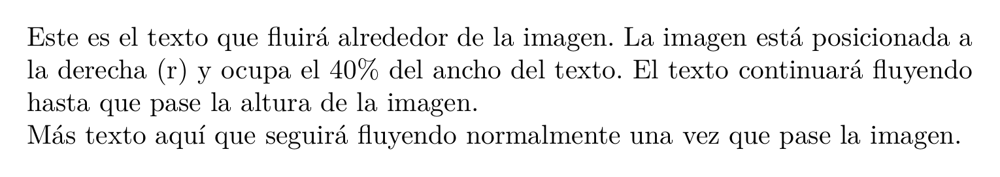

[📄 Ver PDF](assets/previews/IMAGENES_SUBFIGURAS_008.pdf)

### Opciones de wrapfigure

| Posición | Significado |
|----------|-------------|
| `r` / `R` | Derecha |
| `l` / `L` | Izquierda |
| `i` / `I` | Interior (encuadernación) |
| `o` / `O` | Exterior |

```latex
% Sintaxis completa
\begin{wrapfigure}[líneas]{posición}[overhang]{ancho}
    ...
\end{wrapfigure}

% Ejemplo con todas las opciones
\begin{wrapfigure}[12]{r}[1cm]{0.4\textwidth}
    % 12 líneas de alto, derecha, 1cm en el margen
\end{wrapfigure}
```

---

## Rotación de imágenes

### Rotar con includegraphics

```latex
\includegraphics[width=5cm, angle=90]{imagen.jpg}
```

### Rotar figura completa (con caption)

```latex
\begin{sidewaysfigure}
    \centering
    \includegraphics[width=0.8\textheight]{diagrama-grande.pdf}
    \caption{Diagrama extenso mostrado en horizontal}
    \label{fig:horizontal}
\end{sidewaysfigure}
```

### Rotar solo la imagen dentro de figure

```latex
\begin{figure}[htbp]
    \centering
    \rotatebox{90}{%
        \includegraphics[width=0.7\textheight]{imagen.jpg}%
    }
    \caption{Imagen rotada 90 grados}
    \label{fig:rotada}
\end{figure}
```

---

## Marcos y bordes

### Borde simple con fbox

```latex <!-- preview -->
\begin{figure}[htbp]
    \centering
    \fbox{\includegraphics[width=0.6\textwidth]{example-image-a}}
    \caption{Imagen con borde negro}
    \label{fig:borde}
\end{figure}
```

**Resultado:**

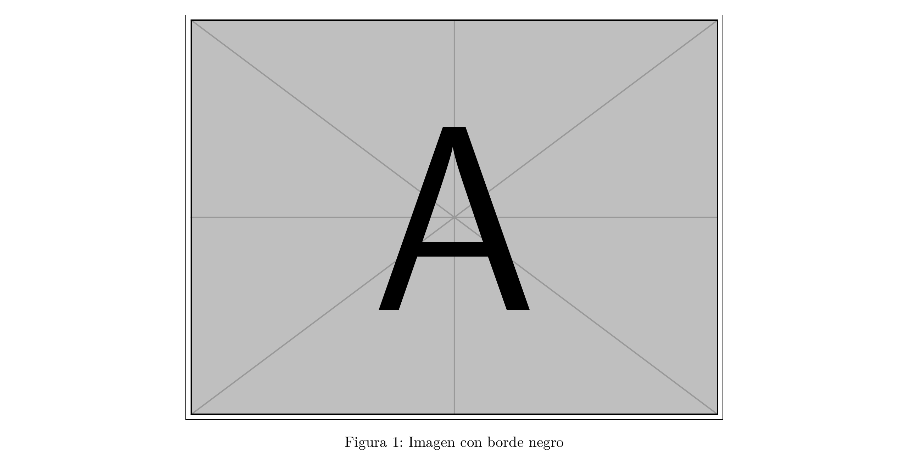

[📄 Ver PDF](assets/previews/IMAGENES_SUBFIGURAS_009.pdf)

### Personalizar el borde

```latex
% Grosor y separación del borde
\setlength{\fboxrule}{2pt}   % Grosor del borde
\setlength{\fboxsep}{5pt}    % Separación del borde

\fbox{\includegraphics[width=0.6\textwidth]{imagen.jpg}}
```

### Borde con color

```latex <!-- preview -->
\begin{figure}[htbp]
    \centering
    \fcolorbox{blue}{white}{%
        \includegraphics[width=0.6\textwidth]{example-image-a}%
    }
    \caption{Imagen con borde azul}
\end{figure}
```

**Resultado:**

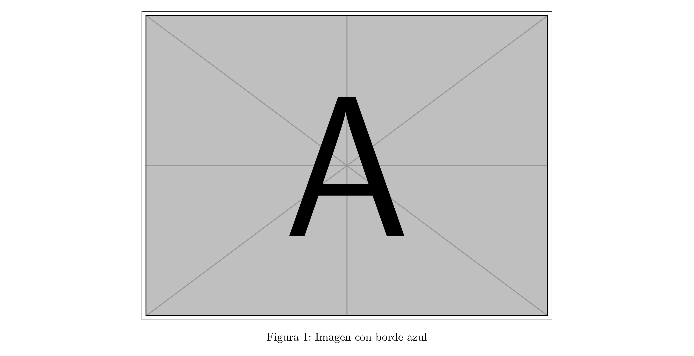

[📄 Ver PDF](assets/previews/IMAGENES_SUBFIGURAS_010.pdf)

### Sombra con TikZ

```latex <!-- preview -->
\begin{figure}[htbp]
    \centering
    \begin{tikzpicture}
        \node[
            draw=gray,
            line width=1pt,
            inner sep=0pt,
            drop shadow={shadow xshift=3pt, shadow yshift=-3pt}
        ] {
            \includegraphics[width=0.6\textwidth]{example-image-a}
        };
    \end{tikzpicture}
    \caption{Imagen con sombra}
    \label{fig:sombra}
\end{figure}
```

**Resultado:**

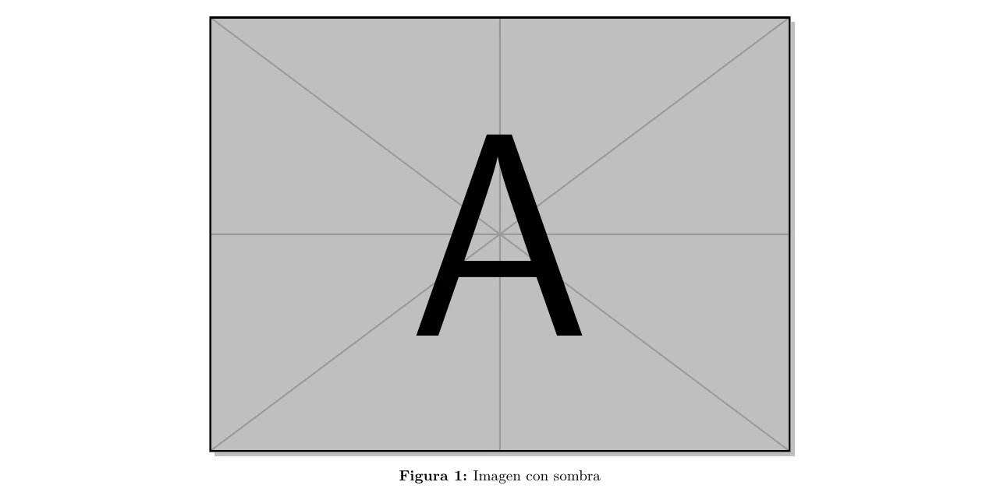

[📄 Ver PDF](assets/previews/IMAGENES_SUBFIGURAS_011.pdf)

### Marco decorativo con tcolorbox

```latex <!-- preview -->
\begin{figure}[htbp]
    \centering
    \begin{tcolorbox}[
        enhanced,
        boxrule=0.5pt,
        colback=white,
        colframe=gray,
        arc=3mm,
        shadow={2mm}{-2mm}{0mm}{gray!50},
        width=0.7\textwidth,
    ]
        \includegraphics[width=\linewidth]{example-image-a}
    \end{tcolorbox}
    \caption{Imagen con marco decorativo}
    \label{fig:decorativa}
\end{figure}
```

**Resultado:**

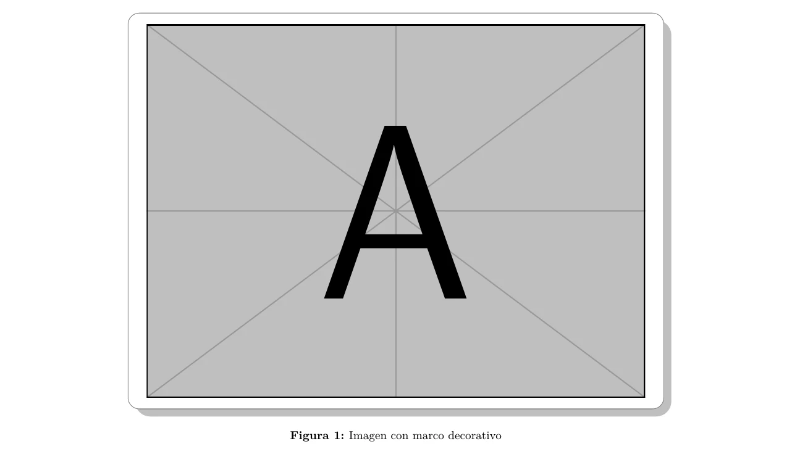

[📄 Ver PDF](assets/previews/IMAGENES_SUBFIGURAS_012.pdf)

---

## Solución de problemas

### "File not found"

**Causas y soluciones**:

```latex
% 1. Verificar la ruta (relativa al archivo main.tex)
\includegraphics{recursos/imagenes/foto.jpg}  % Correcto
\includegraphics{../imagenes/foto.jpg}         % Incorrecto si main.tex está en raíz

% 2. Evitar espacios en nombres de archivo
\includegraphics{mi_imagen.jpg}     % OK
\includegraphics{mi imagen.jpg}     % Puede fallar

% 3. Definir rutas de búsqueda en el preámbulo
\graphicspath{{recursos/imagenes/}{recursos/diagramas/}}
% Ahora puedes usar solo el nombre
\includegraphics{foto.jpg}
```

### Imagen borrosa o pixelada

**Solución**: Usa imágenes de mayor resolución o formatos vectoriales.

```latex
% Para diagramas, preferir PDF vectorial
\includegraphics{diagrama.pdf}

% Para fotos, usar alta resolución (300 DPI mínimo para impresión)
\includegraphics[width=10cm]{foto_alta_res.jpg}
```

### La figura aparece en otro lugar

**Soluciones**:

```latex
% 1. Usar [H] para forzar posición
\begin{figure}[H]
    ...
\end{figure}

% 2. Usar FloatBarrier
\FloatBarrier
\begin{figure}[htbp]
    ...
\end{figure}

% 3. Ajustar parámetros (en preámbulo)
\renewcommand{\textfraction}{0.05}
\renewcommand{\topfraction}{0.95}
```

### Espacio excesivo alrededor de figuras

```latex
% Ajustar espacios (en preámbulo)
\setlength{\intextsep}{10pt}      % Espacio arriba/abajo de floats
\setlength{\floatsep}{10pt}       % Entre floats
\setlength{\textfloatsep}{15pt}   % Entre float y texto
```

### Subfiguras desalineadas

```latex
% Asegurar mismo alineamiento vertical
\begin{subfigure}[t]{0.48\textwidth}  % 't' para alinear por arriba
    ...
\end{subfigure}

% O usar minipage con altura fija
\begin{minipage}[t][5cm][c]{0.48\textwidth}
    \centering
    \includegraphics[height=4cm]{imagen.jpg}
\end{minipage}
```

### Caption demasiado ancho

```latex
\begin{figure}[htbp]
    \centering
    \includegraphics[width=0.5\textwidth]{imagen.jpg}
    \captionsetup{width=0.5\textwidth}
    \caption{Este caption tiene el mismo ancho que la imagen}
\end{figure}
```

---

## Ejemplos completos

### Figura con múltiples elementos

```latex
\begin{figure}[htbp]
    \centering
    
    % Imagen principal
    \includegraphics[width=0.8\textwidth]{sistema.pdf}
    
    % Espacio
    \vspace{0.5cm}
    
    % Fila de detalles
    \begin{subfigure}[b]{0.3\textwidth}
        \centering
        \includegraphics[width=\textwidth]{componente_a.pdf}
        \caption{Componente A}
        \label{fig:comp-a}
    \end{subfigure}
    \hfill
    \begin{subfigure}[b]{0.3\textwidth}
        \centering
        \includegraphics[width=\textwidth]{componente_b.pdf}
        \caption{Componente B}
        \label{fig:comp-b}
    \end{subfigure}
    \hfill
    \begin{subfigure}[b]{0.3\textwidth}
        \centering
        \includegraphics[width=\textwidth]{componente_c.pdf}
        \caption{Componente C}
        \label{fig:comp-c}
    \end{subfigure}
    
    \caption[Arquitectura del sistema]{%
        Arquitectura general del sistema (arriba) con detalles 
        de los componentes principales (abajo).%
    }
    \label{fig:arquitectura}
\end{figure}
```

### Galería de imágenes

```latex
\begin{figure}[htbp]
    \centering
    \foreach \i in {1,...,6} {%
        \begin{subfigure}[b]{0.32\textwidth}
            \centering
            \includegraphics[width=\textwidth]{galeria/img\i.jpg}
            \caption{Imagen \i}
        \end{subfigure}%
        \ifnum\i=3 \\ \fi  % Salto de línea después de 3
    }
    \caption{Galería de resultados experimentales}
    \label{fig:galeria}
\end{figure}
```

---

## Recursos adicionales

- [Documentación de graphicx](https://ctan.org/pkg/graphicx)
- [Documentación de subcaption](https://ctan.org/pkg/subcaption)
- [Documentación de caption](https://ctan.org/pkg/caption)
- [Wikibooks: LaTeX/Floats](https://en.wikibooks.org/wiki/LaTeX/Floats,_Figures_and_Captions)

---

## Ver también

- [FIGURAS_GRAFICAS.md](FIGURAS_GRAFICAS.md) - Crear gráficas con pgfplots
- [TABLAS.md](TABLAS.md) - Guía de tablas
- [REFERENCIAS_CRUZADAS.md](REFERENCIAS_CRUZADAS.md) - Referencias a figuras
