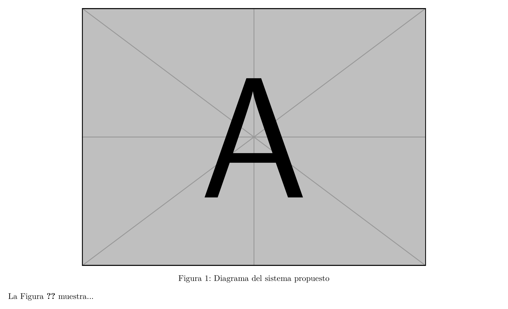
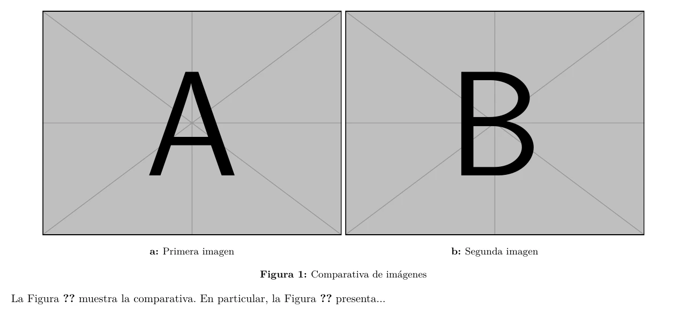
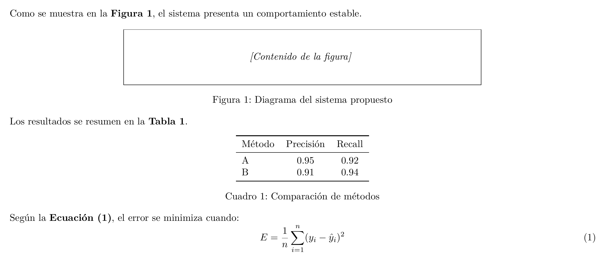
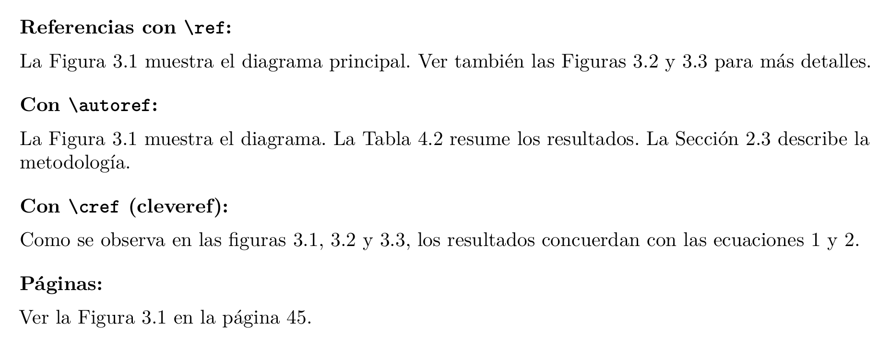

# 🔗 Guía de Referencias Cruzadas

Esta guía explica cómo crear y usar referencias cruzadas internas en documentos LaTeX, incluyendo etiquetas, referencias y el paquete **hyperref**.

---

## 📋 Índice

- [📋 Índice](#-índice)
- [Introducción](#introducción)
  - [Paquetes utilizados](#paquetes-utilizados)
- [Etiquetas y referencias básicas](#etiquetas-y-referencias-básicas)
  - [Crear etiquetas](#crear-etiquetas)
  - [Referenciar](#referenciar)
  - [Ejemplo básico](#ejemplo-básico)
- [Tipos de elementos referenciables](#tipos-de-elementos-referenciables)
  - [Secciones y capítulos](#secciones-y-capítulos)
  - [Figuras](#figuras)
  - [Tablas](#tablas)
  - [Ecuaciones](#ecuaciones)
  - [Listas enumeradas](#listas-enumeradas)
  - [Teoremas y definiciones](#teoremas-y-definiciones)
  - [Código fuente (listings)](#código-fuente-listings)
- [Comandos de referencia avanzados](#comandos-de-referencia-avanzados)
  - [Referencia con nombre (nameref)](#referencia-con-nombre-nameref)
  - [Autoreferencia (autoref)](#autoreferencia-autoref)
  - [Personalizar nombres de autoref](#personalizar-nombres-de-autoref)
  - [Referencias a subfiguras](#referencias-a-subfiguras)
- [Hyperref y enlaces](#hyperref-y-enlaces)
  - [Configuración básica](#configuración-básica)
  - [Opciones principales](#opciones-principales)
  - [Metadatos del PDF](#metadatos-del-pdf)
  - [Crear hipervínculos](#crear-hipervínculos)
  - [Anclas personalizadas](#anclas-personalizadas)
- [Cleveref - Referencias inteligentes](#cleveref---referencias-inteligentes)
  - [Configuración](#configuración)
  - [Uso básico](#uso-básico)
  - [Múltiples referencias](#múltiples-referencias)
  - [Configurar nombres](#configurar-nombres)
  - [Con página](#con-página)
- [Personalización](#personalización)
  - [Formato de números](#formato-de-números)
  - [Reiniciar contadores](#reiniciar-contadores)
  - [Formato personalizado de referencias](#formato-personalizado-de-referencias)
  - [Referencias con texto fijo](#referencias-con-texto-fijo)
- [Buenas prácticas](#buenas-prácticas)
  - [Convención de nombres para etiquetas](#convención-de-nombres-para-etiquetas)
  - [Nombres descriptivos](#nombres-descriptivos)
  - [Colocación correcta de \label](#colocación-correcta-de-label)
  - [Espacio irrompible](#espacio-irrompible)
- [Solución de problemas](#solución-de-problemas)
  - ["Reference undefined"](#reference-undefined)
  - [Referencias muestran "??"](#referencias-muestran-)
  - [Números de página incorrectos](#números-de-página-incorrectos)
  - [Hyperref conflictos](#hyperref-conflictos)
  - [Etiquetas duplicadas](#etiquetas-duplicadas)
  - [Enlaces no funcionan en el PDF](#enlaces-no-funcionan-en-el-pdf)
  - [Colores de enlaces para impresión](#colores-de-enlaces-para-impresión)
- [Ejemplos completos](#ejemplos-completos)
  - [Documento con referencias](#documento-con-referencias)
  - [Con cleveref](#con-cleveref)
- [Ejemplos visuales](#ejemplos-visuales)
  - [Referencias básicas en contexto](#referencias-básicas-en-contexto)
  - [Ejemplo de referencias múltiples](#ejemplo-de-referencias-múltiples)
- [Recursos adicionales](#recursos-adicionales)
- [Ver también](#ver-también)

---

## Introducción

Las referencias cruzadas permiten:

- Enlazar a figuras, tablas, ecuaciones, secciones
- Crear índices automáticos
- Generar hipervínculos en el PDF
- Mantener numeración consistente

### Paquetes utilizados

```latex
\usepackage{hyperref}  % Hipervínculos
\usepackage{cleveref}  % Referencias inteligentes (opcional)
```

---

## Etiquetas y referencias básicas

### Crear etiquetas

```latex
\label{etiqueta}
```

La etiqueta debe colocarse **después** del elemento que numera:

- Secciones: después de `\section{}`
- Figuras/Tablas: después de `\caption{}`
- Ecuaciones: dentro del entorno

### Referenciar

```latex
\ref{etiqueta}      % Número: 3.2
\pageref{etiqueta}  % Página: 45
```

### Ejemplo básico

```latex
\section{Metodología}
\label{sec:metodologia}

Como se explica en la Sección~\ref{sec:metodologia}
(página~\pageref{sec:metodologia})...
```

> **Nota**: Usa `~` (espacio irrompible) entre "Sección" y `\ref` para evitar que se separen en diferentes líneas.

---

## Tipos de elementos referenciables

### Secciones y capítulos

```latex
\chapter{Introducción}
\label{cap:introduccion}

\section{Motivación}
\label{sec:motivacion}

\subsection{Contexto histórico}
\label{subsec:contexto}

% Referencia
En el Capítulo~\ref{cap:introduccion}...
Ver Sección~\ref{sec:motivacion}...
```

### Figuras

```latex <!-- preview -->
\begin{figure}[htbp]
    \centering
    \includegraphics[width=0.7\textwidth]{example-image-a}
    \caption{Diagrama del sistema propuesto}
    \label{fig:diagrama}
\end{figure}

% Referencia
La Figura~\ref{fig:diagrama} muestra...
```

**Resultado:**



[📄 Ver PDF](assets/previews/REFERENCIAS_CRUZADAS_001.pdf)

### Tablas

```latex
\begin{table}[htbp]
    \centering
    \caption{Resultados del experimento}
    \label{tab:resultados}
    \begin{tabular}{lcc}
        ...
    \end{tabular}
\end{table}

% Referencia
Los resultados se muestran en la Tabla~\ref{tab:resultados}.
```

### Ecuaciones

```latex
\begin{equation}
    E = mc^2
    \label{eq:einstein}
\end{equation}

% Referencia
La ecuación~\eqref{eq:einstein} describe...
```

> **Nota**: Para ecuaciones, usa `\eqref{}` que añade paréntesis automáticamente: (3.1)

### Listas enumeradas

```latex
\begin{enumerate}
    \item Primer paso \label{item:paso1}
    \item Segundo paso \label{item:paso2}
\end{enumerate}

% Referencia
Comenzamos con el paso~\ref{item:paso1}...
```

### Teoremas y definiciones

```latex
\begin{theorem}
    \label{thm:pitagoras}
    En un triángulo rectángulo...
\end{theorem}

% Referencia
Por el Teorema~\ref{thm:pitagoras}...
```

### Código fuente (listings)

```latex
\begin{listing}[htbp]
    \begin{pythoncode}
        def hello():
            print("Hello")
    \end{pythoncode}
    \caption{Función de ejemplo}
    \label{lst:ejemplo}
\end{listing}

% Referencia
El Listado~\ref{lst:ejemplo} muestra...
```

---

## Comandos de referencia avanzados

### Referencia con nombre (nameref)

```latex
% Requiere hyperref
\nameref{etiqueta}  % Devuelve el título, no el número

\section{Metodología}
\label{sec:metodologia}

Ver la sección ``\nameref{sec:metodologia}''  % "Metodología"
```

### Autoreferencia (autoref)

```latex
% Requiere hyperref
\autoref{etiqueta}  % Añade prefijo automático

\autoref{fig:diagrama}  % Figura 3.2
\autoref{tab:resultados}  % Tabla 4.1
\autoref{sec:metodologia}  % Sección 2.1
\autoref{eq:einstein}  % Ecuación 1
```

### Personalizar nombres de autoref

```latex
% En el preámbulo
\renewcommand{\figureautorefname}{Figura}
\renewcommand{\tableautorefname}{Tabla}
\renewcommand{\equationautorefname}{Ecuación}
\renewcommand{\sectionautorefname}{Sección}
\renewcommand{\subsectionautorefname}{Sección}
\renewcommand{\chapterautorefname}{Capítulo}
```

### Referencias a subfiguras

```latex <!-- preview -->
\begin{figure}[htbp]
    \centering
    \begin{subfigure}[b]{0.45\textwidth}
        \includegraphics[width=\textwidth]{example-image-a}
        \caption{Primera imagen}
        \label{fig:sub_a}
    \end{subfigure}
    \begin{subfigure}[b]{0.45\textwidth}
        \includegraphics[width=\textwidth]{example-image-b}
        \caption{Segunda imagen}
        \label{fig:sub_b}
    \end{subfigure}
    \caption{Comparativa de imágenes}
    \label{fig:comparativa}
\end{figure}

% Referencias
La Figura~\ref{fig:comparativa} muestra la comparativa.
En particular, la Figura~\ref{fig:sub_a} presenta...
```

**Resultado:**



[📄 Ver PDF](assets/previews/REFERENCIAS_CRUZADAS_002.pdf)

---

## Hyperref y enlaces

### Configuración básica

```latex
\usepackage[
    colorlinks=true,
    linkcolor=blue,
    citecolor=green,
    urlcolor=cyan
]{hyperref}
```

### Opciones principales

| Opción | Descripción |
|--------|-------------|
| `colorlinks` | Enlaces en color (sin recuadro) |
| `linkcolor` | Color de enlaces internos |
| `citecolor` | Color de citas bibliográficas |
| `urlcolor` | Color de URLs |
| `hidelinks` | Sin color ni recuadros |
| `bookmarks` | Crear marcadores en PDF |
| `pdfauthor` | Autor en metadatos PDF |
| `pdftitle` | Título en metadatos PDF |

### Metadatos del PDF

```latex
\hypersetup{
    pdftitle={Mi Trabajo Fin de Grado},
    pdfauthor={Nombre Apellido},
    pdfsubject={Informática},
    pdfkeywords={LaTeX, TFG, Universidad}
}
```

### Crear hipervínculos

```latex
% URL externa
\url{https://www.ua.es}
\href{https://www.ua.es}{Universidad de Alicante}

% Enlace interno a etiqueta
\hyperref[sec:introduccion]{ver introducción}

% Enlace a archivo local
\href{run:./anexos/datos.xlsx}{Abrir hoja de cálculo}

% Enlace de correo
\href{mailto:correo@ua.es}{correo@ua.es}
```

### Anclas personalizadas

```latex
% Crear ancla
\hypertarget{mi_ancla}{Texto de destino}

% Enlazar a ancla
\hyperlink{mi_ancla}{Ir al texto}
```

---

## Cleveref - Referencias inteligentes

El paquete `cleveref` automatiza los prefijos de las referencias.

### Configuración

```latex
% IMPORTANTE: cargar después de hyperref
\usepackage{hyperref}
\usepackage[spanish]{cleveref}
```

### Uso básico

```latex
\cref{etiqueta}   % figura 3.2 / ecuación 4
\Cref{etiqueta}   % Figura 3.2 / Ecuación 4 (mayúscula inicial)
```

### Múltiples referencias

```latex
% Referencias múltiples automáticas
\cref{fig:a,fig:b,fig:c}
% Resultado: "figuras 1, 2 y 3"

\cref{eq:1,eq:2}
% Resultado: "ecuaciones 1 y 2"

% Rango de referencias
\crefrange{fig:a}{fig:d}
% Resultado: "figuras 1 a 4"
```

### Configurar nombres

```latex
\crefname{figure}{figura}{figuras}
\Crefname{figure}{Figura}{Figuras}
\crefname{table}{tabla}{tablas}
\crefname{equation}{ecuación}{ecuaciones}
\crefname{section}{sección}{secciones}
\crefname{chapter}{capítulo}{capítulos}
\crefname{listing}{listado}{listados}
```

### Con página

```latex
\cpageref{etiqueta}      % página 45
\cpagerefrange{a}{b}     % páginas 45 a 48
```

---

## Personalización

### Formato de números

```latex
% Numeración de ecuaciones por sección
\numberwithin{equation}{section}  % (2.3) en sección 2

% Numeración de figuras por capítulo
\numberwithin{figure}{chapter}    % Figura 3.2 en capítulo 3
```

### Reiniciar contadores

```latex
% Reiniciar numeración de figuras cada capítulo
\counterwithin{figure}{chapter}

% Sin reinicio (numeración continua)
\counterwithout{figure}{chapter}
```

### Formato personalizado de referencias

```latex
% Cambiar cómo se muestran las ecuaciones
\renewcommand{\theequation}{\arabic{section}.\arabic{equation}}

% Cambiar figuras a letras
\renewcommand{\thefigure}{\Alph{figure}}
```

### Referencias con texto fijo

```latex
% Definir comando personalizado
\newcommand{\figref}[1]{Figura~\ref{#1}}
\newcommand{\tabref}[1]{Tabla~\ref{#1}}
\newcommand{\secref}[1]{Sección~\ref{#1}}

% Uso
La \figref{fig:diagrama} muestra...
```

---

## Buenas prácticas

### Convención de nombres para etiquetas

| Prefijo | Uso | Ejemplo |
|---------|-----|---------|
| `cap:` | Capítulos | `\label{cap:introduccion}` |
| `sec:` | Secciones | `\label{sec:metodologia}` |
| `subsec:` | Subsecciones | `\label{subsec:datos}` |
| `fig:` | Figuras | `\label{fig:diagrama}` |
| `tab:` | Tablas | `\label{tab:resultados}` |
| `eq:` | Ecuaciones | `\label{eq:einstein}` |
| `lst:` | Código | `\label{lst:algoritmo}` |
| `alg:` | Algoritmos | `\label{alg:ordenacion}` |
| `thm:` | Teoremas | `\label{thm:fundamental}` |
| `def:` | Definiciones | `\label{def:conjunto}` |
| `item:` | Items de lista | `\label{item:paso1}` |
| `app:` | Apéndices | `\label{app:datos}` |

### Nombres descriptivos

```latex
% ❌ Mal
\label{fig1}
\label{eq}

% ✅ Bien
\label{fig:arquitectura_sistema}
\label{eq:funcion_perdida}
```

### Colocación correcta de \label

```latex
% Secciones: inmediatamente después
\section{Metodología}
\label{sec:metodologia}

% Figuras/Tablas: después de \caption
\begin{figure}
    \includegraphics{...}
    \caption{Descripción}
    \label{fig:nombre}  % AQUÍ
\end{figure}

% Ecuaciones: antes del \end o en la misma línea
\begin{equation}
    E = mc^2 \label{eq:einstein}
\end{equation}
```

### Espacio irrompible

```latex
% Usar ~ para evitar separación
Figura~\ref{fig:a}      % ✅
Tabla~\ref{tab:b}       % ✅
Sección~\ref{sec:c}     % ✅
Ecuación~\eqref{eq:d}   % ✅

% Evitar
Figura \ref{fig:a}      % ❌ Puede separarse
```

---

## Solución de problemas

### "Reference undefined"

**Causa**: La etiqueta no existe o hay error tipográfico.

**Solución**:

1. Verificar que `\label{}` existe
2. Comprobar ortografía exacta
3. Compilar dos veces

```latex
% Buscar la etiqueta
\label{sec:metodologia}  % ¿Existe?
\ref{sec:metodologia}    % ¿Escrito igual?
```

### Referencias muestran "??"

**Causa**: Falta compilar una segunda vez.

**Solución**:

```bash
lualatex main
lualatex main  # Segunda compilación necesaria
```

### Números de página incorrectos

**Causa**: Los contadores no se actualizan en primera compilación.

**Solución**: Compilar dos veces mínimo.

### Hyperref conflictos

**Causa**: `hyperref` debe cargarse casi al final.

**Solución**:

```latex
% Cargar hyperref después de casi todos los paquetes
% pero antes de cleveref
\usepackage{...}
\usepackage{hyperref}
\usepackage{cleveref}  % Siempre después de hyperref
```

### Etiquetas duplicadas

**Causa**: Dos elementos con la misma etiqueta.

**Solución**:

```bash
# Buscar advertencias en el log
grep "Label.*multiply defined" main.log
```

```latex
% Usar nombres únicos
\label{fig:diagrama_cap1}
\label{fig:diagrama_cap2}
```

### Enlaces no funcionan en el PDF

**Causa**: Puede ser problema del visor PDF o configuración.

**Solución**:

```latex
% Verificar configuración de hyperref
\usepackage[
    colorlinks=true,
    linkcolor=blue
]{hyperref}
```

### Colores de enlaces para impresión

```latex
% Para versión impresa, ocultar colores
\usepackage[hidelinks]{hyperref}

% O usar colores sutiles
\usepackage[
    colorlinks=true,
    linkcolor=black,
    citecolor=black,
    urlcolor=black
]{hyperref}
```

---

## Ejemplos completos

### Documento con referencias

```latex
\chapter{Marco Teórico}
\label{cap:marco_teorico}

\section{Introducción}
\label{sec:mt_introduccion}

En este capítulo se presentan los fundamentos teóricos necesarios
para comprender el desarrollo del proyecto.

\section{Redes Neuronales}
\label{sec:redes_neuronales}

Las redes neuronales artificiales, como se ilustra en la 
Figura~\ref{fig:red_neuronal}, son modelos computacionales 
inspirados en el cerebro biológico.

\begin{figure}[htbp]
    \centering
    \includegraphics[width=0.7\textwidth]{figuras/red_neuronal.pdf}
    \caption{Estructura de una red neuronal artificial}
    \label{fig:red_neuronal}
\end{figure}

El funcionamiento matemático se describe mediante la 
ecuación~\eqref{eq:activacion}:

\begin{equation}
    y = f\left(\sum_{i=1}^{n} w_i x_i + b\right)
    \label{eq:activacion}
\end{equation}

donde los parámetros se detallan en la Tabla~\ref{tab:parametros}.

\begin{table}[htbp]
    \centering
    \caption{Parámetros del modelo}
    \label{tab:parametros}
    \begin{tabular}{ll}
        \toprule
        Símbolo & Descripción \\
        \midrule
        $w_i$ & Peso de la conexión $i$ \\
        $x_i$ & Entrada $i$ \\
        $b$ & Sesgo (bias) \\
        $f$ & Función de activación \\
        \bottomrule
    \end{tabular}
\end{table}

Para más detalles sobre la implementación, consultar el 
Capítulo~\ref{cap:desarrollo}.
```

### Con cleveref

```latex
\usepackage{hyperref}
\usepackage[spanish]{cleveref}

% Configurar nombres en español
\crefname{figure}{figura}{figuras}
\crefname{table}{tabla}{tablas}
\crefname{equation}{ecuación}{ecuaciones}

% En el documento
Como se observa en las \cref{fig:a,fig:b,fig:c}, los resultados 
son consistentes con las \cref{eq:modelo,eq:perdida}.

La \Cref{tab:resultados} resume los hallazgos principales 
discutidos en la \cref{sec:discusion}.
```

---

## Ejemplos visuales

Estos ejemplos muestran cómo se visualizan las referencias cruzadas en el documento final.

### Referencias básicas en contexto

```latex <!-- preview:2 -->
% Ejemplo de referencias en contexto
% (Standalone: usando valores simulados)

\noindent Como se muestra en la \textbf{Figura~1}, el sistema 
presenta un comportamiento estable.

\begin{figure}[htbp]
    \centering
    \fbox{\parbox{0.6\textwidth}{\centering\vspace{2em}
        \textit{[Contenido de la figura]}
    \vspace{2em}}}
    \caption{Diagrama del sistema propuesto}
    \label{fig:ejemplo}
\end{figure}

\noindent Los resultados se resumen en la \textbf{Tabla~1}.

\begin{table}[htbp]
    \centering
    \begin{tabular}{lcc}
        \toprule
        Método & Precisión & Recall \\
        \midrule
        A & 0.95 & 0.92 \\
        B & 0.91 & 0.94 \\
        \bottomrule
    \end{tabular}
    \caption{Comparación de métodos}
    \label{tab:ejemplo}
\end{table}

\noindent Según la \textbf{Ecuación~(1)}, el error se minimiza cuando:
\begin{equation}
    E = \frac{1}{n}\sum_{i=1}^{n}(y_i - \hat{y}_i)^2
    \label{eq:ejemplo}
\end{equation}
```

**Resultado:**



[📄 Ver PDF](assets/previews/REFERENCIAS_CRUZADAS_003.pdf)

### Ejemplo de referencias múltiples

```latex <!-- preview -->
% Ejemplo de referencias múltiples en texto

\noindent\textbf{Referencias con \texttt{\textbackslash ref}:}\\[0.5em]
La Figura 3.1 muestra el diagrama principal.
Ver también las Figuras 3.2 y 3.3 para más detalles.

\vspace{1em}
\noindent\textbf{Con \texttt{\textbackslash autoref}:}\\[0.5em]
La Figura 3.1 muestra el diagrama.
La Tabla 4.2 resume los resultados.
La Sección 2.3 describe la metodología.

\vspace{1em}
\noindent\textbf{Con \texttt{\textbackslash cref} (cleveref):}\\[0.5em]
Como se observa en las figuras 3.1, 3.2 y 3.3,
los resultados concuerdan con las ecuaciones 1 y 2.

\vspace{1em}
\noindent\textbf{Páginas:}\\[0.5em]
Ver la Figura 3.1 en la página 45.
```

**Resultado:**



[📄 Ver PDF](assets/previews/REFERENCIAS_CRUZADAS_004.pdf)

---

## Recursos adicionales

- [Documentación de hyperref](https://ctan.org/pkg/hyperref)
- [Documentación de cleveref](https://ctan.org/pkg/cleveref)
- [LaTeX Wikibook: Labels and Cross-referencing](https://en.wikibooks.org/wiki/LaTeX/Labels_and_Cross-referencing)

---

## Ver también

- [IMAGENES_SUBFIGURAS.md](IMAGENES_SUBFIGURAS.md) - Figuras y subfiguras
- [TABLAS.md](TABLAS.md) - Creación de tablas
- [ECUACIONES.md](ECUACIONES.md) - Ecuaciones matemáticas
- [BIBLIOGRAFIA.md](BIBLIOGRAFIA.md) - Referencias bibliográficas
