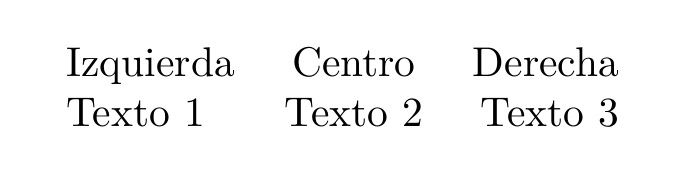
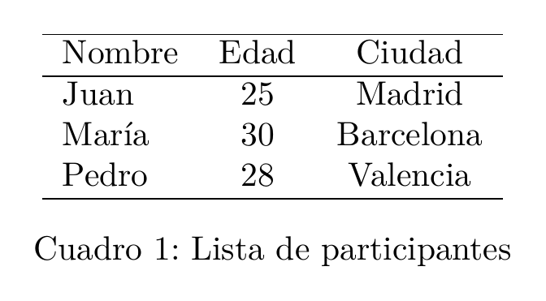
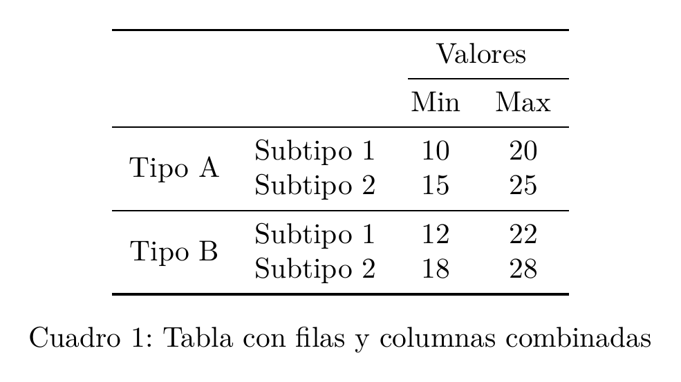
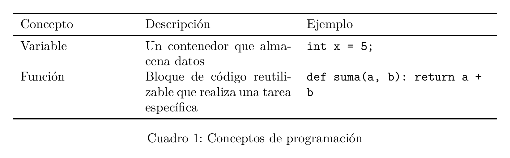
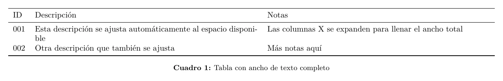
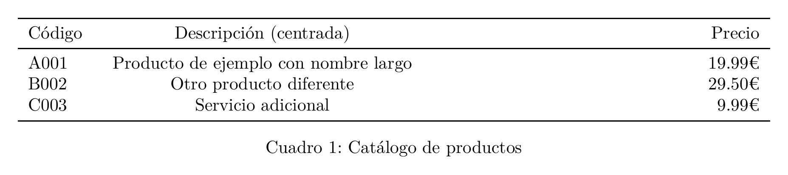
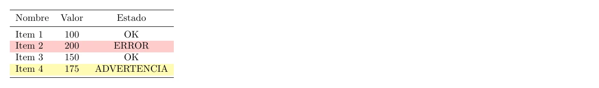
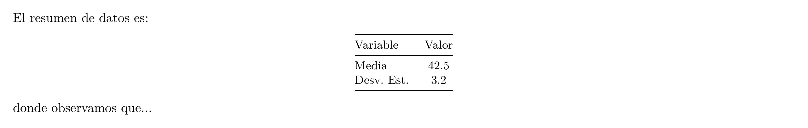
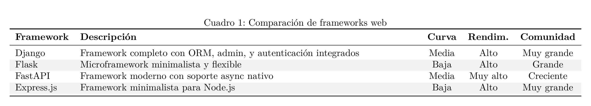

# 📊 Guía de Tablas en LaTeX

Esta guía explica cómo crear tablas profesionales usando los paquetes incluidos en la plantilla: `booktabs`, `longtable`, `tabularx`, y más.

---

## 📋 Índice

- [📋 Índice](#-índice)
- [Introducción](#introducción)
  - [Tipos de columna predefinidos](#tipos-de-columna-predefinidos)
- [Tablas básicas](#tablas-básicas)
  - [Sintaxis mínima](#sintaxis-mínima)
  - [Especificadores de columna básicos](#especificadores-de-columna-básicos)
  - [Tabla básica con entorno table](#tabla-básica-con-entorno-table)
- [Booktabs: tablas profesionales](#booktabs-tablas-profesionales)
  - [Comandos de booktabs](#comandos-de-booktabs)
  - [Tabla profesional básica](#tabla-profesional-básica)
  - [Tabla con agrupación](#tabla-con-agrupación)
  - [Opciones de cmidrule](#opciones-de-cmidrule)
- [Tipos de columnas](#tipos-de-columnas)
  - [Columnas con ancho fijo](#columnas-con-ancho-fijo)
  - [Tipos de columna personalizados de la plantilla](#tipos-de-columna-personalizados-de-la-plantilla)
  - [Definir tipos de columna propios](#definir-tipos-de-columna-propios)
- [Tablas con ancho fijo](#tablas-con-ancho-fijo)
  - [Usando tabularx](#usando-tabularx)
  - [Especificador X](#especificador-x)
  - [Ejemplo con diferentes alineaciones](#ejemplo-con-diferentes-alineaciones)
  - [Proporción entre columnas X](#proporción-entre-columnas-x)
- [Tablas largas](#tablas-largas)
  - [Usando longtable](#usando-longtable)
  - [Estructura de longtable](#estructura-de-longtable)
- [Colores en tablas](#colores-en-tablas)
  - [Filas alternadas](#filas-alternadas)
  - [Color de fila específica](#color-de-fila-específica)
  - [Color de columna](#color-de-columna)
  - [Color de celda específica](#color-de-celda-específica)
  - [Cabecera con color](#cabecera-con-color)
- [Combinar celdas](#combinar-celdas)
  - [Combinar columnas (multicolumn)](#combinar-columnas-multicolumn)
  - [Sintaxis de multicolumn](#sintaxis-de-multicolumn)
  - [Combinar filas (multirow)](#combinar-filas-multirow)
  - [Sintaxis de multirow](#sintaxis-de-multirow)
  - [Combinar filas y columnas](#combinar-filas-y-columnas)
- [Tablas complejas](#tablas-complejas)
  - [Tabla con notas al pie](#tabla-con-notas-al-pie)
  - [Tabla con unidades en cabecera](#tabla-con-unidades-en-cabecera)
  - [Tabla rotada (sidewaystable)](#tabla-rotada-sidewaystable)
  - [Tabla con columna de totales](#tabla-con-columna-de-totales)
  - [Mini-tablas dentro de texto](#mini-tablas-dentro-de-texto)
- [Solución de problemas](#solución-de-problemas)
  - [La tabla es más ancha que la página](#la-tabla-es-más-ancha-que-la-página)
  - [Líneas verticales con booktabs](#líneas-verticales-con-booktabs)
  - [El caption aparece muy lejos](#el-caption-aparece-muy-lejos)
  - [Alineación decimal](#alineación-decimal)
  - [Texto largo en celda no se ajusta](#texto-largo-en-celda-no-se-ajusta)
- [Ejemplos completos](#ejemplos-completos)
  - [Tabla de especificaciones técnicas](#tabla-de-especificaciones-técnicas)
  - [Tabla comparativa](#tabla-comparativa)
- [Recursos adicionales](#recursos-adicionales)
- [Ver también](#ver-también)

---

## Introducción

Esta plantilla incluye los siguientes paquetes para tablas:

```latex
% Ya incluidos en la clase eps-tfg
\RequirePackage{booktabs}     % Líneas profesionales
\RequirePackage{longtable}    % Tablas multipágina
\RequirePackage{tabularx}     % Ancho automático
\RequirePackage{array}        % Tipos de columna extendidos
\RequirePackage{multirow}     % Combinar filas
\RequirePackage{multicol}     % Múltiples columnas
\RequirePackage{colortbl}     % Colores en tablas
\RequirePackage{ragged2e}     % Alineación mejorada
```

### Tipos de columna predefinidos

La plantilla define estos tipos de columna adicionales:

```latex
% Columnas con ancho fijo y alineación
\newcolumntype{L}[1]{>{\raggedright\arraybackslash}m{#1}}  % Izquierda
\newcolumntype{C}[1]{>{\centering\arraybackslash}m{#1}}    % Centro
\newcolumntype{R}[1]{>{\raggedleft\arraybackslash}m{#1}}   % Derecha
```

---

## Tablas básicas

### Sintaxis mínima

```latex <!-- preview -->
\begin{tabular}{lcr}
    Izquierda & Centro & Derecha \\
    Texto 1   & Texto 2 & Texto 3 \\
\end{tabular}
```

**Resultado:**



[📄 Ver PDF](assets/previews/TABLAS_001.pdf)

### Especificadores de columna básicos

| Especificador | Alineación |
|---------------|------------|
| `l` | Izquierda |
| `c` | Centro |
| `r` | Derecha |
| `p{ancho}` | Párrafo con ancho fijo (alineado arriba) |
| `m{ancho}` | Párrafo centrado verticalmente |
| `b{ancho}` | Párrafo alineado abajo |
| `|` | Línea vertical |
| `@{texto}` | Insertar texto entre columnas |
| `*{n}{esp}` | Repetir especificador n veces |

### Tabla básica con entorno table

```latex <!-- preview -->
\begin{table}[htbp]
    \centering
    \begin{tabular}{lcc}
        \hline
        Nombre & Edad & Ciudad \\
        \hline
        Juan   & 25   & Madrid \\
        María  & 30   & Barcelona \\
        Pedro  & 28   & Valencia \\
        \hline
    \end{tabular}
    \caption{Lista de participantes}
    \label{tab:participantes}
\end{table}
```

**Resultado:**



[📄 Ver PDF](assets/previews/TABLAS_002.pdf)

---

## Booktabs: tablas profesionales

El paquete `booktabs` proporciona líneas horizontales más elegantes. **Regla de oro**: No uses líneas verticales.

### Comandos de booktabs

| Comando | Uso |
|---------|-----|
| `\toprule` | Línea superior (gruesa) |
| `\midrule` | Línea media (normal) |
| `\bottomrule` | Línea inferior (gruesa) |
| `\cmidrule{a-b}` | Línea parcial de columna a a b |
| `\addlinespace` | Espacio adicional entre filas |

### Tabla profesional básica

```latex <!-- preview -->
\begin{table}[htbp]
    \centering
    \caption{Resultados del experimento}
    \label{tab:resultados}
    \begin{tabular}{lrrr}
        \toprule
        Muestra & Medición 1 & Medición 2 & Promedio \\
        \midrule
        A       & 12.5       & 13.2       & 12.85 \\
        B       & 15.3       & 14.8       & 15.05 \\
        C       & 11.7       & 12.1       & 11.90 \\
        D       & 16.2       & 15.9       & 16.05 \\
        \bottomrule
    \end{tabular}
\end{table}
```

**Resultado:**



[📄 Ver PDF](assets/previews/TABLAS_003.pdf)

### Tabla con agrupación

```latex <!-- preview -->
\begin{table}[htbp]
    \centering
    \caption{Comparación de métodos}
    \label{tab:metodos}
    \begin{tabular}{lccc}
        \toprule
        & \multicolumn{2}{c}{Precisión (\%)} & \\
        \cmidrule(lr){2-3}
        Método & Entrenamiento & Test & Tiempo (s) \\
        \midrule
        Método A & 95.2 & 93.1 & 120 \\
        Método B & 97.8 & 95.4 & 340 \\
        Método C & 94.6 & 94.2 & 85 \\
        \addlinespace
        Método D & 98.1 & 96.3 & 520 \\
        Método E & 96.5 & 95.8 & 180 \\
        \bottomrule
    \end{tabular}
\end{table}
```

**Resultado:**


[📄 Ver PDF](assets/previews/TABLAS_004.pdf)

### Opciones de cmidrule

```latex
\cmidrule{2-4}        % Línea de columna 2 a 4, completa
\cmidrule(l){2-4}     % Recortada a la izquierda
\cmidrule(r){2-4}     % Recortada a la derecha
\cmidrule(lr){2-4}    % Recortada ambos lados
\cmidrule(l{2pt}){2-4} % Recorte específico
```

---

## Tipos de columnas

### Columnas con ancho fijo

```latex <!-- preview -->
\begin{table}[htbp]
    \centering
    \begin{tabular}{p{3cm}p{4cm}p{5cm}}
        \toprule
        Concepto & Descripción & Ejemplo \\
        \midrule
        Variable & 
        Un contenedor que almacena datos & 
        \texttt{int x = 5;} \\
        Función & 
        Bloque de código reutilizable que realiza una tarea específica & 
        \texttt{def suma(a, b): return a + b} \\
        \bottomrule
    \end{tabular}
    \caption{Conceptos de programación}
\end{table}
```

**Resultado:**



[📄 Ver PDF](assets/previews/TABLAS_005.pdf)

### Tipos de columna personalizados de la plantilla

```latex <!-- preview -->
\begin{table}[htbp]
    \centering
    \begin{tabular}{L{3cm}C{3cm}R{3cm}}
        \toprule
        Izquierda & Centro & Derecha \\
        \midrule
        Texto largo alineado a la izquierda &
        Texto largo centrado en la celda &
        Texto largo alineado a la derecha \\
        \bottomrule
    \end{tabular}
    \caption{Columnas con ancho fijo}
\end{table}
```

**Resultado:**


[📄 Ver PDF](assets/previews/TABLAS_006.pdf)

### Definir tipos de columna propios

```latex
% En el preámbulo o configuracion.tex

% Columna con fondo gris
\newcolumntype{G}{>{\columncolor{gray!20}}c}

% Columna numérica alineada por punto decimal
\newcolumntype{N}{r@{.}l}

% Columna en negrita
\newcolumntype{B}{>{\bfseries}c}

% Columna con fuente pequeña
\newcolumntype{S}{>{\small}c}
```

---

## Tablas con ancho fijo

### Usando tabularx

`tabularx` permite crear tablas que ocupan exactamente un ancho específico, distribuyendo el espacio automáticamente.

```latex <!-- preview:2 -->
\begin{table}[htbp]
    \centering
    \begin{tabularx}{\textwidth}{lXX}
        \toprule
        ID & Descripción & Notas \\
        \midrule
        001 & 
        Esta descripción se ajusta automáticamente al espacio disponible & 
        Las columnas X se expanden para llenar el ancho total \\
        002 & 
        Otra descripción que también se ajusta & 
        Más notas aquí \\
        \bottomrule
    \end{tabularx}
    \caption{Tabla con ancho de texto completo}
    \label{tab:tabularx}
\end{table}
```

**Resultado:**



[📄 Ver PDF](assets/previews/TABLAS_007.pdf)

### Especificador X

| Tipo | Comportamiento |
|------|----------------|
| `X` | Expansión automática, justificado |
| `>{\raggedright\arraybackslash}X` | Expansión, alineado izquierda |
| `>{\centering\arraybackslash}X` | Expansión, centrado |
| `>{\raggedleft\arraybackslash}X` | Expansión, alineado derecha |

### Ejemplo con diferentes alineaciones

```latex <!-- preview -->
\begin{table}[htbp]
    \centering
    \begin{tabularx}{\textwidth}{l>{\centering\arraybackslash}X>{\raggedleft\arraybackslash}X}
        \toprule
        Código & Descripción (centrada) & Precio \\
        \midrule
        A001 & Producto de ejemplo con nombre largo & 19.99€ \\
        B002 & Otro producto diferente & 29.50€ \\
        C003 & Servicio adicional & 9.99€ \\
        \bottomrule
    \end{tabularx}
    \caption{Catálogo de productos}
\end{table}
```

**Resultado:**



[📄 Ver PDF](assets/previews/TABLAS_008.pdf)

### Proporción entre columnas X

```latex
% Paquete necesario (añadir al preámbulo si no está)
\usepackage{ltablex}

% O usar columnas normales con anchos calculados
\begin{tabularx}{\textwidth}{l>{\hsize=1.5\hsize}X>{\hsize=0.5\hsize}X}
    % Primera columna X tiene 1.5 veces el ancho
    % Segunda columna X tiene 0.5 veces el ancho
\end{tabularx}
```

---

## Tablas largas

### Usando longtable

Para tablas que ocupan múltiples páginas:

```latex <!-- preview:2 -->
\begin{longtable}{lccc}
    % Cabecera en la primera página
    \caption{Datos experimentales completos} 
    \label{tab:datos-largos} \\
    \toprule
    ID & Valor A & Valor B & Resultado \\
    \midrule
    \endfirsthead
    
    % Cabecera en páginas siguientes
    \multicolumn{4}{c}{\tablename\ \thetable{} -- continuación} \\
    \toprule
    ID & Valor A & Valor B & Resultado \\
    \midrule
    \endhead
    
    % Pie en páginas intermedias
    \midrule
    \multicolumn{4}{r}{Continúa en la siguiente página...} \\
    \endfoot
    
    % Pie en la última página
    \bottomrule
    \endlastfoot
    
    % Datos
    001 & 12.5 & 8.3 & 20.8 \\
    002 & 15.2 & 9.1 & 24.3 \\
    003 & 11.8 & 7.6 & 19.4 \\
    % ... más filas
    100 & 14.3 & 8.9 & 23.2 \\
\end{longtable}
```

**Resultado:**


[📄 Ver PDF](assets/previews/TABLAS_009.pdf)

### Estructura de longtable

| Comando | Uso |
|---------|-----|
| `\endfirsthead` | Fin de cabecera primera página |
| `\endhead` | Fin de cabecera páginas siguientes |
| `\endfoot` | Fin de pie páginas intermedias |
| `\endlastfoot` | Fin de pie última página |
| `\\*` | Salto de línea que evita salto de página |
| `\pagebreak` | Forzar salto de página |

---

## Colores en tablas

### Filas alternadas

```latex <!-- preview -->
\begin{table}[htbp]
    \centering
    \rowcolors{2}{gray!15}{white}  % Empieza en fila 2, alterna gris/blanco
    \begin{tabular}{lcc}
        \toprule
        \rowcolor{white}  % Cabecera siempre blanca
        Nombre & Valor & Estado \\
        \midrule
        Item 1 & 100 & Activo \\
        Item 2 & 200 & Inactivo \\
        Item 3 & 150 & Activo \\
        Item 4 & 175 & Activo \\
        Item 5 & 125 & Inactivo \\
        \bottomrule
    \end{tabular}
    \caption{Tabla con filas alternadas}
\end{table}
```

**Resultado:**


[📄 Ver PDF](assets/previews/TABLAS_010.pdf)

### Color de fila específica

```latex <!-- preview -->
\begin{tabular}{lcc}
    \toprule
    Nombre & Valor & Estado \\
    \midrule
    Item 1 & 100 & OK \\
    \rowcolor{red!20}
    Item 2 & 200 & ERROR \\
    Item 3 & 150 & OK \\
    \rowcolor{yellow!30}
    Item 4 & 175 & ADVERTENCIA \\
    \bottomrule
\end{tabular}
```

**Resultado:**



[📄 Ver PDF](assets/previews/TABLAS_011.pdf)

### Color de columna

```latex <!-- preview -->
\begin{tabular}{l>{\columncolor{blue!10}}c>{\columncolor{green!10}}c}
    \toprule
    Nombre & Columna Azul & Columna Verde \\
    \midrule
    Fila 1 & Dato A & Dato B \\
    Fila 2 & Dato C & Dato D \\
    \bottomrule
\end{tabular}
```

**Resultado:**


[📄 Ver PDF](assets/previews/TABLAS_012.pdf)

### Color de celda específica

```latex <!-- preview -->
\begin{tabular}{lcc}
    \toprule
    A & B & C \\
    \midrule
    1 & \cellcolor{red!30} 2 & 3 \\
    4 & 5 & \cellcolor{green!30} 6 \\
    \bottomrule
\end{tabular}
```

**Resultado:**


[📄 Ver PDF](assets/previews/TABLAS_013.pdf)

### Cabecera con color

```latex <!-- preview -->
\begin{table}[htbp]
    \centering
    \begin{tabular}{lcc}
        \toprule
        \rowcolor{blue!30}
        \textbf{Columna 1} & \textbf{Columna 2} & \textbf{Columna 3} \\
        \midrule
        Dato 1 & Dato 2 & Dato 3 \\
        Dato 4 & Dato 5 & Dato 6 \\
        \bottomrule
    \end{tabular}
    \caption{Tabla con cabecera coloreada}
\end{table}
```

**Resultado:**


[📄 Ver PDF](assets/previews/TABLAS_014.pdf)

---

## Combinar celdas

### Combinar columnas (multicolumn)

```latex <!-- preview -->
\begin{table}[htbp]
    \centering
    \begin{tabular}{lccc}
        \toprule
        & \multicolumn{3}{c}{Resultados} \\
        \cmidrule(l){2-4}
        Método & Precisión & Recall & F1 \\
        \midrule
        Método A & 0.95 & 0.92 & 0.93 \\
        Método B & 0.91 & 0.94 & 0.92 \\
        \midrule
        \multicolumn{4}{c}{\textit{Nota: valores promedio de 5 ejecuciones}} \\
        \bottomrule
    \end{tabular}
    \caption{Métricas de evaluación}
\end{table}
```

**Resultado:**


[📄 Ver PDF](assets/previews/TABLAS_015.pdf)

### Sintaxis de multicolumn

```latex
\multicolumn{número}{alineación}{contenido}

% Ejemplos
\multicolumn{3}{c}{Texto centrado en 3 columnas}
\multicolumn{2}{l}{Texto a la izquierda en 2 columnas}
\multicolumn{4}{|c|}{Con líneas verticales}
```

### Combinar filas (multirow)

```latex <!-- preview -->
\begin{table}[htbp]
    \centering
    \begin{tabular}{clcc}
        \toprule
        & Submétrica & Valor 1 & Valor 2 \\
        \midrule
        \multirow{3}{*}{Grupo A} 
            & Métrica 1 & 10 & 12 \\
            & Métrica 2 & 15 & 18 \\
            & Métrica 3 & 20 & 22 \\
        \midrule
        \multirow{2}{*}{Grupo B}
            & Métrica 1 & 8 & 9 \\
            & Métrica 2 & 14 & 16 \\
        \bottomrule
    \end{tabular}
    \caption{Datos agrupados}
\end{table}
```

**Resultado:**


[📄 Ver PDF](assets/previews/TABLAS_016.pdf)

### Sintaxis de multirow

```latex
\multirow{filas}{ancho}{contenido}

% Ejemplos
\multirow{3}{*}{Texto}           % * = ancho automático
\multirow{2}{2cm}{Texto largo}   % Ancho fijo
\multirow{4}{=}{Texto}           % = usa ancho de columna
\multirow{3}*{Texto}             % Forma alternativa
```

### Combinar filas y columnas

```latex <!-- preview -->
\begin{table}[htbp]
    \centering
    \begin{tabular}{cccc}
        \toprule
        & & \multicolumn{2}{c}{Valores} \\
        \cmidrule(l){3-4}
        & & Min & Max \\
        \midrule
        \multirow{2}{*}{Tipo A} 
            & Subtipo 1 & 10 & 20 \\
            & Subtipo 2 & 15 & 25 \\
        \midrule
        \multirow{2}{*}{Tipo B}
            & Subtipo 1 & 12 & 22 \\
            & Subtipo 2 & 18 & 28 \\
        \bottomrule
    \end{tabular}
    \caption{Tabla con filas y columnas combinadas}
\end{table}
```

**Resultado:**


[📄 Ver PDF](assets/previews/TABLAS_017.pdf)

---

## Tablas complejas

### Tabla con notas al pie

```latex <!-- preview:2 -->
\begin{table}[htbp]
    \centering
    \begin{tabular}{lcc}
        \toprule
        Algoritmo & Tiempo (s)\textsuperscript{a} & Memoria (MB)\textsuperscript{b} \\
        \midrule
        Algoritmo A & 12.5 & 256 \\
        Algoritmo B & 8.3 & 512 \\
        Algoritmo C & 15.2 & 128 \\
        \bottomrule
    \end{tabular}
    
    \vspace{0.3cm}
    \footnotesize
    \textsuperscript{a} Promedio de 100 ejecuciones. \\
    \textsuperscript{b} Memoria máxima utilizada.
    
    \caption{Comparación de rendimiento}
    \label{tab:rendimiento}
\end{table}
```

**Resultado:**


[📄 Ver PDF](assets/previews/TABLAS_018.pdf)

### Tabla con unidades en cabecera

```latex <!-- preview -->
\begin{table}[htbp]
    \centering
    \begin{tabular}{lccc}
        \toprule
        Material & 
        \begin{tabular}[c]{@{}c@{}}Densidad\\(kg/m³)\end{tabular} &
        \begin{tabular}[c]{@{}c@{}}Resistencia\\(MPa)\end{tabular} &
        \begin{tabular}[c]{@{}c@{}}Coste\\(€/kg)\end{tabular} \\
        \midrule
        Acero & 7850 & 250 & 0.80 \\
        Aluminio & 2700 & 70 & 2.50 \\
        Titanio & 4500 & 140 & 15.00 \\
        \bottomrule
    \end{tabular}
    \caption{Propiedades de materiales}
\end{table}
```

**Resultado:**


[📄 Ver PDF](assets/previews/TABLAS_019.pdf)

### Tabla rotada (sidewaystable)

```latex
\begin{sidewaystable}
    \centering
    \begin{tabular}{lcccccccccc}
        \toprule
        & Ene & Feb & Mar & Abr & May & Jun & Jul & Ago & Sep & Oct \\
        \midrule
        Producto A & 100 & 120 & 115 & 130 & 140 & 135 & 150 & 145 & 160 & 155 \\
        Producto B & 80 & 85 & 90 & 95 & 100 & 105 & 110 & 115 & 120 & 125 \\
        Producto C & 200 & 210 & 220 & 230 & 240 & 250 & 260 & 270 & 280 & 290 \\
        \bottomrule
    \end{tabular}
    \caption{Ventas mensuales (tabla rotada)}
    \label{tab:rotada}
\end{sidewaystable}
```

### Tabla con columna de totales

```latex <!-- preview -->
\begin{table}[htbp]
    \centering
    \begin{tabular}{lrrr}
        \toprule
        Concepto & Q1 & Q2 & Total \\
        \midrule
        Ingresos & 1000 & 1200 & 2200 \\
        Gastos & 800 & 850 & 1650 \\
        \midrule
        \textbf{Beneficio} & \textbf{200} & \textbf{350} & \textbf{550} \\
        \bottomrule
    \end{tabular}
    \caption{Resumen financiero}
\end{table}
```

**Resultado:**


[📄 Ver PDF](assets/previews/TABLAS_020.pdf)

### Mini-tablas dentro de texto

```latex <!-- preview -->
El resumen de datos es:
\begin{center}
    \small
    \begin{tabular}{@{}lc@{}}
        \toprule
        Variable & Valor \\
        \midrule
        Media & 42.5 \\
        Desv. Est. & 3.2 \\
        \bottomrule
    \end{tabular}
\end{center}
donde observamos que...
```

**Resultado:**



[📄 Ver PDF](assets/previews/TABLAS_021.pdf)

---

## Solución de problemas

### La tabla es más ancha que la página

**Soluciones**:

```latex
% 1. Reducir tamaño de fuente
\begin{table}[htbp]
    \centering
    \small  % o \footnotesize, \scriptsize
    \begin{tabular}{...}
    ...
    \end{tabular}
\end{table}

% 2. Usar tabularx
\begin{tabularx}{\textwidth}{lXXX}
    ...
\end{tabularx}

% 3. Escalar la tabla
\begin{table}[htbp]
    \centering
    \resizebox{\textwidth}{!}{%
        \begin{tabular}{...}
        ...
        \end{tabular}%
    }
\end{table}

% 4. Rotar la tabla
\begin{sidewaystable}
    ...
\end{sidewaystable}
```

### Líneas verticales con booktabs

**No uses líneas verticales con booktabs**. Si realmente las necesitas:

```latex
% Alternativa: espaciado
\begin{tabular}{l@{\hspace{1cm}}c@{\hspace{1cm}}c}
```

### El caption aparece muy lejos

```latex
% Reducir espacio
\setlength{\belowcaptionskip}{-10pt}

% O poner caption arriba
\begin{table}[htbp]
    \caption{Mi tabla}
    \centering
    \begin{tabular}{...}
    ...
    \end{tabular}
\end{table}
```

### Alineación decimal

```latex
% Usando el paquete siunitx
\usepackage{siunitx}
\sisetup{
    table-format=3.2,
    table-number-alignment=center
}

\begin{table}[htbp]
    \centering
    \begin{tabular}{lS}
        \toprule
        Item & {Valor} \\
        \midrule
        A & 12.5 \\
        B & 123.45 \\
        C & 1.234 \\
        \bottomrule
    \end{tabular}
\end{table}
```

### Texto largo en celda no se ajusta

```latex <!-- preview -->
% Usar columna p, m, o b con ancho
\begin{tabular}{lp{5cm}c}
    ...
\end{tabular}

% O permitir saltos manuales
\begin{tabular}{lc}
    Item & Texto largo que\\& continúa aquí \\
\end{tabular}
```

**Resultado:**


[📄 Ver PDF](assets/previews/TABLAS_022.pdf)

---

## Ejemplos completos

### Tabla de especificaciones técnicas

```latex <!-- preview:2 -->
\begin{table}[htbp]
    \centering
    \caption{Especificaciones técnicas del sistema}
    \label{tab:especificaciones}
    \begin{tabular}{@{}lll@{}}
        \toprule
        \textbf{Parámetro} & \textbf{Valor} & \textbf{Unidad} \\
        \midrule
        \multicolumn{3}{l}{\textit{Hardware}} \\
        \addlinespace
        \quad Procesador & Intel Core i7-12700K & -- \\
        \quad Memoria RAM & 32 & GB \\
        \quad Almacenamiento & 1 & TB SSD \\
        \addlinespace
        \multicolumn{3}{l}{\textit{Software}} \\
        \addlinespace
        \quad Sistema Operativo & Ubuntu 22.04 LTS & -- \\
        \quad Versión Python & 3.11.4 & -- \\
        \quad Framework ML & TensorFlow 2.13 & -- \\
        \bottomrule
    \end{tabular}
\end{table}
```

**Resultado:**


[📄 Ver PDF](assets/previews/TABLAS_023.pdf)

### Tabla comparativa

```latex <!-- preview:2 -->
\begin{table}[htbp]
    \centering
    \caption{Comparación de frameworks web}
    \label{tab:frameworks}
    \rowcolors{2}{gray!10}{white}
    \begin{tabularx}{\textwidth}{lXccc}
        \toprule
        \rowcolor{white}
        \textbf{Framework} & \textbf{Descripción} & \textbf{Curva} & \textbf{Rendim.} & \textbf{Comunidad} \\
        \midrule
        Django & Framework completo con ORM, admin, y autenticación integrados & Media & Alto & Muy grande \\
        Flask & Microframework minimalista y flexible & Baja & Alto & Grande \\
        FastAPI & Framework moderno con soporte async nativo & Media & Muy alto & Creciente \\
        Express.js & Framework minimalista para Node.js & Baja & Alto & Muy grande \\
        \bottomrule
    \end{tabularx}
\end{table}
```

**Resultado:**



[📄 Ver PDF](assets/previews/TABLAS_024.pdf)

---

## Recursos adicionales

- [Documentación de booktabs](https://ctan.org/pkg/booktabs)
- [Documentación de longtable](https://ctan.org/pkg/longtable)
- [Documentación de tabularx](https://ctan.org/pkg/tabularx)
- [Small Guide to Making Nice Tables](https://people.inf.ethz.ch/mark101/download/publications/publications/booktabs.pdf)

---

## Ver también

- [FIGURAS_GRAFICAS.md](FIGURAS_GRAFICAS.md) - Gráficas con pgfplots
- [IMAGENES_SUBFIGURAS.md](IMAGENES_SUBFIGURAS.md) - Imágenes
- [TEXTO_LISTAS.md](TEXTO_LISTAS.md) - Formato de texto
