# ✏️ Guía de Formato de Texto y Listas

Esta guía explica todas las opciones de formato de texto, listas, y estructuración de contenido disponibles en LaTeX.

---

## 📋 Índice

1. [Formato básico de texto](#formato-básico-de-texto)
2. [Tamaños de fuente](#tamaños-de-fuente)
3. [Familias de fuentes](#familias-de-fuentes)
4. [Colores de texto](#colores-de-texto)
5. [Alineación](#alineación)
6. [Espaciado](#espaciado)
7. [Listas](#listas)
8. [Descripción y definiciones](#descripción-y-definiciones)
9. [Citas y bloques](#citas-y-bloques)
10. [Cajas y recuadros](#cajas-y-recuadros)
11. [Caracteres especiales](#caracteres-especiales)

---

## Formato básico de texto

### Estilos de texto

| Comando | Resultado | Descripción |
|---------|-----------|-------------|
| `\textbf{texto}` | **texto** | Negrita |
| `\textit{texto}` | *texto* | Cursiva |
| `\underline{texto}` | <u>texto</u> | Subrayado |
| `\texttt{texto}` | `texto` | Monoespaciado |
| `\textsc{texto}` | TEXTO (versalitas) | Small Caps |
| `\textsl{texto}` | texto (inclinado) | Slanted |
| `\emph{texto}` | *texto* | Énfasis (contexto) |

### Combinaciones

```latex
\textbf{\textit{Negrita y cursiva}}

\texttt{\textbf{Código en negrita}}

\underline{\textit{Subrayado y cursiva}}
```

### Comandos de conmutación (afectan hasta el final del grupo)

```latex
{\bfseries Este texto está en negrita}
{\itshape Este texto está en cursiva}
{\ttfamily Este texto está en monoespaciado}
{\scshape Este texto está en versalitas}
{\sffamily Este texto está en sans-serif}
```

### Tachado y resaltado

```latex
% Tachado (requiere paquete soul o ulem)
\usepackage{soul}
\st{texto tachado}

% Resaltado (definido en la plantilla)
\hlc{texto resaltado}          % Amarillo por defecto
\hlc[green]{texto verde}       % Color personalizado
\hlc[cyan!30]{texto cian}      % Con opacidad

% Con el paquete soul
\hl{texto resaltado}
```

---

## Tamaños de fuente

### Comandos de tamaño (relativos)

```latex
{\tiny Texto muy pequeño}

{\scriptsize Texto pequeño (como subíndices)}

{\footnotesize Texto tamaño nota al pie}

{\small Texto pequeño}

{\normalsize Texto normal}

{\large Texto grande}

{\Large Texto más grande}

{\LARGE Texto muy grande}

{\huge Texto enorme}

{\Huge Texto gigante}
```

### Tamaño absoluto (con anyfontsize)

```latex
% La plantilla incluye anyfontsize
{\fontsize{14}{16}\selectfont Texto a 14pt con interlineado 16pt}

{\fontsize{20}{24}\selectfont Texto a 20pt}
```

### Escalar texto proporcionalmente

```latex
% Con scalefnt (incluido en la plantilla)
{\scalefont{1.5} Texto 50\% más grande}

{\scalefont{0.8} Texto 20\% más pequeño}
```

---

## Familias de fuentes

### Familias estándar

```latex
{\rmfamily Texto con serifa (roman)}

{\sffamily Texto sin serifa (sans-serif)}

{\ttfamily Texto monoespaciado (typewriter)}
```

### Con LuaLaTeX (fontspec)

```latex
% Cambiar fuente principal (en preámbulo)
\setmainfont{Times New Roman}
\setsansfont{Arial}
\setmonofont{Consolas}

% Usar fuente específica puntualmente
\newfontfamily\mifuente{Comic Sans MS}
{\mifuente Texto en Comic Sans}
```

---

## Colores de texto

### Colores básicos

```latex <!-- preview -->
\textcolor{red}{Texto rojo}
\textcolor{blue}{Texto azul}
\textcolor{green}{Texto verde}
\textcolor{orange}{Texto naranja}
\textcolor{purple}{Texto púrpura}
\textcolor{gray}{Texto gris}
```

**Resultado:**

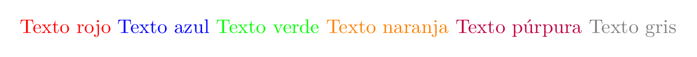

[📄 Ver PDF](assets/previews/TEXTO_LISTAS_001.pdf)

### Colores personalizados

```latex
% Definir color (en preámbulo o configuracion.tex)
\definecolor{miazul}{RGB}{0, 102, 204}
\definecolor{miverde}{HTML}{00AA55}
\definecolor{migris}{gray}{0.4}

% Usar
\textcolor{miazul}{Texto en mi azul personalizado}
```

### Mezcla de colores

```latex
\textcolor{blue!50}{Azul al 50\%}
\textcolor{red!30!blue}{30\% rojo + 70\% azul}
\textcolor{green!50!black}{Verde oscuro}
```

### Fondo de texto

```latex <!-- preview -->
\colorbox{yellow}{Texto con fondo amarillo}

\colorbox{blue!20}{\textcolor{blue}{Texto azul con fondo azul claro}}

\fcolorbox{red}{yellow}{Texto con borde rojo y fondo amarillo}
```

**Resultado:**

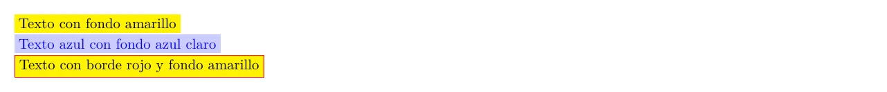

[📄 Ver PDF](assets/previews/TEXTO_LISTAS_002.pdf)

---

## Alineación

### Alineación de párrafos

```latex <!-- preview -->
% Izquierda (por defecto en español)
\begin{flushleft}
    Este texto está alineado a la izquierda.
    Las líneas empiezan en el mismo punto.
\end{flushleft}

% Centro
\begin{center}
    Este texto está centrado.
    Cada línea se centra independientemente.
\end{center}

% Derecha
\begin{flushright}
    Este texto está alineado a la derecha.
    Las líneas terminan en el mismo punto.
\end{flushright}

% Justificado (por defecto)
Este es el comportamiento normal de LaTeX,
el texto se justifica en ambos lados.
```

**Resultado:**

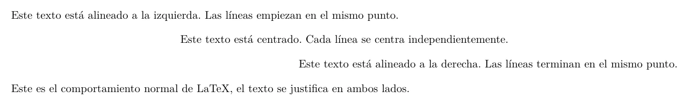

[📄 Ver PDF](assets/previews/TEXTO_LISTAS_003.pdf)

### Comandos de conmutación

```latex
{\raggedright Texto alineado a la izquierda}

{\centering Texto centrado\\en varias líneas}

{\raggedleft Texto alineado a la derecha}
```

### Con ragged2e (mejor calidad)

```latex <!-- preview -->
% Más opciones de configuración
\begin{FlushLeft}
    Texto a la izquierda con mejor espaciado.
\end{FlushLeft}

\begin{Center}
    Texto centrado mejorado.
\end{Center}

\begin{FlushRight}
    Texto a la derecha mejorado.
\end{FlushRight}

% Justificado con hifenación
\begin{justify}
    Texto justificado con mejor hifenación.
\end{justify}
```

**Resultado:**

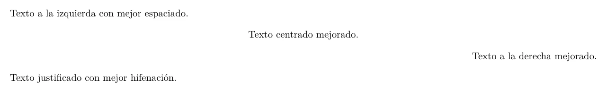

[📄 Ver PDF](assets/previews/TEXTO_LISTAS_004.pdf)

---

## Espaciado

### Espaciado horizontal

```latex
Texto\hspace{1cm}con espacio de 1cm

Texto\quad con quad (ancho de M)

Texto\qquad con qquad (doble quad)

Texto\, con espacio fino

Texto\; con espacio medio

Texto\: con espacio grueso

Texto\ con espacio normal forzado

Texto\hfill al extremo derecho
```

### Espaciado vertical

```latex
Línea 1

\vspace{1cm}

Línea 2 (con 1cm de separación)

\smallskip   % Espacio pequeño
\medskip     % Espacio medio
\bigskip     % Espacio grande

% Espacio elástico
\vfill       % Llena el espacio disponible
```

### Interlineado

```latex <!-- preview -->
% Para todo el documento (en preámbulo)
\renewcommand{\baselinestretch}{1.5}

% Para una sección
\begin{spacing}{1.5}
    Este texto tiene interlineado de 1.5
\end{spacing}

% O con setspace
\singlespacing
\onehalfspacing
\doublespacing
```

**Resultado:**

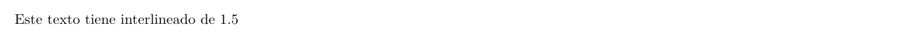

[📄 Ver PDF](assets/previews/TEXTO_LISTAS_005.pdf)

### Control de párrafos

```latex
% Sangría de primera línea
\setlength{\parindent}{1.5em}

% Espacio entre párrafos
\setlength{\parskip}{0.5em}

% Sin sangría en un párrafo específico
\noindent Este párrafo no tiene sangría.

% Forzar sangría
\indent Este sí tiene sangría aunque siga a un título.
```

---

## Listas

### Lista sin numerar (itemize)

```latex <!-- preview -->
\begin{itemize}
    \item Primer elemento
    \item Segundo elemento
    \item Tercer elemento
\end{itemize}
```

**Resultado:**

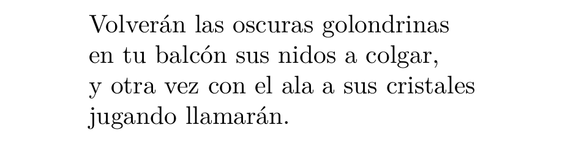

[📄 Ver PDF](assets/previews/TEXTO_LISTAS_006.pdf)

### Lista numerada (enumerate)

```latex <!-- preview -->
\begin{enumerate}
    \item Primer paso
    \item Segundo paso
    \item Tercer paso
\end{enumerate}
```

**Resultado:**

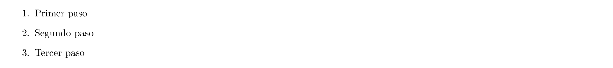

[📄 Ver PDF](assets/previews/TEXTO_LISTAS_007.pdf)

### Listas anidadas

```latex <!-- preview -->
\begin{itemize}
    \item Categoría A
    \begin{itemize}
        \item Subcategoría A.1
        \item Subcategoría A.2
        \begin{itemize}
            \item Elemento A.2.a
            \item Elemento A.2.b
        \end{itemize}
    \end{itemize}
    \item Categoría B
\end{itemize}
```

**Resultado:**

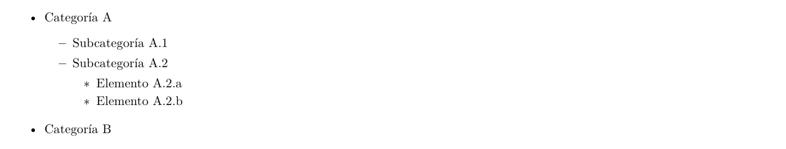

[📄 Ver PDF](assets/previews/TEXTO_LISTAS_008.pdf)

### Personalizar símbolos de itemize

```latex <!-- preview -->
% Para un item específico
\begin{itemize}
    \item[--] Con guion
    \item[$\star$] Con estrella
    \item[$\checkmark$] Con check
    \item[$\rightarrow$] Con flecha
    \item[\textbullet] Bullet estándar
\end{itemize}

% Globalmente (en preámbulo)
\renewcommand{\labelitemi}{\textbullet}      % Nivel 1
\renewcommand{\labelitemii}{\textendash}     % Nivel 2
\renewcommand{\labelitemiii}{\textasteriskcentered} % Nivel 3
\renewcommand{\labelitemiv}{\textperiodcentered}    % Nivel 4
```

**Resultado:**


[📄 Ver PDF](assets/previews/TEXTO_LISTAS_009.pdf)

### Personalizar enumerate

```latex <!-- preview -->
% Con enumerate de KOMA-Script o enumitem
\begin{enumerate}[label=\alph*)]   % a) b) c)
    \item Primer elemento
    \item Segundo elemento
\end{enumerate}

\begin{enumerate}[label=\roman*.]  % i. ii. iii.
    \item Primer elemento
    \item Segundo elemento
\end{enumerate}

\begin{enumerate}[label=\arabic*)] % 1) 2) 3)
    \item Primer elemento
    \item Segundo elemento
\end{enumerate}

\begin{enumerate}[label=\Alph*.]   % A. B. C.
    \item Primer elemento
    \item Segundo elemento
\end{enumerate}
```

**Resultado:**

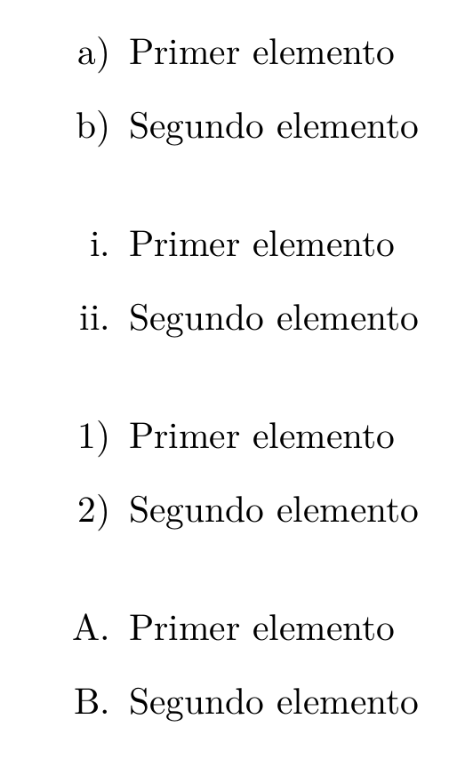

[📄 Ver PDF](assets/previews/TEXTO_LISTAS_010.pdf)

### Opciones avanzadas con enumitem

```latex <!-- preview -->
% \usepackage{enumitem}

% Sin espacio entre items
\begin{itemize}[noitemsep]
    \item Item 1
    \item Item 2
\end{itemize}

% Compacto (sin espacio vertical extra)
\begin{itemize}[nosep]
    \item Item 1
    \item Item 2
\end{itemize}

% Con margen personalizado
\begin{itemize}[leftmargin=2cm]
    \item Item con mayor margen
\end{itemize}

% Empezar desde otro número
\begin{enumerate}[start=5]
    \item Este es el item 5
    \item Este es el item 6
\end{enumerate}

% Continuar numeración
\begin{enumerate}
    \item Primer item
\end{enumerate}

Texto intermedio...

\begin{enumerate}[resume]
    \item Segundo item (continúa)
\end{enumerate}
```

**Resultado:**

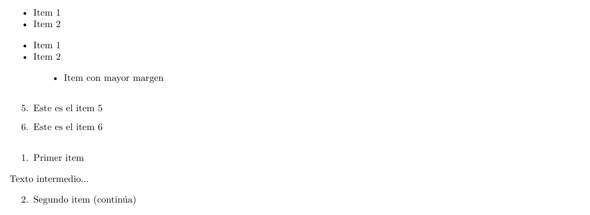

[📄 Ver PDF](assets/previews/TEXTO_LISTAS_011.pdf)

### Lista en línea

```latex
\usepackage[inline]{enumitem}

Los pasos son: 
\begin{enumerate*}[label=(\arabic*)]
    \item abrir,
    \item modificar, y
    \item guardar
\end{enumerate*}.

% O con itemize
Las opciones son \begin{itemize*}[label={}]
    \item rojo,
    \item verde, o
    \item azul
\end{itemize*}.
```

---

## Descripción y definiciones

### Lista de descripción básica

```latex <!-- preview -->
\begin{description}
    \item[Término 1] Definición del primer término.
    \item[Término 2] Definición del segundo término.
    \item[Término largo] Definición de un término más largo.
\end{description}
```

**Resultado:**

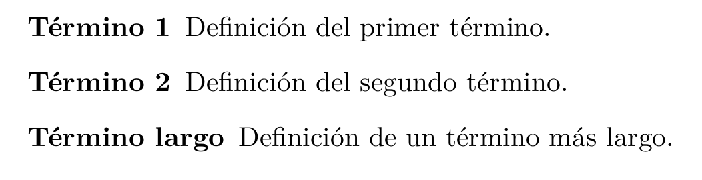

[📄 Ver PDF](assets/previews/TEXTO_LISTAS_012.pdf)

### Descripción con formato

```latex <!-- preview -->
\begin{description}[font=\normalfont\itshape]
    \item[Variable] Un contenedor para datos.
    \item[Función] Un bloque de código reutilizable.
\end{description}
```

**Resultado:**

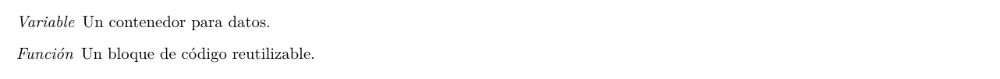

[📄 Ver PDF](assets/previews/TEXTO_LISTAS_013.pdf)

### Estilo personalizado

```latex <!-- preview -->
\begin{description}[
    style=nextline,           % Definición en línea siguiente
    leftmargin=3cm,           % Margen izquierdo
    labelwidth=2.5cm          % Ancho de la etiqueta
]
    \item[Algoritmo] 
    Conjunto ordenado de operaciones que permite hallar 
    la solución de un problema.
    \item[Programa]
    Conjunto de instrucciones que se ejecutan secuencialmente.
\end{description}
```

**Resultado:**

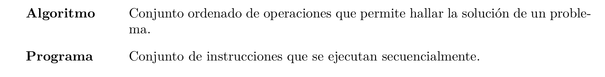

[📄 Ver PDF](assets/previews/TEXTO_LISTAS_014.pdf)

### Glosario manual

```latex <!-- preview -->
\newcommand{\term}[2]{\item[\textbf{#1}] #2}

\begin{description}
    \term{API}{Interfaz de Programación de Aplicaciones. 
        Conjunto de definiciones y protocolos para construir 
        e integrar software.}
    \term{REST}{Transferencia de Estado Representacional. 
        Estilo arquitectónico para servicios web.}
    \term{JSON}{Notación de Objetos JavaScript. Formato 
        ligero de intercambio de datos.}
\end{description}
```

**Resultado:**

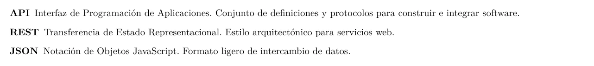

[📄 Ver PDF](assets/previews/TEXTO_LISTAS_015.pdf)

---

## Citas y bloques

### Cita corta (quote)

```latex <!-- preview -->
Como dijo Einstein:
\begin{quote}
    La imaginación es más importante que el conocimiento.
\end{quote}
```

**Resultado:**

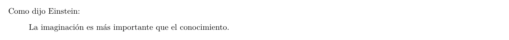

[📄 Ver PDF](assets/previews/TEXTO_LISTAS_016.pdf)

### Cita larga (quotation)

```latex <!-- preview -->
Según el autor:
\begin{quotation}
    Este es un texto más largo que puede ocupar varios párrafos.
    Se distingue de quote en que los párrafos tienen sangría.
    
    Este es el segundo párrafo de la cita, y podemos ver 
    cómo la sangría ayuda a distinguir los párrafos.
\end{quotation}
```

**Resultado:**

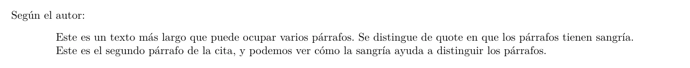

[📄 Ver PDF](assets/previews/TEXTO_LISTAS_017.pdf)

### Verso (poem)

```latex <!-- preview -->
\begin{verse}
    Volverán las oscuras golondrinas \\
    en tu balcón sus nidos a colgar, \\
    y otra vez con el ala a sus cristales \\
    jugando llamarán.
\end{verse}
```

**Resultado:**

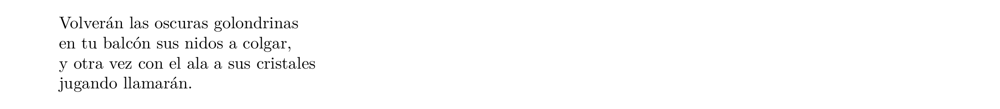

[📄 Ver PDF](assets/previews/TEXTO_LISTAS_018.pdf)

### Bloque literal (verbatim)

```latex
\begin{verbatim}
Este texto se muestra exactamente como se escribe.
    Los espacios     se preservan.
Los caracteres especiales % $ & _ también.
\end{verbatim}

% Inline
\verb|texto literal con | símbolos $%&|
```

### Abstracto

```latex <!-- preview -->
\begin{abstract}
    Este trabajo presenta un nuevo enfoque para resolver
    el problema de optimización en redes neuronales...
\end{abstract}
```

**Resultado:**


[📄 Ver PDF](assets/previews/TEXTO_LISTAS_019.pdf)

---

## Cajas y recuadros

### Caja simple (fbox)

```latex
\fbox{Texto en una caja}

% Con padding
\setlength{\fboxsep}{10pt}
\fbox{Texto con más espacio}

% Con borde más grueso
\setlength{\fboxrule}{2pt}
\fbox{Texto con borde grueso}
```

### Caja con color

```latex
\colorbox{yellow}{Fondo amarillo}

\fcolorbox{red}{yellow}{Borde rojo, fondo amarillo}

\fcolorbox{blue}{white}{\parbox{5cm}{
    Texto en un párrafo con ancho fijo 
    dentro de una caja con borde azul.
}}
```

### Minipage (caja con ancho)

```latex <!-- preview -->
\begin{minipage}{0.45\textwidth}
    Este es un bloque de texto con ancho controlado.
    Puede contener párrafos, listas, y otros elementos.
\end{minipage}
```

**Resultado:**


[📄 Ver PDF](assets/previews/TEXTO_LISTAS_020.pdf)

### Cajas lado a lado

```latex <!-- preview -->
\begin{minipage}[t]{0.48\textwidth}
    \textbf{Columna izquierda}
    
    Contenido de la primera columna con 
    texto que puede ser largo.
\end{minipage}
\hfill
\begin{minipage}[t]{0.48\textwidth}
    \textbf{Columna derecha}
    
    Contenido de la segunda columna 
    alineado con la primera.
\end{minipage}
```

**Resultado:**

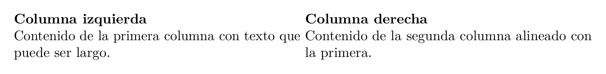

[📄 Ver PDF](assets/previews/TEXTO_LISTAS_021.pdf)

### Tcolorbox (cajas decorativas)

```latex <!-- preview -->
% La plantilla incluye tcolorbox
\begin{tcolorbox}[
    colback=blue!5,
    colframe=blue!75!black,
    title={Nota importante}
]
    Este es el contenido de una caja decorativa
    con título y colores personalizados.
\end{tcolorbox}

% Sin título
\begin{tcolorbox}[colback=green!10, colframe=green!50!black]
    Información destacada en verde.
\end{tcolorbox}

% Caja de advertencia
\begin{tcolorbox}[
    colback=red!10,
    colframe=red!75!black,
    title={Advertencia}
]
    Contenido de advertencia importante.
\end{tcolorbox}
```

**Resultado:**

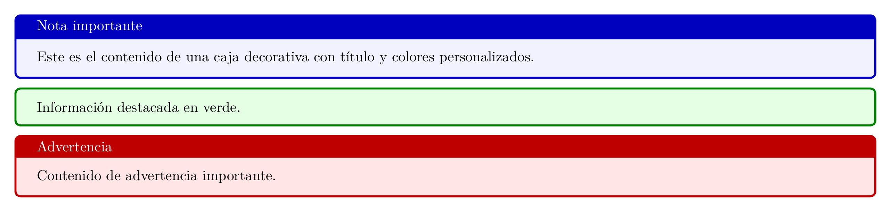

[📄 Ver PDF](assets/previews/TEXTO_LISTAS_022.pdf)

### Mdframed (marcos)

```latex <!-- preview -->
% La plantilla incluye mdframed
\begin{mdframed}[
    linecolor=blue,
    linewidth=2pt,
    backgroundcolor=blue!5,
    roundcorner=5pt
]
    Texto dentro de un marco personalizado
    con esquinas redondeadas.
\end{mdframed}
```

**Resultado:**

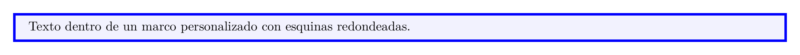

[📄 Ver PDF](assets/previews/TEXTO_LISTAS_023.pdf)

---

## Caracteres especiales

### Caracteres reservados en LaTeX

| Carácter | Cómo escribirlo |
|----------|-----------------|
| `#` | `\#` |
| `$` | `\$` |
| `%` | `\%` |
| `&` | `\&` |
| `_` | `\_` |
| `{` | `\{` |
| `}` | `\}` |
| `~` | `\textasciitilde` |
| `^` | `\textasciicircum` |
| `\` | `\textbackslash` |

### Comillas tipográficas

```latex
``Comillas inglesas dobles''

`Comillas inglesas simples'

<<Comillas latinas>>   % O usar csquotes

\enquote{Comillas automáticas}  % Con csquotes
```

### Guiones y rayas

```latex
- guion simple (para palabras compuestas)

-- guion medio (para rangos: páginas 10--20)

--- guion largo (para diálogos y aclaraciones)
```

### Puntos suspensivos

```latex
Texto\ldots más texto

% O
Texto\dots más texto
```

### Símbolos comunes

```latex
\copyright    % ©
\textregistered  % ®
\texttrademark   % ™
\texteuro     % €
\textdollar   % $
\textsterling % £
\textyen      % ¥
\textdegree   % °
\textsection  % §
\textparagraph % ¶
\dag          % †
\ddag         % ‡
\textbullet   % •
```

### Iconos con FontAwesome

```latex
% La plantilla incluye fontawesome5
\faIcon{check}        % ✓
\faIcon{times}        % ✗
\faIcon{star}         % ★
\faIcon{heart}        % ♥
\faIcon{envelope}     % ✉
\faIcon{phone}        % ☎
\faIcon{github}       % Logo GitHub
\faIcon{linkedin}     % Logo LinkedIn
\faIcon{twitter}      % Logo Twitter
```

---

## Ejemplos completos

### Documento con formato mixto

```latex
\section{Introducción}

Este proyecto aborda el problema de \textbf{optimización} en 
sistemas de \textit{aprendizaje automático}. Como señala 
\textcite{autor2023}:

\begin{quote}
    La optimización es fundamental para el éxito de cualquier 
    modelo de machine learning.
\end{quote}

Los principales \textcolor{blue}{objetivos} son:

\begin{enumerate}
    \item \textbf{Reducir} el tiempo de entrenamiento
    \item \textbf{Mejorar} la precisión del modelo
    \item \textbf{Minimizar} el consumo de recursos
\end{enumerate}

\begin{tcolorbox}[colback=yellow!10, colframe=orange!75!black, 
    title={\faIcon{lightbulb} Nota}]
    Este enfoque es \emph{especialmente útil} cuando se trabaja 
    con conjuntos de datos de gran tamaño.
\end{tcolorbox}

Para más detalles, consulta la Sección~\ref{sec:metodologia}.
```

---

## Recursos adicionales

- [Documentación de enumitem](https://ctan.org/pkg/enumitem)
- [Documentación de tcolorbox](https://ctan.org/pkg/tcolorbox)
- [Documentación de soul](https://ctan.org/pkg/soul)
- [Lista de símbolos LaTeX](https://www.ctan.org/pkg/comprehensive)

---

## Ver también

- [GUIA_PRINCIPIANTES.md](GUIA_PRINCIPIANTES.md) - Introducción a LaTeX
- [ECUACIONES.md](ECUACIONES.md) - Formato matemático
- [TABLAS.md](TABLAS.md) - Guía de tablas
